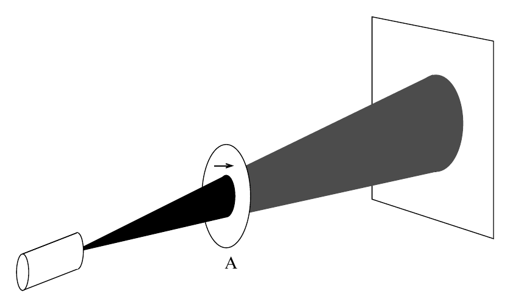

# **Lecture 1: From Classical Bits to Quantum Qubits**

 **Welcome to Quantum Computing!**

---
<div style="page-break-after: always;"></div>

## **What is Quantum Computing?**
- A new way of processing information
- Based on the laws of quantum mechanics
- Not just "faster computers" but **different kind** of computation

---
<div style="page-break-after: always;"></div>

## How quantum computing works?

```
Classical Computing:                     Quantum Computing:
• Uses bits (0 or 1)                     • Uses qubits (can be 0, 1, or both)
• Deterministic operations               • Probabilistic operations  
• Independent bits                       • Entangled qubits
• Like reading a book                    • Like experiencing VR
```

---
<div style="page-break-after: always;"></div>

## Why do we need Quantum Computing?


---
<div style="page-break-after: always;"></div>

## Are there real quantum computers?


---
<div style="page-break-after: always;"></div>

## Who is doing quantum computation?

---
<div style="page-break-after: always;"></div>

## What is this course about?
- Quantum computing
- Quantum information, quantum logic, gates, circuits
- Quantum algorithms, design principals, complexities
- Applications of quantum algorithms to data analysis, optimization, ai
- Comparison to non-quantum (classical) algorithms

---
<div style="page-break-after: always;"></div>

## Weekly topics
- Mathematical foundations
- Core quantum algorithms
- More advanced algorithms
- Applications
- Quantum error correction
  
---
<div style="page-break-after: always;"></div>

## Grading
- 40% 3-5 assignments including python implementations (you can work as groups of 1-3 people)
- 20% Midterm
- 40% Final

---
<div style="page-break-after: always;"></div>

### **Textbooks & Resources**

No required textbook. But, lecture notes are mostly based on
- "Quantum Computation and Quantum Information" by Nielsen & Chuang (primary theoretical reference)
- "An Introduction to Quantum Computing" by Kaye, Laflamme, Mosca (CS-focused theory)
- "Quantum Computing for Computer Scientists" by Yanofsky & Mannucci (CS-focused and more basics)  
- "Quantum Computing: A Gentle Introduction" by Eleanor G. Rieffel and Wolfgang H. Polak. 

---
<div style="page-break-after: always;"></div>

**Online available** notes-books:
- [A Course on the Theory of Quantum Computing](https://arxiv.org/pdf/2507.11536) by John Watrous, see also his IBM-Qiskit Textbook (free online: [qiskit.org/textbook](https://quantum.cloud.ibm.com/learning/en/courses))
- [Quantum country](https://quantum.country/) by Andy Matuschak and [Michael Nielsen](https://michaelnielsen.org/)  see also his great [introduction to neural networks](http://neuralnetworksanddeeplearning.com/)
- [Pennylane tutorials and documentation](https://pennylane.ai/qml)
- [Quantum Algorithm Zoo](https://quantumalgorithmzoo.org/)

---
<div style="page-break-after: always;"></div>

 ## From Classical Bits to Quantum Qubits

 **What is a bit?**
- Smallest unit of classical information
- Can be either **0** or **1**
- Like a light switch: ON or OFF

 **Examples of Bits:**
```
Computer memory: 0 or 1
Light bulb: ON or OFF
Coin: Heads or Tails
```
---
<div style="page-break-after: always;"></div>

 **Mathematical Representation:**
We can represent a bit as a vector:
\[
0 = \begin{bmatrix} 1 \\ 0 \end{bmatrix}, \quad
1 = \begin{bmatrix} 0 \\ 1 \end{bmatrix}
\]

---

<div style="page-break-after: always;"></div>

### **Introducing Quantum Bits (Qubits)**

 **The Quantum Surprise:**
A qubit can be **0, 1, or BOTH at the same time!**

 **Analogy: Spinning Coin**
```
Classical coin:          Heads OR Tails
Quantum coin (spinning): Heads AND Tails simultaneously
Only when you stop it (measure) does it become one or the other
```
---
<div style="page-break-after: always;"></div>

 **Mathematical Representation:**
A qubit state is:
\[
|\psi\rangle = \alpha|0\rangle + \beta|1\rangle
\]
where:
- \(|0\rangle\) and \(|1\rangle\) are basis states
- \(\alpha\) and \(\beta\) are **complex numbers**
- \(|\alpha|^2 + |\beta|^2 = 1\) (total probability = 1)

---

<div style="page-break-after: always;"></div>

## **Understanding Probability Amplitudes**

 **Classical Probability:**
If a coin has 50% chance heads, 50% tails:
- Probability of heads = 0.5
- Probability of tails = 0.5
- Total = 1

---
<div style="page-break-after: always;"></div>

 **Quantum Probability Amplitudes:**
For a qubit: \(|\psi\rangle = \alpha|0\rangle + \beta|1\rangle\)
- **Amplitude** for \(|0\rangle\) is \(\alpha\) (a complex number)
- **Probability** of measuring \(|0\rangle\) is \(|\alpha|^2\)
- **Probability** of measuring \(|1\rangle\) is \(|\beta|^2\)
- \(|\alpha|^2 + |\beta|^2 = 1\)

 **Example:**
If \(\alpha = \frac{1}{\sqrt{2}}\) and \(\beta = \frac{1}{\sqrt{2}}\):
- Probability of 0 = \(\left|\frac{1}{\sqrt{2}}\right|^2 = \frac{1}{2}\)
- Probability of 1 = \(\left|\frac{1}{\sqrt{2}}\right|^2 = \frac{1}{2}\)

---
<div style="page-break-after: always;"></div>

## **Polarization - A Physical Qubit**

 **Polarized Sunglasses Experience:**
- When you tilt your head while wearing polarized sunglasses...
- Some light gets through, some doesn't
- The sunglasses act as a **filter** for light direction

---
<div style="page-break-after: always;"></div>

 **What is Light Polarization?**
Light is an electromagnetic wave that vibrates in different directions:

 **Polarizer as a Filter:**
```
Unpolarized light → Polarizer → Polarized light in one direction
```
---
<div style="page-break-after: always;"></div>

 **Example: Horizontal Polarizer**
Only lets through light vibrating horizontally(50% light pass through):


---
<div style="page-break-after: always;"></div>

 **Example: two orthogonal polarizer**
No light passes through (all photons are blocked).


---
<div style="page-break-after: always;"></div>

**Example: inserting polarizer-B**
some light passes through.


---
<div style="page-break-after: always;"></div>

## **Coordinate System for Polarization**

 **Mathematical Representation:**
Horizontal polarization = \(|H\rangle\)
Vertical polarization = \(|V\rangle\)

<div style="text-align: center;">
<table>
<td>
<svg width="300" height="300" style="border: 1px solid #ccc; background: white;">
  <!-- Coordinate axes -->
  <line x1="150" y1="50" x2="150" y2="250" stroke="black" stroke-width="1"/>
  <line x1="50" y1="150" x2="250" y2="150" stroke="black" stroke-width="1"/>
  
  <!-- Origin -->
  <circle cx="150" cy="150" r="3" fill="black"/>
  <text x="140" y="170">(0,0)</text>
  
  <!-- Angle markers -->
  <line x1="150" y1="150" x2="250" y2="150" stroke="green" stroke-width="2"/>
  <text x="170" y="180" fill="green">θ = 0° (Horizontal)</text>
  
  <line x1="150" y1="150" x2="150" y2="50" stroke="red" stroke-width="2"/>
  <text x="80" y="100" fill="red">θ = 90° (Vertical)</text>
  
  <line x1="150" y1="150" x2="250" y2="50" stroke="blue" stroke-width="2"/>
  <text x="170" y="70" fill="blue">θ = 45° (Diagonal)</text>
  
  <!-- Angle arc -->
  <path d="M170,150 A20,20 0 0,0 162,135" fill="none" stroke="black" stroke-width="1"/>
  <text x="180" y="145">θ</text>
</svg>
</td>
<td>
Angle θ determines polarization direction:  

- θ = 0°: Horizontal polarization \(|H\rangle\)
- θ = 90°: Vertical polarization \(|V\rangle\)
- θ = 45°: Diagonal polarization \(|D\rangle\)
</td>
</table>

</div>

---


<div style="page-break-after: always;"></div>

**Single Polarizer**

```
Sunlight (unpolarized) → Polarizer H → Only H polarized light
```
---
<div style="page-break-after: always;"></div>

<div style="text-align: center;">
<svg width="500" height="200">
  <!-- Sun -->
  <circle cx="50" cy="100" r="30" fill="#ffcc00"/>
  <text x="50" y="150">Sunlight</text>
  
  <!-- Arrow to polarizer -->
  <line x1="80" y1="100" x2="140" y2="100" stroke="black" stroke-width="2" marker-end="url(#arrow)"/>
  
  <!-- Polarizer -->
  <rect x="140" y="50" width="40" height="100" fill="#e0e0ff" stroke="blue" stroke-width="2"/>
  <text x="150" y="100">H</text>
  <text x="140" y="170">Polarizer</text>
  
  <!-- Arrow after polarizer -->
  <line x1="180" y1="100" x2="240" y2="100" stroke="red" stroke-width="3" marker-end="url(#arrow)"/>
  
  <!-- Result -->
  <rect x="240" y="80" width="200" height="60" fill="#f0f0ff" stroke="black" stroke-width="1"/>
  <text x="290" y="100">Only H light</text>
  <text x="290" y="120">(50% of photons)</text>
</svg>
</div>

 **What happens to individual photons?**
- Photon is smallest unit of light
- Each photon either PASSES or is ABSORBED
- Probability depends on its initial polarization

For unpolarized light:
- Probability to pass H polarizer = 50%
- Probability to be absorbed = 50%

---

<div style="page-break-after: always;"></div>

## **Crossed Polarizers**

```
Light → Polarizer H → Polarizer V → Darkness!
```

<div style="text-align: center;">
<svg width="600" height="200">
  <!-- Light source -->
  <circle cx="50" cy="100" r="20" fill="#ffffaa"/>
  <text x="50" y="130">Light</text>
  
  <!-- First polarizer -->
  <rect x="100" y="50" width="40" height="100" fill="#e0e0ff" stroke="blue" stroke-width="2"/>
  <text x="110" y="100">H</text>
  
  <!-- Arrow between -->
  <line x1="140" y1="100" x2="230" y2="100" stroke="red" stroke-width="2" marker-end="url(#arrow)"/>
  <text x="150" y="90">H light only</text>
  
  <!-- Second polarizer -->
  <rect x="230" y="50" width="40" height="100" fill="#ffe0e0" stroke="red" stroke-width="2"/>
  <text x="240" y="100">V</text>
  
  <!-- Result -->
  <line x1="270" y1="100" x2="290" y2="100" stroke="gray" stroke-dasharray="5,5" stroke-width="1"/>
  <text x="280" y="100">NO LIGHT!</text>
  <text x="280" y="120">0% transmission</text>
</svg>
</div>

---
<div style="page-break-after: always;"></div>

 **Why no light?**
1. First polarizer: Only H photons pass
2. Second polarizer (V): Blocks all H photons
3. Result: No light gets through

 **Mathematically:**
After first polarizer: \(|H\rangle\)
Probability through V polarizer = \(|\langle V|H\rangle|^2 = 0\)

---

<div style="page-break-after: always;"></div>

## **The Magic Middle Polarizer!**

```
Light → H → 45° → V → SOME LIGHT!
```

<div style="text-align: center;">
<svg width="700" height="200">
  <!-- Setup -->
  <circle cx="50" cy="100" r="15" fill="#ffffaa"/>
  <text x="50" y="120">Light</text>
  
  <!-- First polarizer -->
  <rect x="100" y="50" width="30" height="100" fill="#e0e0ff" stroke="blue" stroke-width="2"/>
  <text x="110" y="100">H</text>
  
  <!-- Middle polarizer -->
  <rect x="150" y="50" width="30" height="100" fill="#e0ffe0" stroke="green" stroke-width="2"/>
  <text x="160" y="100">45°</text>
  
  <!-- Last polarizer -->
  <rect x="200" y="50" width="30" height="100" fill="#ffe0e0" stroke="red" stroke-width="2"/>
  <text x="210" y="100">V</text>
  
  <!-- Result -->
  <line x1="230" y1="100" x2="300" y2="100" stroke="red" stroke-width="3" marker-end="url(#arrow)"/>
  <text x="265" y="90">SOME LIGHT!</text>
  <text x="265" y="110">25% of original</text>
</svg>
</div>

 **Counterintuitive Result:**
Adding a third polarizer at 45° **allows light through**!

---
<div style="page-break-after: always;"></div>

 **Explanation with Qubits:**
1. After H polarizer: \(|H\rangle\)
2. 45° polarizer creates **superposition**: \(|D\rangle = \frac{1}{\sqrt{2}}(|H\rangle + |V\rangle)\)
3. Now has both H and V components!
4. Some can pass final V polarizer

Probability = \(\frac{1}{2} \times \frac{1}{2} = \frac{1}{4}\) of original

---
<div style="page-break-after: always;"></div>

## **Superposition in Polarization**

 **Diagonal Polarization as Superposition:**
\[
|D\rangle = \frac{1}{\sqrt{2}}|H\rangle + \frac{1}{\sqrt{2}}|V\rangle
\]


 **What does this mean?**
- Photon is in BOTH H AND V states simultaneously
- When measured by H polarizer: 50% chance H, 50% chance V
- When measured by V polarizer: 50% chance H, 50% chance V

---
<div style="page-break-after: always;"></div>


## **Introducing Quantum Spin**

 **Electrons Have "Spin"**
- Not actually spinning like a top
- Intrinsic property like mass or charge
- Always has same magnitude but can point in different directions

---
<div style="page-break-after: always;"></div>


 **Spin Directions:**
- Up along z-axis: \(|\uparrow_z\rangle\) or \(|0\rangle\)
- Down along z-axis: \(|\downarrow_z\rangle\) or \(|1\rangle\)

<div style="text-align: center;">
<svg width="400" height="200">
  <!-- Up spin -->
  <line x1="100" y1="150" x2="100" y2="50" stroke="black" stroke-width="2"/>
  <line x1="100" y1="50" x2="90" y2="70" stroke="black" stroke-width="2"/>
  <line x1="100" y1="50" x2="110" y2="70" stroke="black" stroke-width="2"/>
  <circle cx="100" cy="150" r="5" fill="black"/>
  <text x="100" y="170">z-axis</text>
  <text x="100" y="40">↑ spin up</text>
  
  <!-- Down spin -->
  <line x1="300" y1="50" x2="300" y2="150" stroke="black" stroke-width="2"/>
  <line x1="300" y1="150" x2="290" y2="130" stroke="black" stroke-width="2"/>
  <line x1="300" y1="150" x2="310" y2="130" stroke="black" stroke-width="2"/>
  <circle cx="300" cy="50" r="5" fill="black"/>
  <text x="300" y="30">z-axis</text>
  <text x="300" y="170">↓ spin down</text>
</svg>
</div>

---
<div style="page-break-after: always;"></div>


## **Stern-Gerlach Experiment (1922)**

 **The Setup:**
```
Silver atoms (with one unpaired electron)
        ↓
Strong magnet with non-uniform field
        ↓
Detector screen
```
---
<div style="page-break-after: always;"></div>

<div style="text-align: center;">
<svg width="500" height="300">
  <!-- Atom source -->
  <circle cx="250" cy="50" r="20" fill="#aaddff"/>
  <text x="250" y="80">Silver atoms</text>
  
  <!-- Magnet -->
  <rect x="150" y="100" width="200" height="60" fill="#cccccc" stroke="black" stroke-width="2"/>
  <text x="250" y="130">Magnet with</text>
  <text x="250" y="150">non-uniform field</text>
  
  <!-- Paths -->
  <path d="M250,50 Q250,80 240,120" stroke="red" stroke-width="2" fill="none"/>
  <path d="M250,50 Q250,80 260,120" stroke="blue" stroke-width="2" fill="none"/>
  
  <!-- Detector screen -->
  <line x1="100" y1="200" x2="400" y2="200" stroke="black" stroke-width="3"/>
  
  <!-- Spots -->
  <circle cx="240" cy="190" r="8" fill="red"/>
  <circle cx="280" cy="190" r="8" fill="blue"/>
  <text x="240" y="210">Up</text>
  <text x="280" y="210">Down</text>
</svg>
</div>

---

<div style="page-break-after: always;">

 **Actual Result:**
Only **TWO** discrete spots appear!
- One spot for spin UP
- One spot for spin DOWN

---
<div style="page-break-after: always;"></div>

## **What Stern-Gerlach Shows Us**

 **Key Discovery:**
1. **Quantization:** Spin only takes discrete values (not continuous)
2. **Measurement:** Apparatus "measures" spin along vertical axis
3. **Collapse:** Measurement forces atom into UP or DOWN state

 **First SG Apparatus:**
- Measures spin along z-axis
- Splits beam into \(|\uparrow_z\rangle\) and \(|\downarrow_z\rangle\)
- Select one path (e.g., \(|\uparrow_z\rangle\) only) for next experiment

---

<div style="page-break-after: always;"></div>

## **Sequential Stern-Gerlach Experiments**

 **Experiment 1: SG-z → SG-z**
```
Atoms → SG-z (select ↑_z) → SG-z → All ↑_z
```
**Result:** 100% up. Once measured up, stays up if measured same way.

---

<div style="page-break-after: always;">

 **Experiment 2: SG-z → SG-x → SG-z**
```
Atoms → SG-z (↑_z) → SG-x → SG-z → 50% ↑_z, 50% ↓_z
```
**Surprise:** After SG-x, we lose information about z-spin!

<div style="text-align: center;">
<svg width="600" height="200">
  <!-- SG-z -->
  <rect x="50" y="50" width="60" height="100" fill="#e0e0ff" stroke="blue" stroke-width="2"/>
  <text x="80" y="100">SG-z</text>
  <text x="80" y="120">(select ↑)</text>
  
  <!-- Arrow -->
  <line x1="110" y1="100" x2="140" y2="100" stroke="black" stroke-width="2" marker-end="url(#arrow)"/>
  
  <!-- SG-x -->
  <rect x="140" y="50" width="60" height="100" fill="#ffe0e0" stroke="red" stroke-width="2"/>
  <text x="170" y="100">SG-x</text>
  
  <!-- Arrow -->
  <line x1="200" y1="100" x2="230" y2="100" stroke="black" stroke-width="2" marker-end="url(#arrow)"/>
  
  <!-- SG-z -->
  <rect x="230" y="50" width="60" height="100" fill="#e0e0ff" stroke="blue" stroke-width="2"/>
  <text x="260" y="100">SG-z</text>
  
  <!-- Result -->
  <rect x="310" y="70" width="100" height="60" fill="#f0f0ff" stroke="black" stroke-width="1"/>
  <text x="360" y="90">50% ↑</text>
  <text x="360" y="110">50% ↓</text>
</svg>
</div>

---

<div style="page-break-after: always;"></div>


## **Understanding the SG-x Apparatus**

 **What is SG-x?**
- Measures spin along x-axis
- Splits into \(|\uparrow_x\rangle\) and \(|\downarrow_x\rangle\)

 **Mathematical Relationship:**
\[
|\uparrow_z\rangle = \frac{1}{\sqrt{2}}|\uparrow_x\rangle + \frac{1}{\sqrt{2}}|\downarrow_x\rangle
\]
\[
|\downarrow_z\rangle = \frac{1}{\sqrt{2}}|\uparrow_x\rangle - \frac{1}{\sqrt{2}}|\downarrow_x\rangle
\]

 **Interpretation:**
\(|\uparrow_z\rangle\) is a **superposition** of x-spin states!

---

<div style="page-break-after: always;">

## **Analysis of SG-z → SG-x → SG-z**

 **Step by Step:**
1. Start with \(|\uparrow_z\rangle\)
2. SG-x measurement: Forces into either \(|\uparrow_x\rangle\) or \(|\downarrow_x\rangle\) (50% each)
3. Let's say we get \(|\uparrow_x\rangle\)
4. Now: \(|\uparrow_x\rangle = \frac{1}{\sqrt{2}}|\uparrow_z\rangle + \frac{1}{\sqrt{2}}|\downarrow_z\rangle\)
5. Final SG-z: 50% chance ↑_z, 50% chance ↓_z

 **Key Insight:**
The middle measurement **destroys** original information
- Like the middle polarizer creates new possibilities

---
<div style="page-break-after: always;"></div>

## **Quantum vs Classical Measurement**

 **Classical Measurement:**
<div style="text-align: center;">
<svg width="400" height="150">
  <!-- Light bulb -->
  <circle cx="200" cy="80" r="30" fill="#ffff00"/>
  <text x="200" y="80" font-size="20">ON</text>
  
  <!-- Observer -->
  <circle cx="200" cy="140" r="20" fill="#ccccff"/>
  <text x="200" y="145">👁️</text>
  
  <!-- Result -->
  <rect x="250" y="60" width="150" height="60" fill="#f0f0f0" stroke="black" stroke-width="1"/>
  <text x="300" y="80">Still ON!</text>
  <text x="300" y="100">No change</text>
</svg>
</div>

---

<div style="page-break-after: always;">

 **Quantum Measurement:**
<div style="text-align: center;">
<svg width="400" height="150">
  <!-- Spinning coin -->
  <circle cx="200" cy="80" r="30" fill="url(#spinning)"/>
  <text x="200" y="80">?</text>
  <text x="200" y="115">Spinning</text>
  
  <!-- Observer -->
  <circle cx="200" cy="140" r="20" fill="#ccccff"/>
  <text x="200" y="145">👁️</text>
  
  <!-- Result -->
  <circle cx="300" cy="80" r="30" fill="silver"/>
  <text x="300" y="80">H</text>
  <text x="300" y="115">STOPS!</text>
  <text x="300" y="130">(Collapses)</text>
</svg>
</div>

<div style="page-break-after: always;"></div>

---

## **Connection to Computation**

 **Stern-Gerlach as Quantum Gates:**
- SG-z: Measures in computational basis {|0⟩, |1⟩}
- SG-x: Measures in Hadamard basis {|+⟩, |-⟩}
- Where: \(|+\rangle = \frac{1}{\sqrt{2}}(|0\rangle + |1\rangle)\)

 **Sequence SG-z → SG-x → SG-z is like:**
1. Prepare |0⟩
2. Apply Hadamard gate (creates superposition)
3. Measure in computational basis

 **The Hadamard Gate:**
\[
H = \frac{1}{\sqrt{2}}\begin{bmatrix} 1 & 1 \\ 1 & -1 \end{bmatrix}
\]
\[
H|0\rangle = |+\rangle, \quad H|1\rangle = |-\rangle
\]

---

<div style="page-break-after: always;">

<div style="text-align: center;">
<svg width="500" height="200">
  <!-- Quantum circuit -->
  <rect x="50" y="30" width="500" height="100" fill="white" stroke="black" stroke-width="1"/>
  
  <!-- Qubit line -->
  <line x1="70" y1="70" x2="430" y2="70" stroke="black" stroke-width="2"/>
  
  <!-- Gates -->
  <rect x="100" y="50" width="40" height="40" fill="#ccccff" stroke="blue" stroke-width="2"/>
  <text x="110" y="75">|0⟩</text>
  
  <rect x="200" y="50" width="40" height="40" fill="#ffcccc" stroke="red" stroke-width="2"/>
  <text x="210" y="75">H</text>
  
  <!-- Measurement -->
  <rect x="300" y="50" width="80" height="40" fill="#ccffcc" stroke="green" stroke-width="2"/>
  <text x="305" y="75">Measure</text>
  
  <!-- Results -->
  <rect x="400" y="60" width="80" height="20" fill="#f0f0f0" stroke="black" stroke-width="1"/>
  <text x="410" y="75">0 or 1</text>
  <text x="410" y="95">50% each</text>
</svg>
</div>

---
<div style="page-break-after: always;"></div>


## **Summary - Key Quantum Concepts**

 **1. Superposition:**
- Quantum systems can be in multiple states at once
- \(|\psi\rangle = \alpha|0\rangle + \beta|1\rangle\)

 **2. Measurement Collapse:**
- Measurement forces system into definite state
- Probability given by \(|\alpha|^2\) and \(|\beta|^2\)

---

<div style="page-break-after: always;">

 **3. Basis Change:**
- Same state looks different in different bases
- \(|0\rangle = \frac{1}{\sqrt{2}}(|+\rangle + |-\rangle)\)

 **4. Quantum Information:**
- More powerful than classical information
- Enables new algorithms (we'll learn these next!)

---

<div style="page-break-after: always;">

<div style="text-align: center;">
<svg width="600" height="200">
  <!-- Classical vs Quantum -->
  <rect x="50" y="50" width="250" height="130" fill="#f0f0ff" stroke="blue" stroke-width="2"/>
  <text x="150" y="80">Classical Bit</text>
  <circle cx="100" cy="120" r="20" fill="silver"/>
  <text x="100" y="120">0</text>
  <circle cx="200" cy="120" r="20" fill="silver"/>
  <text x="200" y="120">1</text>
  <text x="130" y="160">Either 0 OR 1</text>
  
  <rect x="320" y="50" width="400" height="130" fill="#fff0f0" stroke="red" stroke-width="2"/>
  <text x="350" y="80">Quantum Bit</text>
  <circle cx="400" cy="120" r="40" fill="url(#spinning)"/>
  <text x="350" y="120">?</text>
  <text x="350" y="150">0 AND 1 simultaneously</text>
</svg>
</div>

<div style="page-break-after: always;"></div>

---

## **Exercises**

 **Problem 1: Polarizer Math**
Light passes through polarizers at 0°, 30°, and 90°. What fraction emerges?
Hint: Use Malus's Law: \(I = I_0 \cos^2(\theta)\)

 **Problem 2: Quantum State**
A qubit is in state: \(|\psi\rangle = \frac{3}{5}|0\rangle + \frac{4i}{5}|1\rangle\)
a) Verify this is a valid quantum state
b) What is probability of measuring |0⟩?
c) What is probability of measuring |1⟩?

 **Problem 3: Stern-Gerlach**
If we start with \(|\uparrow_z\rangle\) and measure:
SG-z → SG-x → SG-y → SG-z
What is the probability of getting ↑_z at the end?

---

<div style="page-break-after: always;"></div>

## **Next Lecture Preview**

 **Coming Up:**
1. **Dirac Notation:** The language of quantum mechanics
2. **Quantum Gates:** How to manipulate qubits
3. **Entanglement:** The "spooky" quantum correlation
4. **Quantum Circuits:** Building quantum algorithms

 **Reading:**
- Textbook Chapter 1: Introduction to Quantum Computing
- Qiskit Documentation: Basic quantum concepts

---
<div style="page-break-after: always;"></div>

**Key Takeaway:** Quantum mechanics gives us new computational resources 
- superposition and entanglement 
- that don't exist in classical computing. 

Understanding these through simple examples (polarization, Stern-Gerlach) is the first step toward quantum algorithms!

<style>
#spinning {
  background: conic-gradient(from 0deg, silver, gray, silver, gray, silver);
}
</style>

<defs>
  <marker id="arrow" markerWidth="10" markerHeight="10" refX="9" refY="3" orient="auto" markerUnits="strokeWidth">
    <path d="M0,0 L0,6 L9,3 z" fill="black"/>
  </marker>
</defs>