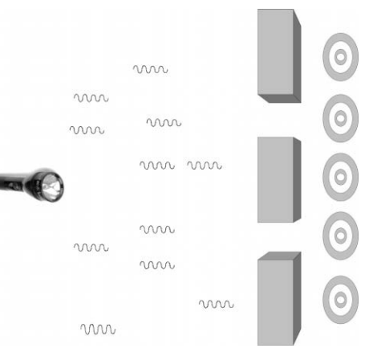
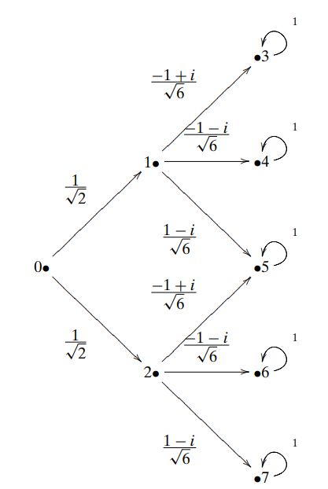
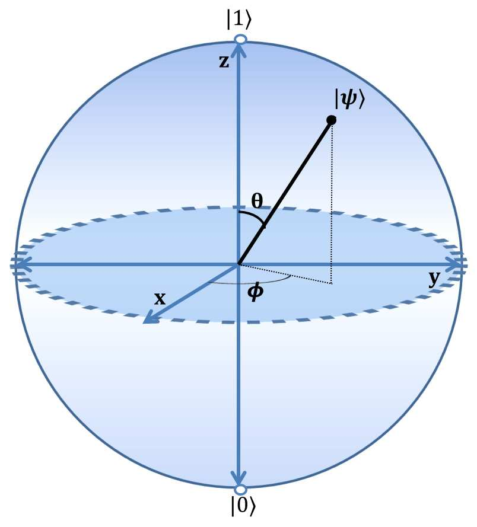
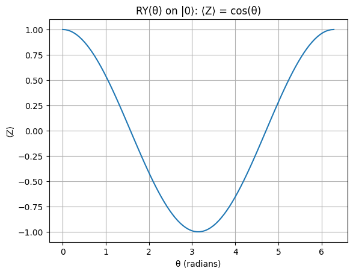
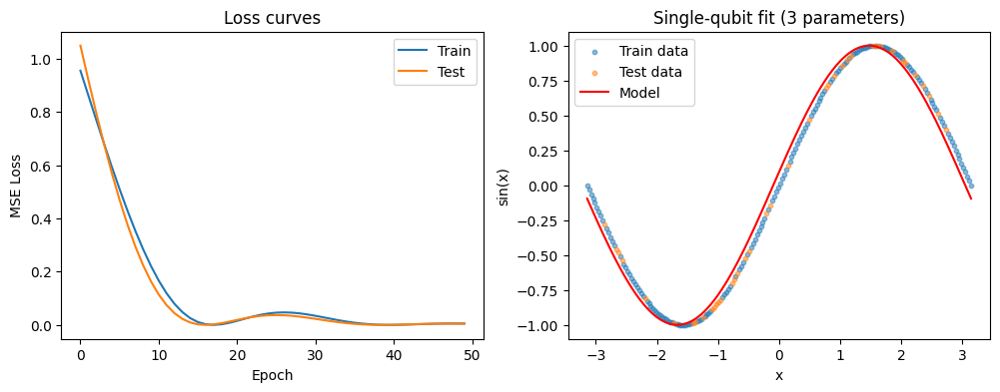

# **Lecture 2: Qubit Representations, Rotation Gates, and Variational Circuits**  
*with Postulates of Quantum Mechanics and a Trainable Single‑Qubit Model*
- [**Lecture 2: Qubit Representations, Rotation Gates, and Variational Circuits**](#lecture-2-qubit-representations-rotation-gates-and-variational-circuits)
  - [**Lecture Overview**](#lecture-overview)
  - [**Vector Basics for Quantum States**](#vector-basics-for-quantum-states)
    - [**Basis vectors**](#basis-vectors)
    - [**Inner product and norm**](#inner-product-and-norm)
  - [**Postulates of Quantum Mechanics**](#postulates-of-quantum-mechanics)
    - [**Postulate 1: State Space**](#postulate-1-state-space)
    - [**Postulate 2: Evolution**](#postulate-2-evolution)
    - [**Postulate 3: Measurement (Born Rule)**](#postulate-3-measurement-born-rule)
    - [**Postulate 4: Composite Systems**](#postulate-4-composite-systems)
  - [**3. The Bloch Sphere Representation**](#3-the-bloch-sphere-representation)
  - [**4. Rotation Gates**](#4-rotation-gates)
    - [**Effect on the Bloch sphere**](#effect-on-the-bloch-sphere)
  - [**Simulating Rotations with PennyLane and PyTorch**](#simulating-rotations-with-pennylane-and-pytorch)
    - [**Visualizing the effect of rotation**](#visualizing-the-effect-of-rotation)
  - [**Application: Single‑Qubit Predictor for sin(x) with Train/Test Split**](#application-singlequbit-predictor-for-sinx-with-traintest-split)
    - [**Circuit design**](#circuit-design)
  - [Pauli Matrices](#pauli-matrices)
    - [1. Pauli-X ($\\sigma\_x$) – The "bit-flip" matrix](#1-pauli-x-sigma_x--the-bit-flip-matrix)
    - [2. Pauli-Y ($\\sigma\_y$) – The "bit-flip + phase-flip" matrix](#2-pauli-y-sigma_y--the-bit-flip--phase-flip-matrix)
    - [3. Pauli-Z ($\\sigma\_z$) – The "phase-flip" matrix](#3-pauli-z-sigma_z--the-phase-flip-matrix)
  - [Key Properties (relevant to our previous example)](#key-properties-relevant-to-our-previous-example)
  - [**Moving to Multiple Qubits**](#moving-to-multiple-qubits)
    - [**Entanglement**](#entanglement)
    - [Analogy:  The Quantum State as a Bubble](#analogy--the-quantum-state-as-a-bubble)
  - [**Multi‑qubit gates**](#multiqubit-gates)
  - [**Why Unitary? Schrödinger Equation**](#why-unitary-schrödinger-equation)
  - [**Summary and Next Lecture**](#summary-and-next-lecture)
  - [**Exercises**](#exercises)
  - [**AI Tool Demo**](#ai-tool-demo)

---

## **Lecture Overview**

1. **Vector basics** – basis vectors, inner product, norm  
2. **Postulates of Quantum Mechanics** – state space, evolution, measurement (Born rule), composite systems  
3. **Qubit state on the Bloch sphere** – angles θ and φ  
4. **Rotation gates** – how they change the qubit state  
5. **Python simulation with PennyLane & PyTorch** – visualizing rotations, train‑test split  
6. **Application: single‑qubit predictor for sin(x)** – a first variational quantum circuit with proper evaluation  
7. **Multi‑qubit systems** – tensor products, entanglement  
8. **Why unitary?** – from Schrödinger equation to quantum gates  
9. **Summary and next lecture**

---

**Review (from lecture-1): Polarization of photon**
- Linear polarization: consider light as a **wave** (electric field)
  - horizontal |H>, electric field oscillates in horizontal plane
  - vertical |V>, oscillates in vertical plane
- Circular polarization: electric field rotates in a circle
  - rotation to the right (clockwise) |R>
  - rotation to the left (counter-clockwise) |L>

---

**Review (from lecture-1): Probabilistic machine vs quantum machine**


1/2 probability, it passes through. Then 1/3 probability it hits one of the three target(measurement)

*from the book Quantum-Computing-for-Computer-Scientists*

---


*from the book Quantum-Computing-for-Computer-Scientists*


---



probability from 0 to 3, $|P(0,3)|^2?$
probability from 0 to 3, $|P(0,5)|^2?$   
*from the book Quantum-Computing-for-Computer-Scientists*

---

## **Vector Basics for Quantum States**

A quantum state is a vector in a complex vector space.  
For a single qubit, the space is **ℂ²** (two‑dimensional complex space).

### **Basis vectors**
Any vector can be written as a combination of basis vectors.  
The **computational basis** is:

```math
|0\rangle = \begin{bmatrix}1\\0\end{bmatrix},\qquad 
|1\rangle = \begin{bmatrix}0\\1\end{bmatrix}
```

A general qubit state is:

```math
|\psi\rangle = \alpha|0\rangle + \beta|1\rangle = \begin{bmatrix}\alpha\\\beta\end{bmatrix},\quad \alpha,\beta\in\mathbb{C}.
```

---

### **Inner product and norm**
The inner product $\langle\phi|\psi\rangle$ is the dot product with complex conjugation:

```math
\langle\phi|\psi\rangle = \phi_0^*\psi_0 + \phi_1^*\psi_1.
```

The **norm** of a vector is $\||\psi\rangle\| = \sqrt{\langle\psi|\psi\rangle}$.  
For a valid quantum state we require **normalization**: $\||\psi\rangle\| = 1$, i.e.

```math
|\alpha|^2 + |\beta|^2 = 1.
```

---

---

## **Postulates of Quantum Mechanics**

To understand how qubits behave, we need the fundamental rules 
- the **postulates of quantum mechanics**. 
 
They are stated here in the simplified form suitable for finite‑dimensional systems.

---

### **Postulate 1: State Space**
The state of an isolated physical system is represented by a **unit vector** in a complex Hilbert space (inner product space).  
For a qubit, this space is $\mathbb{C}^2$.

---

### **Postulate 2: Evolution**
The evolution of a closed quantum system is described by a **unitary transformation**.  
If the state at time $t_1$ is $|\psi\rangle$, then at time $t_2$ it is $|\psi'\rangle = U|\psi\rangle$, where $U$ is unitary ($U^\dagger U = I$).  
(Continuous time evolution is given by the Schrödinger equation, but for circuits we work with discrete gates.)

---

### **Postulate 3: Measurement (Born Rule)**
Quantum measurements are described by a set of **measurement operators** $\{M_m\}$ acting on the state space. The index $m$ refers to the measurement outcome.  
If the state is $|\psi\rangle$ before measurement, the probability that result $m$ occurs is  

```math
p(m) = \langle\psi| M_m^\dagger M_m |\psi\rangle,
```

and the state after measurement collapses to  

```math
\frac{M_m|\psi\rangle}{\sqrt{p(m)}}.
```

For a **projective measurement** in the computational basis $\{|0\rangle,|1\rangle\}$, the operators are $M_0=|0\rangle\langle0|$, $M_1=|1\rangle\langle1|$. Then  

```math
p(0)=|\langle0|\psi\rangle|^2=|\alpha|^2,\quad p(1)=|\langle1|\psi\rangle|^2=|\beta|^2,
```

and after measuring 0 the state becomes $|0\rangle$ (similarly for 1).

This is the **Born rule**: the probability of an outcome is the squared magnitude of the amplitude.

### **Postulate 4: Composite Systems**
The state space of a composite physical system is the **tensor product** of the state spaces of the individual components.  
For two qubits, the space is $\mathbb{C}^2 \otimes \mathbb{C}^2 \cong \mathbb{C}^4$. If one qubit is in state $|\psi_1\rangle$ and the other in $|\psi_2\rangle$, the joint state is $|\psi_1\rangle\otimes|\psi_2\rangle$ (often written $|\psi_1\psi_2\rangle$).  
Not all states are product states – those that aren’t are called **entangled**.

These postulates are the foundation for everything that follows.

---

---

## **3. The Bloch Sphere Representation**

Because $|\alpha|^2+|\beta|^2=1$, we can write

```math
|\psi\rangle = \cos\frac{\theta}{2}\,|0\rangle + e^{i\phi}\sin\frac{\theta}{2}\,|1\rangle,
```

with **θ ∈ [0,π]** and **φ ∈ [0,2π)**.  
(We omit an overall global phase, which is physically unobservable.)

---

These two angles describe a point on the surface of a sphere – the **Bloch sphere**.

- **θ** (polar angle) determines the probability of measuring $|0\rangle$ vs $|1\rangle$.  
- **φ** (azimuthal angle) is a relative phase.

<div style="text-align: center;">
 
</div>


**Examples:**
- $|0\rangle$: θ=0 → north pole 
- $|1\rangle$: θ=π → south pole  
  - **edit:** the image shows opposite, it should be $|0\rangle$ on the up 
- $|+\rangle = \frac{1}{\sqrt{2}}(|0\rangle+|1\rangle)$: θ=π/2, φ=0 → point on x‑axis  
- $|-\rangle = \frac{1}{\sqrt{2}}(|0\rangle-|1\rangle)$: θ=π/2, φ=π → opposite x‑axis  
- $|+i\rangle = \frac{1}{\sqrt{2}}(|0\rangle+i|1\rangle)$: θ=π/2, φ=π/2 → y‑axis

---

## **4. Rotation Gates**

Quantum gates are **unitary matrices**: $U^\dagger U = I$.  
For a single qubit, rotations around the x, y, and z axes are especially important.

```math
R_x(\theta) = e^{-i\frac{\theta}{2}X} = 
\cos\frac{\theta}{2}I - i\sin\frac{\theta}{2}X =
\begin{bmatrix}
\cos\frac{\theta}{2} & -i\sin\frac{\theta}{2}\\
-i\sin\frac{\theta}{2} & \cos\frac{\theta}{2}
\end{bmatrix}
```

```math
R_y(\theta) = e^{-i\frac{\theta}{2}Y} =
\begin{bmatrix}
\cos\frac{\theta}{2} & -\sin\frac{\theta}{2}\\
\sin\frac{\theta}{2} & \cos\frac{\theta}{2}
\end{bmatrix}
```

```math
R_z(\theta) = e^{-i\frac{\theta}{2}Z} =
\begin{bmatrix}
e^{-i\theta/2} & 0\\
0 & e^{i\theta/2}
\end{bmatrix}
```

Here $X,Y,Z$ are the Pauli matrices:

```math
X=\begin{bmatrix}0&1\\1&0\end{bmatrix},\;
Y=\begin{bmatrix}0&-i\\i&0\end{bmatrix},\;
Z=\begin{bmatrix}1&0\\0&-1\end{bmatrix}.
```

### **Effect on the Bloch sphere**
- $R_x(\theta)$ rotates the state by angle θ **around the x‑axis**.  
- $R_y(\theta)$ rotates around the y‑axis.  
- $R_z(\theta)$ rotates around the z‑axis (changes only the phase φ).

For example, $R_y(\theta)$ takes $|0\rangle$ to $\cos\frac{\theta}{2}|0\rangle + \sin\frac{\theta}{2}|1\rangle$ – a superposition whose amplitudes are controlled by θ.

---

## **Simulating Rotations with PennyLane and PyTorch**

We'll use **PennyLane** – a library for differentiable quantum programming – together with **PyTorch** for automatic differentiation.

```python
import pennylane as qml
import torch
import matplotlib.pyplot as plt

# Create a device (simulator)
dev = qml.device('default.qubit', wires=1)

# Define a quantum function that applies a rotation and returns the expectation value of PauliZ
@qml.qnode(dev, interface='torch', diff_method='backprop')
def rotate_and_measure(theta, phi):
    qml.RY(theta, wires=0)          # rotate around y-axis
    qml.RZ(phi, wires=0)             # rotate around z-axis
    return qml.expval(qml.PauliZ(0)) # ⟨Z⟩ = probability difference

# Test with some values
theta = torch.tensor(1.2, requires_grad=True)
phi   = torch.tensor(0.5, requires_grad=True)

z_exp = rotate_and_measure(theta, phi)
print(f"Expectation value ⟨Z⟩ = {z_exp.item():.4f}")
```

**Explanation:**
- `@qml.qnode` converts the quantum function into a PennyLane **QNode** that can be executed.
- We measure the expectation value of PauliZ, which equals $P(0)-P(1)$.
- The `interface='torch'` allows us to backpropagate through the circuit.

### **Visualizing the effect of rotation**

We can sweep the rotation angle and see how ⟨Z⟩ changes:

```python
angles = torch.linspace(0, 2*torch.pi, 100)
exp_vals = [rotate_and_measure(a, 0.0) for a in angles]

plt.plot(angles.detach().numpy(), [v.item() for v in exp_vals])
plt.xlabel('θ (radians)')
plt.ylabel('⟨Z⟩')
plt.title('RY(θ) on |0⟩: ⟨Z⟩ = cos(θ)')
plt.grid()
plt.show()
```

The plot shows ⟨Z⟩ = cos(θ), exactly as expected from theory.

---

## **Application: Single‑Qubit Predictor for sin(x) with Train/Test Split**

Can we learn the function $f(x)=\sin(x)$ using a single qubit circuit.
- Given some x, y values
- Can we design a model that predicts y for a given x value.   

---

**The idea:** use a parameterized rotation to encode the input x, then train a few parameters so that the measurement output matches sin(x).

---

### **Circuit design**
1. Start in $|0\rangle$.  
2. Apply $R_y(x)$ to encode the input x (this creates a state whose amplitudes depend on x).  
3. Apply a trainable rotation $R_y(\theta)$ (or a combination of rotations) – these are our **weights**.  
4. Measure ⟨Z⟩, which gives a value in [-1,1].  
5. Compare with sin(x) (scaled to [-1,1]) and optimize θ.

---

We will:
- Generate synthetic data (x, sin(x)).
- Split into training (80%) and test (20%) sets using `sklearn`.
- Train the model on the training set.
- Evaluate final loss on the test set.


```python
import pennylane as qml
import torch
import torch.nn as nn
import torch.optim as optim
from sklearn.model_selection import train_test_split
import numpy as np
import matplotlib.pyplot as plt

class SingleQubitPredictor(nn.Module):
    def __init__(self):
        super().__init__()
        # Three trainable parameters (float32 by default)
        self.theta_z = nn.Parameter(torch.tensor(0.0))
        self.theta_y = nn.Parameter(torch.tensor(0.0))
        self.theta_x = nn.Parameter(torch.tensor(0.0))
        
        self.dev = qml.device('default.qubit', wires=1)
        
        @qml.qnode(self.dev, interface='torch', diff_method='backprop')
        def circuit(x_val, tz, ty, tx):
            qml.RY(x_val, wires=0)          # data encoding
            qml.RZ(tz, wires=0)              # trainable rotation around z
            qml.RY(ty, wires=0)              # trainable rotation around y
            qml.RX(tx, wires=0)              # trainable rotation around x
            return qml.expval(qml.PauliZ(0))
        
        self.circuit = circuit

    def forward(self, x):
        # x is a batch of input values (float32)
        # Call circuit for each element and convert output to float32
        preds = torch.stack([self.circuit(xi, self.theta_z, self.theta_y, self.theta_x).float() for xi in x])
        return preds

# Generate dataset (float32)
x_all = torch.linspace(-torch.pi, torch.pi, 200, dtype=torch.float32)
y_all = torch.sin(x_all)

# Train/test split
x_np = x_all.numpy().reshape(-1, 1)
y_np = y_all.numpy()
x_train_np, x_test_np, y_train_np, y_test_np = train_test_split(
    x_np, y_np, test_size=0.2, shuffle=True, random_state=42
)

x_train = torch.tensor(x_train_np.flatten(), dtype=torch.float32)
y_train = torch.tensor(y_train_np, dtype=torch.float32)
x_test  = torch.tensor(x_test_np.flatten(), dtype=torch.float32)
y_test  = torch.tensor(y_test_np, dtype=torch.float32)

model = SingleQubitPredictor()
optimizer = optim.Adam(model.parameters(), lr=0.1)
loss_fn = nn.MSELoss()

train_losses = []
test_losses = []

for epoch in range(50):
    # Training
    model.train()
    optimizer.zero_grad()
    y_pred_train = model(x_train)
    loss_train = loss_fn(y_pred_train, y_train)
    loss_train.backward()
    optimizer.step()
    train_losses.append(loss_train.item())
    
    # Evaluation
    model.eval()
    with torch.no_grad():
        y_pred_test = model(x_test)
        loss_test = loss_fn(y_pred_test, y_test)
        test_losses.append(loss_test.item())
    
    if epoch % 1 == 0:
        print(f"Epoch {epoch:3d} | Train loss: {loss_train.item():.6f} | Test loss: {loss_test.item():.6f}")

# Plotting
plt.figure(figsize=(12,4))
plt.subplot(1,2,1)
plt.plot(train_losses, label='Train')
plt.plot(test_losses, label='Test')
plt.xlabel('Epoch')
plt.ylabel('MSE Loss')
plt.legend()
plt.title('Loss curves')

plt.subplot(1,2,2)
plt.scatter(x_train.numpy(), y_train.numpy(), s=10, alpha=0.5, label='Train data')
plt.scatter(x_test.numpy(), y_test.numpy(), s=10, alpha=0.5, label='Test data')
x_plot = torch.linspace(-torch.pi, torch.pi, 300, dtype=torch.float32)
with torch.no_grad():
    y_plot = model(x_plot)
plt.plot(x_plot.numpy(), y_plot.numpy(), 'r-', label='Model')
plt.xlabel('x')
plt.ylabel('sin(x)')
plt.legend()
plt.title('Single‑qubit fit (3 parameters)')
plt.show()

print(f"Final test loss: {test_losses[-1]:.6f}")
print(f"Trained parameters: θ_z = {model.theta_z.item():.4f}, θ_y = {model.theta_y.item():.4f}, θ_x = {model.theta_x.item():.4f}")
```
---



---

**What happens?**  
With three trainable parameters ($\theta_z, \theta_y, \theta_x$), the circuit can implement **any single‑qubit unitary**. 

---

The circuit applies the following operations:

0. the initial state $|0\rangle$
1. **Data encoding**: $R_Y(x)$ – rotates around the Y-axis by an angle equal to the input value $x$.
2. **Trainable rotations**: $R_Z(\theta_z)$, $R_Y(\theta_y)$, $R_X(\theta_x)$ – in that order.
3. **Measurement**: expectation value of the PauliZ operator.

---

The overall unitary is $U = R_X(\theta_x) R_Y(\theta_y) R_Z(\theta_z) R_Y(x)$, and the output is  
```math
f(x) = \langle 0 | R_Y(x)^\dagger \, R_Z(\theta_z)^\dagger R_Y(\theta_y)^\dagger R_X(\theta_x)^\dagger \, Z \, R_X(\theta_x) R_Y(\theta_y) R_Z(\theta_z) R_Y(x) | 0 \rangle.
```

---

Define the trainable part as $V = R_X(\theta_x) R_Y(\theta_y) R_Z(\theta_z)$. Then  
```math
f(x) = \langle 0 | R_Y(x)^\dagger \, (V^\dagger Z V) \, R_Y(x) | 0 \rangle.
```

---

This example illustrates:

- **Data encoding** into quantum states.
- **Parameterized quantum circuits** (the basis of variational quantum algorithms).
- **Training** using automatic differentiation.
- **Proper evaluation** with train/test split. 

How to analyze the circuit further?

---

## Pauli Matrices

The Pauli matrices are a set of three $2 \times 2$ complex matrices that are fundamental in quantum mechanics and quantum computing. 
- They are Hermitian, unitary, and traceless, and they form a basis for the space of $2 \times 2$ Hermitian matrices. 
- They are usually denoted by $\sigma_x$, $\sigma_y$, and $\sigma_z$ (or sometimes $X$, $Y$, $Z$).

---

### 1. Pauli-X ($\sigma_x$) – The "bit-flip" matrix
```math
\sigma_x = \begin{pmatrix} 0 & 1 \\ 1 & 0 \end{pmatrix}
```
- It swaps the $|0\rangle$ and $|1\rangle$ states.
- Eigenvalues: $+1$ (eigenvector $\frac{|0\rangle+|1\rangle}{\sqrt{2}}$) and $-1$ (eigenvector $\frac{|0\rangle-|1\rangle}{\sqrt{2}}$).

---

### 2. Pauli-Y ($\sigma_y$) – The "bit-flip + phase-flip" matrix
```math
\sigma_y = \begin{pmatrix} 0 & -i \\ i & 0 \end{pmatrix}
```
- It applies a combination of a bit-flip and a phase-flip.
- Eigenvalues: $+1$ (eigenvector $\frac{|0\rangle - i|1\rangle}{\sqrt{2}}$) and $-1$ (eigenvector $\frac{|0\rangle + i|1\rangle}{\sqrt{2}}$).

---

### 3. Pauli-Z ($\sigma_z$) – The "phase-flip" matrix
```math
\sigma_z = \begin{pmatrix} 1 & 0 \\ 0 & -1 \end{pmatrix}
```
- It leaves $|0\rangle$ unchanged and flips the sign of $|1\rangle$.
- Eigenvalues: $+1$ (eigenvector $|0\rangle$) and $-1$ (eigenvector $|1\rangle$).

---

## Key Properties (relevant to our previous example)

1. **Hermitian**: $\sigma_i^\dagger = \sigma_i$ (they are equal to their own conjugate transpose).

---

2. **Traceless**: $tr(\sigma_i) = 0$.

---

3. **Square to Identity**: $\sigma_i^2 = I$ (the $2\times2$ identity matrix).

---
1. **Orthogonality**: $tr(\sigma_i \sigma_j) = 2\delta_{ij}$ (they are orthogonal under the trace inner product).

---
5. **Basis for Hermitian matrices**: Any $2\times2$ Hermitian matrix $H$ can be written uniquely as
```math
H = \alpha_0 I + \alpha_x \sigma_x + \alpha_y \sigma_y + \alpha_z \sigma_z
```
  with real coefficients $\alpha_0,\alpha_x,\alpha_y,\alpha_z$.

---

In our circuit analysis, The operator $O = V^\dagger Z V$ is obtained by conjugating the Pauli‑$Z$ matrix with a unitary $V$. 

This operation preserves two key properties of $Z$:
- Hermitian (property 1) 
- and traceless (property 2), 
so it can be expanded as a linear combination of $\sigma_x,\sigma_y,\sigma_z$ with real coefficients. 

---


Any $2\times2$ Hermitian traceless matrix can be expanded uniquely in the basis of the three Pauli matrices $\{\sigma_x,\sigma_y,\sigma_z\}$ with **real coefficients**. 
```math
O = a\,\sigma_x + b\,\sigma_y + c\,\sigma_z, \qquad a,b,c \in \mathbb{R}.
```

---

because $Z$ has eigenvalues $+1$ and $-1$, its unitary conjugate $O$ also has eigenvalues $+1$ and $-1$. For a matrix of the form $a\sigma_x+b\sigma_y+c\sigma_z$, the eigenvalues are $\pm\sqrt{a^2+b^2+c^2}$. 

For these to be $\pm1$, we must have
```math
\sqrt{a^2+b^2+c^2} = 1 \quad\Longrightarrow\quad a^2+b^2+c^2 = 1.
```
- $O$ is a genuine Pauli operator (a point on the Bloch sphere).

---

The operator $O = V^\dagger Z V$ is a Pauli operator rotated by $V$, so it can be written as  
```math
O = a \sigma_x + b \sigma_y + c \sigma_z, \quad \text{with } a^2+b^2+c^2 = 1.
```

---

Now, $R_Y(x)^\dagger O R_Y(x)$ rotates $O$ about the Y‑axis by $-x$. Using standard rotation formulas, we get  
```math
R_Y(-x) O R_Y(x) = (a \cos x + c \sin x) \sigma_x + b \sigma_y + (-a \sin x + c \cos x) \sigma_z.
```

---

Since $\langle 0 | \sigma_x | 0 \rangle = \langle 0 | \sigma_y | 0 \rangle = 0 $ and $\langle 0 | \sigma_z | 0 \rangle = 1$, the final output simplifies to  
```math
f(x) = -a \sin x + c \cos x.
```

Thus the model can only represent functions of the form  
```math
f(x) = A \cos x + B \sin x, \quad \text{with } A = c,\; B = -a,
```  
and the constraint $A^2 + B^2 = a^2 + c^2 \leq 1$ (because $b^2 = 1 - a^2 - c^2 \geq 0$).

---


## **Moving to Multiple Qubits**

Real quantum computers use many qubits. The state of **n qubits** lives in the tensor product space:

```math
\mathcal{H} = \mathbb{C}^2 \otimes \mathbb{C}^2 \otimes \cdots \otimes \mathbb{C}^2 \quad (\text{n times})
```

Dimension = $2^n$. A basis is given by all n‑bit strings, e.g. for two qubits:

```math
|00\rangle,\ |01\rangle,\ |10\rangle,\ |11\rangle.
```

A general two‑qubit state is

```math
|\psi\rangle = \alpha_{00}|00\rangle + \alpha_{01}|01\rangle + \alpha_{10}|10\rangle + \alpha_{11}|11\rangle,
```

with $\sum |\alpha_{ij}|^2 = 1$.

---

### **Entanglement**
Some states cannot be written as a product of single‑qubit states. Example:

```math
|\Phi^+\rangle = \frac{1}{\sqrt{2}}(|00\rangle + |11\rangle)
```

This is an **entangled** state – measuring one qubit instantly affects the other.

---

### Analogy:  The Quantum State as a Bubble

<div style="display: flex; justify-content: center; align-items: center; gap: 10px;">
  <div style="position: relative; width: 100px; height: 100px;">
    <div style="width: 100%; height: 100%; border-radius: 50%; background: radial-gradient(circle at 30% 30%, #aaddff, #3b8fc2); box-shadow: 0 4px 8px rgba(0,0,0,0.2);"></div>
    <div style="position: absolute; top: 50%; left: 50%; transform: translate(-50%, -50%); font-size: 24px;">📌</div>
  </div>
  <span style="font-size: 24px;">= qubit state |ψ⟩</span>
</div>

**Think of a qubit's quantum state as a soap bubble floating in air**

- The **bubble itself** = the entire quantum state (the wave function)
- The **air inside** = the probability amplitudes (α, β)
- The **bubble's surface** = the connection between all possible outcomes

---
```
    ◯
   (📌)
```
**Key Insight:**
Just as a bubble is a single, coherent object that fills a region of space, a quantum state is a single mathematical object that encodes all possibilities for the qubit.

---

**Superposition – The Bubble Is Everywhere at Once**

 Before Measurement: The Bubble Spreads Out

<div style="display: flex; justify-content: center; align-items: center; gap: 10px; flex-wrap: wrap;">
  <!-- Main bubble -->
  <div style="position: relative; width: 100px; height: 100px;">
    <div style="width: 100%; height: 100%; border-radius: 50%; background: radial-gradient(circle at 30% 30%, #aaddff, #3b8fc2);"></div>
    <div style="position: absolute; top: 50%; left: 50%; transform: translate(-50%, -50%); font-size: 24px;">📌</div>
  </div>
  <!-- Faint echoes to indicate spread -->
  <div style="position: relative; width: 120px; height: 120px; margin-left: -30px;">
    <div style="position: absolute; width: 100%; height: 100%; border-radius: 50%; background: radial-gradient(circle at 30% 30%, rgba(170,221,255,0.3), rgba(59,143,194,0.1));"></div>
  </div>
  <div style="position: relative; width: 140px; height: 140px; margin-left: -50px;">
    <div style="position: absolute; width: 100%; height: 100%; border-radius: 50%; background: radial-gradient(circle at 30% 30%, rgba(170,221,255,0.2), rgba(59,143,194,0.05));"></div>
  </div>
  <span style="font-size: 24px;">Superposition: amplitudes spread</span>
</div>

**A bubble isn't "mostly here" or "mostly there" – it's a continuous film**

---
```
      ╭───╮
    ╭─│   │─╮
   ╭│  │   │ │╮
   ││  │   │ ││
   ╰│  │   │ │╯
    ╰─│   │─╯
      ╰───╯
```

- The bubble's shape represents how the amplitudes are distributed
- You cannot point to one spot and say "the bubble is here"
- Similarly, a qubit in superposition isn't "partly |0⟩ and partly |1⟩" – it's a single state with amplitude spread across basis states

**Question:** Where exactly is the bubble?  
**Answer:** It's everywhere its film exists – just like a superposition state exists in all basis states simultaneously.

---

**Measurement – Popping the Bubble**

<div style="display: flex; justify-content: center; align-items: center; gap: 40px; flex-wrap: wrap;">
  <!-- Before: bubble with pin -->
  <div style="text-align: center;">
    <div style="position: relative; width: 100px; height: 100px; margin: 0 auto;">
      <div style="width: 100%; height: 100%; border-radius: 50%; background: radial-gradient(circle at 30% 30%, #aaddff, #3b8fc2);"></div>
      <div style="position: absolute; top: 50%; left: 50%; transform: translate(-50%, -50%); font-size: 24px;">📌</div>
    </div>
    <div>Before measurement</div>
  </div>
  
  <!-- Arrow -->
  <div style="font-size: 40px;">→</div>
  
  <!-- After: droplet -->
  <div style="text-align: center;">
    <div style="position: relative; width: 100px; height: 100px; margin: 0 auto;">
      <div style="width: 20px; height: 20px; border-radius: 50%; background: #0077be; position: absolute; top: 40px; left: 40px; box-shadow: 0 2px 5px rgba(0,0,0,0.3);"></div>
      <div style="position: absolute; top: 60px; left: 30px; font-size: 12px;">droplet</div>
    </div>
    <div>After measurement (collapsed)</div>
  </div>
</div>

**When you pop a bubble with a pin:**

- The bubble *collapses* instantly
- The air rushes out, the film disappears
- All that remains is a single tiny droplet at one random point

---

After Measurement: Collapse to a Single Outcome

```
    ◯         →      💧
   (📌)               ●
```
**This is quantum measurement:**

- The bubble (quantum state) collapses
- One outcome (droplet) appears randomly
- The probability of where the droplet lands follows the Born rule:  
  *More "bubble film" in a region = higher chance the droplet appears there*

**Born rule visualized:** The droplet is most likely to land where the bubble was "thickest" (largest amplitude).

---
 **Multiple Qubits – Bubbles Multiply**
<div style="display: flex; justify-content: center; align-items: center; gap: 40px; flex-wrap: wrap;">
  <div style="text-align: center;">
    <div style="position: relative; width: 80px; height: 80px; margin: 0 auto;">
      <div style="width: 100%; height: 100%; border-radius: 50%; background: radial-gradient(circle at 30% 30%, #f9a8d4, #d53f8c);"></div>
      <div style="position: absolute; top: 50%; left: 50%; transform: translate(-50%, -50%); font-size: 20px;">📌</div>
    </div>
    <div>Qubit A</div>
  </div>
  
  <div style="text-align: center;">
    <div style="position: relative; width: 80px; height: 80px; margin: 0 auto;">
      <div style="width: 100%; height: 100%; border-radius: 50%; background: radial-gradient(circle at 30% 30%, #b9fbc0, #2e8b57);"></div>
      <div style="position: absolute; top: 50%; left: 50%; transform: translate(-50%, -50%); font-size: 20px;">📌</div>
    </div>
    <div>Qubit B</div>
  </div>
</div>
<p style="text-align: center; font-style: italic;">Product state: |ψ<sub>A</sub>⟩ ⊗ |ψ<sub>B</sub>⟩</p>

---

Two Unentangled Qubits = Two Separate Bubbles

```
    ◯         ◯
   (📌)       (📌)
   Qubit A    Qubit B
```

- Each bubble floats independently
- Each has its own shape, its own amplitudes
- The joint state is just "bubble A AND bubble B" – a product state
- Popping bubble A affects only qubit A; bubble B remains unchanged

**Mathematically:** $|\psi_A\rangle \otimes |\psi_B\rangle$  

---

**Two Entangled Qubits = One Bubble with Two Lobes**
<div style="display: flex; justify-content: center; align-items: center; gap: 20px; flex-wrap: wrap;">
  <!-- The merged bubble -->
  <div style="position: relative; width: 200px; height: 120px;">
    <!-- Left lobe -->
    <div style="position: absolute; left: 0; width: 100px; height: 100px; border-radius: 50%; background: radial-gradient(circle at 30% 30%, #f5e56b, #d4af37);"></div>
    <!-- Right lobe (overlapping) -->
    <div style="position: absolute; left: 60px; width: 100px; height: 100px; border-radius: 50%; background: radial-gradient(circle at 30% 30%, #f5e56b, #d4af37);"></div>
    <!-- Pins in each lobe -->
    <div style="position: absolute; top: 30px; left: 30px; font-size: 20px;">📌</div>
    <div style="position: absolute; top: 30px; left: 110px; font-size: 20px;">📌</div>
    <!-- Labels -->
    <div style="position: absolute; bottom: -10px; left: 25px;">A</div>
    <div style="position: absolute; bottom: -10px; left: 125px;">B</div>
  </div>
  <div style="max-width: 200px;">
    <p><strong>One bubble, two lobes</strong><br>Entangled state |Φ⁺⟩</p>
  </div>
</div>

---

```
      ╱╲      ╱╲
     ╱  ╲    ╱  ╲
    ╱    ╲  ╱    ╲
   ╱      ╲╱      ╲
  ╱       ╭──╮      ╲
 ╱       (📌📌)       ╲
  ╲       ╰──╯      ╱
   ╲      ╱╲      ╱
    ╲    ╱  ╲    ╱
     ╲  ╱    ╲  ╱
      ╲╱      ╲╱
     Lobe A   Lobe B
```

**This is a single bubble with two connected lobes**

- The two lobes are still distinguishable (we can label them A and B)
- But they share the same film – they are part of **one unified structure**
- You cannot describe one lobe independently without reference to the other

---

**What happens when you pop one lobe?**
<div style="display: flex; justify-content: center; align-items: center; gap: 20px; flex-wrap: wrap;">
  <!-- Before pop -->
  <div style="text-align: center;">
    <div style="position: relative; width: 180px; height: 100px;">
      <div style="position: absolute; left: 0; width: 90px; height: 90px; border-radius: 50%; background: radial-gradient(circle at 30% 30%, #f5e56b, #d4af37);"></div>
      <div style="position: absolute; left: 50px; width: 90px; height: 90px; border-radius: 50%; background: radial-gradient(circle at 30% 30%, #f5e56b, #d4af37);"></div>
      <div style="position: absolute; top: 25px; left: 25px; font-size: 18px;">📌</div>
      <div style="position: absolute; top: 25px; left: 100px; font-size: 18px;">📌</div>
      <div style="position: absolute; bottom: -5px; left: 25px;">A</div>
      <div style="position: absolute; bottom: -5px; left: 100px;">B</div>
    </div>
    <div>Before</div>
  </div>
  
  <div style="font-size: 30px;">→</div>
  
  <!-- After pop: both lobes gone, two droplets -->
  <div style="text-align: center;">
    <div style="position: relative; width: 180px; height: 100px;">
      <!-- Droplet at A -->
      <div style="position: absolute; top: 40px; left: 30px; width: 15px; height: 15px; border-radius: 50%; background: #0077be;"></div>
      <!-- Droplet at B -->
      <div style="position: absolute; top: 40px; left: 105px; width: 15px; height: 15px; border-radius: 50%; background: #0077be;"></div>
      <div style="position: absolute; bottom: 10px; left: 25px;">A droplet</div>
      <div style="position: absolute; bottom: 10px; left: 100px;">B droplet</div>
    </div>
    <div>After pop – correlated droplets</div>
  </div>
</div>

---


```
      Popping lobe A →
      
      The ENTIRE bubble collapses!
      
      Two droplets appear:
      💧 at A     💧 at B
      
      Their positions are PERFECTLY CORRELATED
```

**This is entanglement:**
- The qubits remain separate physical systems (two lobes)
- But their joint state is a single entity (one connected bubble)
- Measurement affects both instantly, with correlated outcomes

---

<table style="width:100%; border-collapse: collapse; text-align: center;">
  <tr>
    <th>Concept</th>
    <th>Bubble Picture</th>
    <th>Key Idea</th>
  </tr>
  <tr>
    <td>Single qubit state</td>
    <td>
      <div style="position: relative; width: 60px; height: 60px; margin: 0 auto;">
        <div style="width: 100%; height: 100%; border-radius: 50%; background: radial-gradient(circle at 30% 30%, #aaddff, #3b8fc2);"></div>
        <div style="position: absolute; top: 50%; left: 50%; transform: translate(-50%, -50%); font-size: 16px;">📌</div>
      </div>
    </td>
    <td>One coherent object</td>
  </tr>
  <tr>
    <td>Superposition</td>
    <td>
      <div style="position: relative; width: 60px; height: 60px; margin: 0 auto;">
        <div style="width: 100%; height: 100%; border-radius: 50%; background: radial-gradient(circle at 30% 30%, #aaddff, #3b8fc2); box-shadow: 0 0 0 4px rgba(59,143,194,0.3), 0 0 0 8px rgba(59,143,194,0.1);"></div>
        <div style="position: absolute; top: 50%; left: 50%; transform: translate(-50%, -50%); font-size: 16px;">📌</div>
      </div>
    </td>
    <td>Amplitude spread</td>
  </tr>
  <tr>
    <td>Measurement</td>
    <td>
      <div style="display: flex; align-items: center; justify-content: center;">
        <div style="position: relative; width: 40px; height: 40px;">
          <div style="width: 100%; height: 100%; border-radius: 50%; background: radial-gradient(circle at 30% 30%, #aaddff, #3b8fc2);"></div>
          <div style="position: absolute; top: 50%; left: 50%; transform: translate(-50%, -50%); font-size: 12px;">📌</div>
        </div>
        <span style="margin:0 5px;">→</span>
        <div style="width: 10px; height: 10px; border-radius: 50%; background: #0077be;"></div>
      </div>
    </td>
    <td>Collapse to one outcome</td>
  </tr>
  <tr>
    <td>Product state</td>
    <td>
      <div style="display: flex; gap: 5px; justify-content: center;">
        <div style="position: relative; width: 35px; height: 35px;">
          <div style="width: 100%; height: 100%; border-radius: 50%; background: radial-gradient(circle at 30% 30%, #f9a8d4, #d53f8c);"></div>
          <div style="position: absolute; top: 50%; left: 50%; transform: translate(-50%, -50%); font-size: 10px;">📌</div>
        </div>
        <div style="position: relative; width: 35px; height: 35px;">
          <div style="width: 100%; height: 100%; border-radius: 50%; background: radial-gradient(circle at 30% 30%, #b9fbc0, #2e8b57);"></div>
          <div style="position: absolute; top: 50%; left: 50%; transform: translate(-50%, -50%); font-size: 10px;">📌</div>
        </div>
      </div>
    </td>
    <td>Independent qubits</td>
  </tr>
  <tr>
    <td>Entangled state</td>
    <td>
      <div style="position: relative; width: 100px; height: 50px; margin: 0 auto;">
        <div style="position: absolute; left: 0; width: 40px; height: 40px; border-radius: 50%; background: radial-gradient(circle at 30% 30%, #f5e56b, #d4af37);"></div>
        <div style="position: absolute; left: 30px; width: 40px; height: 40px; border-radius: 50%; background: radial-gradient(circle at 30% 30%, #f5e56b, #d4af37);"></div>
        <div style="position: absolute; top: 10px; left: 10px; font-size: 10px;">📌</div>
        <div style="position: absolute; top: 10px; left: 45px; font-size: 10px;">📌</div>
      </div>
    </td>
    <td>Connected qubits, correlated outcomes</td>
  </tr>
</table>

---

**Why This Analogy Works (and Its Limits)**

What It Gets Right

✅ **Coherence** – The bubble is one object, just like a quantum state  
✅ **Superposition** – The bubble is spread out, not localized  
✅ **Probability** – Droplet landing follows bubble's "thickness" (Born rule)  
✅ **Collapse** – Popping = measurement, instant and irreversible  
✅ **Product states** – Separate bubbles = no entanglement  
✅ **Entanglement** – Connected lobes = one joint state, two subsystems

What It Glosses Over (For Now)

⚠️ Bubbles exist in 3D space – quantum states live in abstract Hilbert space  
⚠️ Bubbles have fixed shape – quantum states evolve continuously  
⚠️ Droplet analogy suggests particle-like outcome –**measurement gives a basis state, not a position**

---

**A Glimpse Beyond (For the Curious)**
 This "Bubble Picture" Is Actually Real Mathematics

What we've drawn intuitively is closely related to **tensor network diagrams** 

<div style="display: flex; justify-content: center; align-items: center; gap: 40px;">
  <div style="text-align: center;">
    <div style="font-family: monospace; font-size: 24px;">──[ψ]──</div>
    <div>Tensor network notation</div>
  </div>
  <div style="font-size: 30px;">⇔</div>
  <div style="text-align: center;">
    <div style="position: relative; width: 60px; height: 60px; margin: 0 auto;">
      <div style="width: 100%; height: 100%; border-radius: 50%; background: radial-gradient(circle at 30% 30%, #aaddff, #3b8fc2);"></div>
      <div style="position: absolute; top: 50%; left: 50%; transform: translate(-50%, -50%); font-size: 16px;">📌</div>
    </div>
    <div>Bubble analogy</div>
  </div>
</div>
<p style="text-align: center;">Both represent the same mathematical object – a tensor (generalized matrix).</p>

---
Tensor netowrks are a powerful mathematical language used in:
- Quantum information theory
- Many-body physics
- Machine learning

In tensor networks:
- Bubbles = tensors (generalized matrices)
- Legs = indices (qubits)
- Connected bubbles = tensor contractions (interactions)

**For now, enjoy the bubbles!**  
When you encounter tensor networks in later courses, you'll recognize the pictures immediately.

---


## **Multi‑qubit gates**
- **CNOT** (controlled‑NOT): flips the target qubit if the control is $|1\rangle$.  
  Matrix (control = qubit 0, target = qubit 1):

```math
\text{CNOT} = \begin{bmatrix}
1 & 0 & 0 & 0\\
0 & 1 & 0 & 0\\
0 & 0 & 0 & 1\\
0 & 0 & 1 & 0
\end{bmatrix}
```

---

- **Hadamard on two qubits**: creates superposition on both.

**Example circuit** to create a Bell state:

```
q0: ──H──@─
         │
q1: ─────X─
```

---

Starting from $|00\rangle$:
1. H on q0: $\frac{1}{\sqrt{2}}(|0\rangle+|1\rangle)\otimes|0\rangle = \frac{1}{\sqrt{2}}(|00\rangle+|10\rangle)$  
2. CNOT: $\frac{1}{\sqrt{2}}(|00\rangle+|11\rangle)$ – a Bell state.

---

## **Why Unitary? Schrödinger Equation**

All quantum gates must be **unitary** ($U^\dagger U = I$). Why?

The time evolution of a closed quantum system is governed by the **Schrödinger equation**:

```math
i\hbar\frac{d}{dt}|\psi(t)\rangle = H|\psi(t)\rangle,
```

where $H$ is the Hamiltonian (Hermitian). The solution is

```math
|\psi(t)\rangle = e^{-iHt/\hbar}|\psi(0)\rangle.
```

The operator $U = e^{-iHt/\hbar}$ is **unitary** because $H$ is Hermitian.  
Gates are discrete applications of such evolution operators.

---

**Properties of unitary operators:**
- They preserve the norm: $\langle\psi|\psi\rangle = \langle\psi|U^\dagger U|\psi\rangle = 1$.
- They are reversible: $U^{-1} = U^\dagger$.
- They map orthonormal bases to orthonormal bases.

This is why quantum computation is reversible (except measurement).

---

## **Summary and Next Lecture**

**Today we learned:**
- Vector representation of qubits, basis states.
- The four postulates of quantum mechanics (state space, evolution, measurement, composition).
- Bloch sphere and rotation gates.
- Simple parameterized quantum circuits and training with PennyLane+Torch, including proper train/test split.
- Multi‑qubit states, entanglement, and unitarity.

**Next lecture (Week 3):**
- Dirac notation in depth.
- More quantum gates (Pauli, Hadamard, phase, CNOT, Toffoli).
- Building quantum circuits.
- Introduction to quantum algorithms (Deutsch‑Jozsa).

---

## **Exercises**

1. **Bloch sphere coordinates**  
   Write the states $|+\rangle$, $|-\rangle$, $|+i\rangle$, and $|-i\rangle$ in the form $\cos\frac{\theta}{2}|0\rangle + e^{i\phi}\sin\frac{\theta}{2}|1\rangle$. Verify their Bloch angles.

2. **Rotation composition**  
   Show that $R_y(\theta_1) R_y(\theta_2) = R_y(\theta_1+\theta_2)$. What about $R_x$ and $R_z$?

3. **Measurement probabilities**  
   A qubit is in state $|\psi\rangle = \frac{1}{\sqrt{3}}|0\rangle + \sqrt{\frac{2}{3}}|1\rangle$.  
   - What are the probabilities of measuring 0 and 1?  
   - After measuring 1, what is the new state?

4. **Parameterized circuit**  
   Modify the single‑qubit predictor to use two trainable rotations ($R_y(\theta_1)$ and $R_z(\theta_2)$). Does it fit sin(x) better? Why or why not? (Hint: what functions can it represent now?)

5. **Two‑qubit state**  
   Compute the state after applying H on qubit 0 and then CNOT (control=0, target=1) starting from $|01\rangle$. Is the resulting state entangled?

6. **Unitarity check**  
   Verify that the Pauli matrices are Hermitian and that $e^{-i\theta X/2}$ is unitary.

---

## **AI Tool Demo**

This lecture's code examples were generated with the help of **DeepSeek**.  
We used AI to:
- Suggest PennyLane syntax for parameterized circuits.
- Implement the train/test split with scikit‑learn.
- Debug the training loop.
- Generate explanatory comments and exercises.

**Remember**: always understand what the code does before using it in your assignments.
