- [Part 1: Quantum Gates – Quick Refresher](#part-1-quantum-gates--quick-refresher)
    - [Single‑qubit gates](#singlequbit-gates)
    - [Two‑qubit gate – CNOT](#twoqubit-gate--cnot)
    - [Toffoli Gate (CCNOT – Controlled-Controlled-NOT)](#toffoli-gate-ccnot--controlled-controlled-not)
    - [Building an Oracle (U\_f) with Toffoli](#building-an-oracle-u_f-with-toffoli)
    - [SWAP Gate](#swap-gate)
    - [Fredkin Gate (CSWAP – Controlled-SWAP)](#fredkin-gate-cswap--controlled-swap)
    - [Summary: Toffoli, SWAP, Fredkin](#summary-toffoli-swap-fredkin)
  - [Part 2: Decomposition  and Universality of Quantum Gates](#part-2-decomposition--and-universality-of-quantum-gates)
    - [Universality of a set of quantum gates](#universality-of-a-set-of-quantum-gates)
    - [Kitaev’s Circuit Simulation Theorem (Solovay–Kitaev)](#kitaevs-circuit-simulation-theorem-solovaykitaev)
- [Part 2: The Quantum Algorithms – Oracle Model](#part-2-the-quantum-algorithms--oracle-model)
  - [The Oracle (U\_f)](#the-oracle-u_f)
  - [Phase kickback – the key trick](#phase-kickback--the-key-trick)
  - [Deutsch Algorithm (1‑bit function)](#deutsch-algorithm-1bit-function)
    - [Deutsch–Jozsa Algorithm (n‑bit function)](#deutschjozsa-algorithm-nbit-function)
    - [Summary – Why is this remarkable?](#summary--why-is-this-remarkable)
  - [Bernstein–Vazirani Algorithm](#bernsteinvazirani-algorithm)
    - [A concrete 2‑bit example ((s = 10))](#a-concrete-2bit-example-s--10)
  - [Simon’s Problem and Algorithm](#simons-problem-and-algorithm)
    - [A concrete 2‑bit example ((s = 11))](#a-concrete-2bit-example-s--11)
    - [The full Simon's algorithm analysis](#the-full-simons-algorithm-analysis)
  - [Summary of all four algorithms](#summary-of-all-four-algorithms)
  - [Next Lecture Preview](#next-lecture-preview)


## Lecture Overview

1. **Quantum Gates Refresher** – Quick review  
2. **The Quantum Oracle Model** – What is an oracle?  
3. **Deutsch‑Jozsa Algorithm** – Start with **examples first**, then the general rule  
4. **Bernstein‑Vazirani Algorithm** – Learn a hidden string with one query  
5. **Simon’s Problem** – Introduction to exponential speedup  
6. **AI Tool Demo** – Generating oracles with AI  

---

# Part 1: Quantum Gates – Quick Refresher

### Single‑qubit gates

\[
H = \frac{1}{\sqrt{2}}\begin{bmatrix}1 & 1\\ 1 & -1\end{bmatrix},\quad
X = \begin{bmatrix}0 & 1\\ 1 & 0\end{bmatrix},\quad
Z = \begin{bmatrix}1 & 0\\ 0 & -1\end{bmatrix}
\]

- **Hadamard (H)**: creates superposition  
  \(H|0\rangle = |+\rangle = \frac{|0\rangle+|1\rangle}{\sqrt{2}},\; H|1\rangle = |-\rangle = \frac{|0\rangle-|1\rangle}{\sqrt{2}}\)
- **Pauli‑X**: bit flip (NOT)  
- **Pauli‑Z**: phase flip

---

### Two‑qubit gate – CNOT

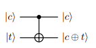

If control = \(|1\rangle\), flip target; else do nothing.

---

What happends when we have controlled-Z gate?
*what is the output function*

---

what happens when we have  \(|t\rangle =  |+\rangle or |-\rangle \)?

---
### Toffoli Gate (CCNOT – Controlled-Controlled-NOT)

The Toffoli gate has **two control qubits** and **one target qubit**. The target flips only if **both** controls are \(|1\rangle\).

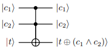

---

**Truth table:**

```math
\begin{array}{ccc|c}
c_1 & c_2 & t & t' \\
\hline
0 & 0 & 0 & 0 \\
0 & 0 & 1 & 1 \\
0 & 1 & 0 & 0 \\
0 & 1 & 1 & 1 \\
1 & 0 & 0 & 0 \\
1 & 0 & 1 & 1 \\
1 & 1 & 0 & 1 \\
1 & 1 & 1 & 0
\end{array}
```

---

**Matrix form** (8×8, basis \(|000\rangle,|001\rangle,\ldots,|111\rangle\)):

```math
\text{Toffoli} = \begin{bmatrix}
1&0&0&0&0&0&0&0\\
0&1&0&0&0&0&0&0\\
0&0&1&0&0&0&0&0\\
0&0&0&1&0&0&0&0\\
0&0&0&0&1&0&0&0\\
0&0&0&0&0&1&0&0\\
0&0&0&0&0&0&0&1\\
0&0&0&0&0&0&1&0
\end{bmatrix}
```

**Why it matters:** Toffoli is **universal for classical reversible computation** – any classical Boolean circuit can be built from Toffoli gates (plus ancilla bits). In particular, it can compute the AND of two bits into a target initially \(|0\rangle\):

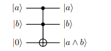

---

### Building an Oracle \(U_f\) with Toffoli

A classical Boolean function \(f:\{0,1\}^n\to\{0,1\}\) can be expressed as a circuit of AND, OR, NOT gates. Since Toffoli can compute AND (with a target initially \(|0\rangle\)) and CNOT can copy bits, we can construct a reversible circuit for \(f\) using Toffoli and CNOT. This circuit implements the unitary:


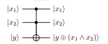


**Example:** \(n=2\), \(f(x)=x_1 \wedge x_2\) (AND). Using Toffoli:


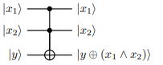


**Phase oracle from Toffoli:** To get the phase oracle \(|x\rangle \to (-1)^{f(x)}|x\rangle\), we replace \(|y\rangle\) with \(|-\rangle\):

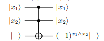


Because of phase kickback, the target \(|-\rangle\) remains \(|-\rangle\) and the controls acquire a phase \((-1)^{x_1\wedge x_2}\).

**General procedure:** Any classical circuit for \(f\) using AND, OR, NOT can be turned into a reversible circuit using Toffoli and CNOT. Then setting the output qubit to \(|-\rangle\) gives the phase oracle.

---

### SWAP Gate

The SWAP gate exchanges the states of two qubits.

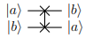


**Truth table:**

\[
\begin{array}{cc|cc}
a & b & a' & b' \\
\hline
0 & 0 & 0 & 0 \\
0 & 1 & 1 & 0 \\
1 & 0 & 0 & 1 \\
1 & 1 & 1 & 1
\end{array}
\]

**Matrix form** (4×4, basis \(|00\rangle,|01\rangle,|10\rangle,|11\rangle\)):

\[
\text{SWAP} = \begin{bmatrix}
1 & 0 & 0 & 0 \\
0 & 0 & 1 & 0 \\
0 & 1 & 0 & 0 \\
0 & 0 & 0 & 1
\end{bmatrix}
\]

**Decomposition using three CNOTs:**

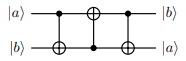

**Verification:**  
1. CNOT(a→b): \(|ab\rangle \to |a, a\oplus b\rangle\)  
2. CNOT(b→a): \(|a, a\oplus b\rangle \to |a\oplus(a\oplus b), a\oplus b\rangle = |b, a\oplus b\rangle\)  
3. CNOT(a→b): \(|b, a\oplus b\rangle \to |b, b\oplus(a\oplus b)\rangle = |b, a\rangle\)

---

### Fredkin Gate (CSWAP – Controlled-SWAP)

The Fredkin gate has **one control qubit** and **two target qubits**. If control = \(|1\rangle\), the two targets are swapped; if control = \(|0\rangle\), they remain unchanged.

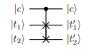

**Truth table:**

\[
\begin{array}{ccc|cc}
c & t_1 & t_2 & t_1' & t_2' \\
\hline
0 & 0 & 0 & 0 & 0 \\
0 & 0 & 1 & 0 & 1 \\
0 & 1 & 0 & 1 & 0 \\
0 & 1 & 1 & 1 & 1 \\
1 & 0 & 0 & 0 & 0 \\
1 & 0 & 1 & 1 & 0 \\
1 & 1 & 0 & 0 & 1 \\
1 & 1 & 1 & 1 & 1
\end{array}
\]

**Matrix form** (8×8):

\[
\text{Fredkin} = \begin{bmatrix}
1&0&0&0&0&0&0&0\\
0&1&0&0&0&0&0&0\\
0&0&1&0&0&0&0&0\\
0&0&0&1&0&0&0&0\\
0&0&0&0&1&0&0&0\\
0&0&0&0&0&0&1&0\\
0&0&0&0&0&1&0&0\\
0&0&0&0&0&0&0&1
\end{bmatrix}
\]

**Relation to SWAP:** If control = \(|1\rangle\), Fredkin acts as SWAP on the two targets. If control = \(|0\rangle\), it acts as identity. Thus Fredkin = controlled-SWAP.

**Universality:** Like Toffoli, Fredkin is also **universal** for **classical** reversible computation and has the additional property of **conserving the number of 1's** (Hamming weight preserving).

---

**PennyLane code:**

```python
import pennylane as qml

dev = qml.device('default.qubit', wires=3)

@qml.qnode(dev)
def toffoli_demo(a, b, t):
    if a: qml.PauliX(0)
    if b: qml.PauliX(1)
    if t: qml.PauliX(2)
    qml.Toffoli(wires=[0,1,2])
    return qml.state()

@qml.qnode(dev)
def swap_demo(a, b):
    dev2 = qml.device('default.qubit', wires=2)
    @qml.qnode(dev2)
    def circuit():
        if a: qml.PauliX(0)
        if b: qml.PauliX(1)
        qml.SWAP(wires=[0,1])
        return qml.state()
    return circuit()

@qml.qnode(dev)
def fredkin_demo(c, t1, t2):
    if c: qml.PauliX(0)
    if t1: qml.PauliX(1)
    if t2: qml.PauliX(2)
    qml.CSWAP(wires=[0,1,2])   # CSWAP = Fredkin
    return qml.state()

print("Toffoli(1,1,0):", toffoli_demo(1,1,0))  # target becomes 1
print("SWAP(1,0):", swap_demo(1,0))            # |01⟩
print("Fredkin(1,1,0):", fredkin_demo(1,1,0)) # swap → t1=0, t2=1
```

---

### Summary: Toffoli, SWAP, Fredkin

- **Toffoli** computes AND and is universal for reversible classical computation. It can be used to build oracles for any Boolean function.
- **SWAP** exchanges two qubits and can be decomposed into three CNOTs.
- **Fredkin** is a controlled-SWAP, also universal and preserves Hamming weight.

These gates are essential building blocks for quantum circuits, especially when implementing classical functions as oracles in algorithms like Deutsch‑Jozsa, Grover, and Shor.

---

## Part 2: Decomposition  and Universality of Quantum Gates


**Idea:** Any complex quantum gate can be written as a sequence of simpler gates.

---

**Single Qubit: Euler Angles**

Any single‑qubit unitary (upto global phase) \(U=R_z(\alpha) R_y(\beta) R_z(\gamma)\)

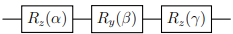

---

 **Two Qubits: Cartan Decomposotion** 
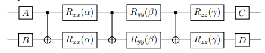
- \(A,B,C,D\) are single‑qubit gates

---

**alternative decomposition (Kraus-Cirac decomposition)**
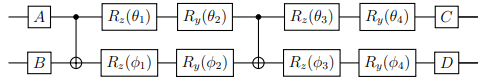

---

**Why Does This Matter?**

- **Real quantum computers** only implement a small set of native gates (e.g., CNOT + single‑qubit rotations)
- **Compilers** can automatically decompose complex gates into allowed ones


---

### Universality of a set of quantum gates

- A set of gates is **universal** if we can build **any possible quantum circuit** using only those gates
- Like NAND gates in classical computing – but quantum gates need to handle **continuous rotations**

---

**{H, S, CNOT} (Clifford Gates) – Not Universal!**
- Gates: \(H\), \(S = \begin{bmatrix}1&0\\0&i\end{bmatrix}\), CNOT  
- These can only map basis states to basis states (up to signs)  
- Cannot create arbitrary rotations → **not universal**

---

**Why not?**

- This set generates the **Clifford group**.  
  - Clifford gates map Pauli operators to Pauli operators under conjugation (e.g., \( H X H = Z \), \( S X S^\dagger = Y \), etc.).
  - The Clifford group on \(n\) qubits is a **finite group** (size \(\sim 2^{n^2+2n}\)).
- Any circuit built only from H, S, and CNOT can only produce a finite set of unitary operations.  
  - You cannot create states like \(|0\rangle + e^{i\pi/4}|1\rangle\) (an eigenstate of the \(T\) gate) exactly or even approximate it arbitrarily well.
  - Without a non‑Clifford gate (e.g., \(T\), or a rotation by an irrational angle), you cannot achieve universality.

---

**What *is* needed for universality?**
A common universal gate set is 
- **{H, T, CNOT}** 
- or **{H, S, T, CNOT}**.  

> Adding any gate outside the Clifford group (e.g., \(T = \sqrt{S}\)) breaks the finite‑group restriction and allows approximation of any unitary via the Solovay–Kitaev theorem.

---


**Summary Table**

| Gate Set | Universal? | Notes |
|----------|------------|-------|
| CNOT + all single‑qubit rotations | ✅ Yes (exact) | Most common theoretical set |
| CNOT + H + T | ✅ Yes (approximate) | Standard discrete universal set |
| Toffoli + H + T | ✅ Yes | Also universal |
| Toffoli + H | ❌ No | Missing non‑Clifford rotation (e.g., T) |
| H + S + CNOT (Clifford) | ❌ No | Only generates a finite group |
| NAND (classical) | ✅ Yes (classical) | Only for bits, not qubits |

---

**Key Takeaway**

> **Universality** requires either **all continuous single‑qubit rotations** or a **discrete set containing a non‑Clifford gate** like \(T\).  
> **Toffoli + H** is not enough – you need an extra ingredient.

---

### Kitaev’s Circuit Simulation Theorem (Solovay–Kitaev) 

**The Big Picture**

Suppose you have a **finite set of basic quantum gates** (like Hadamard, T, and CNOT) that can eventually create any quantum operation.  
You want to build a specific unitary gate \(U\) (e.g., a rotation by 1 degree).  
The theorem tells you: **you can approximate \(U\) to very high accuracy using surprisingly few gates from your set.**

---

**The Trade‑off: Error vs. Number of Gates**

Let:
- \(\varepsilon\) = the maximum error you allow (e.g., \(\varepsilon = 0.001\)).
- \(L\) = the number of gates in the sequence that approximates \(U\).

The theorem states that you can always find a sequence with  

\[
L = O\!\left(\log^c\frac{1}{\varepsilon}\right)
\]

where \(c\) is a small constant (typically \(c \approx 1\)–\(4\) for practical cases).

---

**Key point**

- **Exponential improvement in error requires only a polynomial (in fact, polylogarithmic) increase in gate count.**  
  To make the error ten times smaller, you only need to add a *constant* number of extra gates (because \(\log(1/\varepsilon)\) grows very slowly).

- **Example:**  
  If a certain approximation uses 1000 gates to achieve error \(10^{-3}\), then to achieve error \(10^{-6}\) (1000 times smaller) you might need only about \(1000 \times \log^c(1000) \approx\) a few thousand gates, not a million.

---

**Why is this surprising?**  

Without the theorem, you might fear that reducing error by a factor of \(k\) would require \(k\) times more gates (linear overhead).  
Kitaev (and later Solovay) proved that quantum gates are much more efficient: you can “zoom in” on the desired operation using a recursive, self‑similar construction – similar to how a fractal fills space with a few simple rules.

---

**Formal Statement (for the interested student)**

> **Solovay–Kitaev Theorem**  
> Let \(G\) be a finite set of gates that is universal for \(SU(d)\) (i.e., any unitary can be approximated arbitrarily well).  
> Then there exists a constant \(c\) and an algorithm that, for any target \(U \in SU(d)\) and any \(\varepsilon > 0\), produces a sequence of gates from \(G\) of length \(L\) such that  
> \[
> \|U - V\| \le \varepsilon \quad\text{and}\quad L = O\!\left(\log^c\frac{1}{\varepsilon}\right).
> \]

Here \(\|\cdot\|\) is the operator norm (distance between unitaries).

---

**Take‑home message for quantum computing**

- **You don’t need an infinite hardware instruction set.** A few basic gates are enough to build any quantum circuit efficiently.
- **The overhead for high precision is very mild** – a key reason why fault‑tolerant quantum computing is possible in theory.

---
Below is a **complete, step‑by‑step teaching module** that builds from the basic oracle model to the Deutsch and Deutsch–Jozsa algorithms. It assumes the student has seen basic quantum circuits and superposition.

---

# Part 2: The Quantum Algorithms – Oracle Model

## The Oracle \(U_f\)

A quantum oracle is a black box that implements a function \(f : \{0,1\}^n \to \{0,1\}\) as a unitary transformation:

\[
U_f |x\rangle |y\rangle = |x\rangle |y \oplus f(x)\rangle
\]

Here \(x\) is \(n\) qubits (the input register), \(y\) is a single qubit (the output register), and \(\oplus\) is addition modulo 2.

---

**Circuit representation (as controlled operaiton or more generic way)**
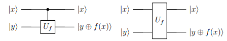

---

## Phase kickback – the key trick

If we prepare the output qubit in the state \(|-\rangle = \frac{|0\rangle - |1\rangle}{\sqrt{2}}\), a remarkable thing happens:

---

\[
\begin{aligned}
U_f |x\rangle |-\rangle 
&= U_f |x\rangle \frac{|0\rangle - |1\rangle}{\sqrt{2}} \\
&= \frac{1}{\sqrt{2}} \big( U_f|x\rangle|0\rangle - U_f|x\rangle|1\rangle \big) \\
&= \frac{1}{\sqrt{2}} \big( |x\rangle|0\oplus f(x)\rangle - |x\rangle|1\oplus f(x)\rangle \big) \\
&= \frac{1}{\sqrt{2}} |x\rangle \big( |f(x)\rangle - |1-f(x)\rangle \big)
\end{aligned}
\]

---

\[
\frac{1}{\sqrt{2}} |x\rangle \big( |f(x)\rangle - |1-f(x)\rangle \big)
\]
Now examine the two possibilities:

* If \(f(x)=0\): \(|f(x)\rangle = |0\rangle\), \(|1-f(x)\rangle = |1\rangle\) → \(\frac{|0\rangle - |1\rangle}{\sqrt{2}} = |-\rangle\)
* If \(f(x)=1\): \(|f(x)\rangle = |1\rangle\), \(|1-f(x)\rangle = |0\rangle\) → \(\frac{|1\rangle - |0\rangle}{\sqrt{2}} = -|-\rangle\)

Thus:

\[
U_f |x\rangle |-\rangle = (-1)^{f(x)} |x\rangle |-\rangle
\]

**Interpretation:** The output qubit stays \(|-\rangle\) and a **phase** \((-1)^{f(x)}\) is kicked back onto the input register. 

---

From now on we can ignore the output qubit and simply write:

\[
\text{Oracle effect: } |x\rangle \;\xrightarrow{\;U_f\;}\; (-1)^{f(x)} |x\rangle
\]

---

## Deutsch Algorithm (1‑bit function)

We are given a function \(f : \{0,1\} \to \{0,1\}\). It is **promised** to be either:

* **Constant**: \(f(0)=f(1)\) (both 0 or both 1), or
* **Balanced**: \(f(0) \neq f(1)\) (one 0, one 1).

**Goal:** Determine which with only **one** query to the oracle.

---

**Classical difficulty**  

Classically you need two queries: check \(f(0)\) and \(f(1)\). 

---

**Quantum implementation**
One query suffices. How?


---

1. **Initial state:** \(|0\rangle|1\rangle\)


2. **Apply \(H\) to both qubits:**  
   \[
   |0\rangle|1\rangle \;\xrightarrow{H\otimes H}\; \left(\frac{|0\rangle+|1\rangle}{\sqrt{2}}\right) \left(\frac{|0\rangle-|1\rangle}{\sqrt{2}}\right) = |+\rangle|-\rangle
   \]

---

3. **Apply oracle \(U_f\) (phase kickback):**  
   The input register \(|x\rangle = |+\rangle\) becomes:
   \[
   \frac{1}{\sqrt{2}}\big( (-1)^{f(0)}|0\rangle + (-1)^{f(1)}|1\rangle \big) |-\rangle
   \]

---


4. **Apply Hadamard on the first qubit:**  
   Recall \(H|0\rangle = |+\rangle,\; H|1\rangle = |-\rangle\). So:
   \[
   H \left( \frac{(-1)^{f(0)}|0\rangle + (-1)^{f(1)}|1\rangle}{\sqrt{2}} \right) 
   = \frac{(-1)^{f(0)}|+\rangle + (-1)^{f(1)}|-\rangle}{\sqrt{2}}
   \]
   Rearranging:
   \[
   = \frac{(-1)^{f(0)}+(-1)^{f(1)}}{2}\,|0\rangle \;+\; \frac{(-1)^{f(0)}-(-1)^{f(1)}}{2}\,|1\rangle
   \]

---

5. **Measurement of the first qubit:**
   - **Constant** case: \(f(0)=f(1)\) ⇒ \((-1)^{f(0)} = (-1)^{f(1)}\).  
     Then amplitude of \(|1\rangle\) = 0, amplitude of \(|0\rangle\) = \(\pm 1\).  
     → **Always measure \(|0\rangle\)**.
   - **Balanced** case: \(f(0)\neq f(1)\) ⇒ \((-1)^{f(0)} = -(-1)^{f(1)}\).  
     Then amplitude of \(|0\rangle\) = 0, amplitude of \(|1\rangle\) = \(\pm 1\).  
     → **Always measure \(|1\rangle\)**.

**Conclusion:** One measurement tells us the answer with certainty.

---

**Quantum circuit**

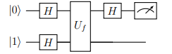

(Here the second qubit starts in \(|1\rangle\) and is put into \(|-\rangle\) by the first \(H\).  \(|-\rangle\) is used for phase kickback.)

---

### Deutsch–Jozsa Algorithm (n‑bit function)

Now \(f : \{0,1\}^n \to \{0,1\}\) with the promise that \(f\) is either **constant** (all outputs equal) or **balanced** (exactly half the inputs give 0, half give 1).  
**Goal:** Decide constant vs. balanced with **one** quantum query (classically you may need \(2^{n-1}+1\) queries).

---

#### Step‑by‑step

1. **Initial state:** \(|0\rangle^{\otimes n} |1\rangle\)

---

2. **Apply \(H^{\otimes n}\) on the top register and \(H\) on the bottom:**  
   Top becomes \(\frac{1}{\sqrt{2^n}}\sum_{x\in\{0,1\}^n} |x\rangle\), bottom becomes \(|-\rangle\).  
   \[
   |\psi_0\rangle = \frac{1}{\sqrt{2^n}}\sum_{x=0}^{2^n-1} |x\rangle |-\rangle
   \]

---

3. **Apply oracle \(U_f\) (phase kickback):**  
   \[
   |\psi_1\rangle = \frac{1}{\sqrt{2^n}}\sum_{x} (-1)^{f(x)} |x\rangle |-\rangle
   \]

---

4. **Apply \(H^{\otimes n}\) to the top register:**  
   The Hadamard transform on an \(n\)-qubit basis state:
   \[
   H^{\otimes n}|x\rangle = \frac{1}{\sqrt{2^n}}\sum_{z\in\{0,1\}^n} (-1)^{x\cdot z} |z\rangle
   \]
   where \(x\cdot z = \sum_{i=1}^n x_i z_i \mod 2\) (bitwise dot product).  
   Thus:
   \[
   H^{\otimes n}|\psi_1\rangle = \frac{1}{2^n}\sum_{x,z} (-1)^{f(x) + x\cdot z} |z\rangle
   \]

   The amplitude of the **all‑zero** state \(|z=0\rangle\) is:
   \[
   \frac{1}{2^n}\sum_{x} (-1)^{f(x)}
   \]

---

5. **Measure the top register in the computational basis.**  
   - **If \(f\) is constant**: \((-1)^{f(x)} = \pm 1\) for all \(x\).  
     Then amplitude of \(|0\rangle^{\otimes n} = \frac{1}{2^n}\sum_{x} (\pm 1) = \pm 1\).  
     All other amplitudes are 0.  
     → **We measure \(|0\rangle^{\otimes n}\) with certainty**.
   - **If \(f\) is balanced**: Exactly half the \(x\) give \(+1\), half give \(-1\).  
     Then \(\sum_{x} (-1)^{f(x)} = 0\), so amplitude of \(|0\rangle^{\otimes n} = 0\).  
     The probability to measure \(|0\rangle^{\otimes n}\) is zero.  
     → **We measure some non‑zero bitstring**.

**Conclusion:**  
- Measure \(|0\ldots0\rangle\) → \(f\) is constant.  
- Measure anything else → \(f\) is balanced.

---

#### A concrete 2‑bit example

Let’s take \(n=2\) and a balanced function:  
\(f(00)=0,\; f(01)=1,\; f(10)=1,\; f(11)=0\) (two 0’s, two 1’s).  

The state after the oracle is:
\[
\frac{1}{2}\big( +|00\rangle -|01\rangle -|10\rangle +|11\rangle \big) |-\rangle
\]

---

Apply \(H^{\otimes 2}\):

- \(H^{\otimes 2}|00\rangle = \frac{1}{2}(|00\rangle+|01\rangle+|10\rangle+|11\rangle)\)
- \(H^{\otimes 2}|01\rangle = \frac{1}{2}(|00\rangle-|01\rangle+|10\rangle-|11\rangle)\)
- \(H^{\otimes 2}|10\rangle = \frac{1}{2}(|00\rangle+|01\rangle-|10\rangle-|11\rangle)\)
- \(H^{\otimes 2}|11\rangle = \frac{1}{2}(|00\rangle-|01\rangle-|10\rangle+|11\rangle)\)

---

Summing with the coefficients \((+1, -1, -1, +1)\):

- Coefficient of \(|00\rangle\): \(\frac{1}{4}(1-1-1+1) = 0\)
- Coefficient of \(|01\rangle\): \(\frac{1}{4}(1+1-1-1) = 0\)
- Coefficient of \(|10\rangle\): \(\frac{1}{4}(1-1+1-1) = 0\)
- Coefficient of \(|11\rangle\): \(\frac{1}{4}(1+1+1+1) = 1\)

So the state becomes \(|11\rangle|-\rangle\). Measurement yields \(|11\rangle\) (non‑zero) → balanced. ✅

---

### Summary – Why is this remarkable?

| Algorithm | Classical queries (worst case) | Quantum queries |
|-----------|-------------------------------|------------------|
| Deutsch   | 2                             | 1                |
| Deutsch–Jozsa | \(2^{n-1}+1\)                | 1                |

The quantum solution uses **superposition** and **phase kickback** to evaluate all inputs simultaneously, then **interference** (via Hadamard) to extract the global property “constant or balanced” in a single measurement.

---


## Bernstein–Vazirani Algorithm

In Deutsch-Jozsa algorithm,
- Measure \(|0\ldots0\rangle\) → \(f\) is constant.  
- Measure anything else → \(f\) is balanced.

**Can we have more information about the function?**

---

**Problem statement**

We are given an unknown **hidden string** \(s \in \{0,1\}^n\).  
A quantum oracle computes the function  

\[
f(x) = s \cdot x = \bigoplus_{i=1}^{n} s_i x_i \quad (\text{dot product modulo }2).
\]

**Goal:** Determine \(s\) using as few oracle queries as possible.

---

Classically, one query gives only one bit \(f(x)\); to find all \(n\) bits of \(s\) you need at least \(n\) queries (e.g., query \(x = 1,2,4,\dots\)).  

**On quantum circuit, a single query suffices!**

---

**Circuit and phase oracle**

Because \(f(x) = s\cdot x\), the phase kickback trick gives  

\[
U_f |x\rangle|-\rangle = (-1)^{s\cdot x} |x\rangle|-\rangle.
\]

Thus the oracle effectively applies the phase \((-1)^{s\cdot x}\) to the input register.

The circuit is **identical** to the Deutsch–Jozsa circuit:


---


### A concrete 2‑bit example (\(s = 10\))

Let \(n=2\) and \(s = 10\) (i.e., \(s_1=1, s_2=0\)).  
Then \(f(x) = x_1\) (the first bit).  
Truth table:  
\(f(00)=0,\; f(01)=0,\; f(10)=1,\; f(11)=1\).

---

**Step‑by‑step calculation:**

1. **Initial state:** \(|00\rangle|1\rangle\)

---

2. **Apply \(H^{\otimes 2}\) on top, \(H\) on bottom:**  
   \[
   \frac{1}{2}\big(|00\rangle+|01\rangle+|10\rangle+|11\rangle\big) \otimes |-\rangle
   \]

---

3. **Oracle phase kickback:**  
   Each \(|x\rangle\) gets factor \((-1)^{f(x)}\):  
   \[
   \frac{1}{2}\big( +|00\rangle + |01\rangle - |10\rangle - |11\rangle \big)|-\rangle
   \]

---

4. **Apply \(H^{\otimes 2}\) to the top register.**  
   Instead of doing the full sum, we use the known identity:  
   \[
   H^{\otimes n} \left( \frac{1}{\sqrt{2^n}} \sum_{x} (-1)^{s\cdot x} |x\rangle \right) = |s\rangle.
   \]  
   Here the normalisation of our state is \(\frac{1}{2}\), which is exactly \(\frac{1}{\sqrt{2^n}}\) for \(n=2\).  
   So after \(H^{\otimes 2}\) the state becomes \(|10\rangle\).

---

5. **Measurement of the top register** yields \(10\) with certainty.

Thus one run reveals the whole hidden string \(s\).

---

**Why the identity holds: Working with Hadamard gates**

For any \(s\):
\[
H^{\otimes n} |x\rangle = \frac{1}{\sqrt{2^n}} \sum_{z} (-1)^{x\cdot z} |z\rangle.
\]
Therefore,
\[
H^{\otimes n} \left( \frac{1}{\sqrt{2^n}} \sum_{x} (-1)^{s\cdot x} |x\rangle \right)
= \frac{1}{2^n} \sum_{x,z} (-1)^{s\cdot x + x\cdot z} |z\rangle
= \frac{1}{2^n} \sum_{z} \left( \sum_{x} (-1)^{x\cdot (s\oplus z)} \right) |z\rangle.
\]
The inner sum is \(2^n\) if \(s\oplus z = 0\) (i.e., \(z=s\)), and \(0\) otherwise. Hence the result is \(|s\rangle\).

---

## Simon’s Problem and Algorithm

We are given a function \(f: \{0,1\}^n \to \{0,1\}^m\) (usually \(m \ge n-1\)) with a **promise**:  
There exists a **non‑zero** string \(s \in \{0,1\}^n\) such that  

\[
f(x) = f(y) \;\iff\; y = x \;\text{or}\; y = x \oplus s.
\]

In other words, \(f\) is **two‑to‑one** with period \(s\) (the case \(s=0\) would be one‑to‑one, but we exclude it).  
**Goal:** Find the hidden period \(s\) using as few queries as possible.

---

Classically, you need to find a collision \(f(x)=f(x\oplus s)\). The best classical algorithm takes \(\Omega(2^{n/2})\) queries (birthday bound).  

**Quantum; Simon’s algorithm finds \(s\) with only \(O(n)\) queries – an exponential speedup.**

---

**Oracle and circuit**

The oracle now works on two registers:  
\[
U_f |x\rangle|0\rangle = |x\rangle|f(x)\rangle.
\]
Note: we do **not** use the \(|-\rangle\) trick here; instead we use the **second register** to store \(f(x)\) and then measure it.

---

The circuit (repeated \(O(n)\) times):

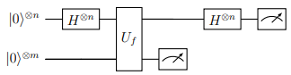

After the first Hadamard we have 
\[
\frac{1}{\sqrt{2^n}}\sum_{x} |x\rangle|0\rangle.
\]  
The oracle produces 
\[
\frac{1}{\sqrt{2^n}}\sum_{x} |x\rangle|f(x)\rangle.
\]

Now we **measure the second register**. Suppose we obtain a value \(f(x_0)\). Because \(f\) is two‑to‑one, the first register collapses to the superposition  

\[
\frac{1}{\sqrt{2}}\big( |x_0\rangle + |x_0 \oplus s\rangle \big).
\]

---

**Applying the final Hadamard**

Apply \(H^{\otimes n}\) to the first register. Using the identity \(H^{\otimes n}|x\rangle = \frac{1}{\sqrt{2^n}}\sum_{z} (-1)^{x\cdot z}|z\rangle\):

\[
H^{\otimes n} \left( \frac{1}{\sqrt{2}}(|x_0\rangle + |x_0\oplus s\rangle) \right)
= \frac{1}{\sqrt{2^{n+1}}} \sum_{z} \big( (-1)^{x_0\cdot z} + (-1)^{(x_0\oplus s)\cdot z} \big) |z\rangle.
\]

Now \((x_0\oplus s)\cdot z = x_0\cdot z \oplus s\cdot z\). Hence:

\[
(-1)^{x_0\cdot z} + (-1)^{x_0\cdot z \oplus s\cdot z}
= (-1)^{x_0\cdot z}\big(1 + (-1)^{s\cdot z}\big).
\]

- If \(s\cdot z = 0 \pmod{2}\), the bracket is \(1+1=2\).  
- If \(s\cdot z = 1\), the bracket is \(1-1=0\).

Therefore the final state has **non‑zero amplitude only for those \(z\) such that \(s\cdot z = 0\)**. Moreover, all such \(z\) appear with equal probability.

When we measure the first register, we obtain a random \(z\) satisfying \(z\cdot s = 0\).

---

After many runs, we collect several \(z\) values that satisfy \(z\cdot s=0\).

Solve equation to find $s$.

---

### A concrete 2‑bit example (\(s = 11\))

Take \(n=2\), \(s=11\). Define \(f\) as:  

\(f(00)=a,\; f(11)=a\)  
\(f(01)=b,\; f(10)=b\)  
with \(a\neq b\).

**Step‑by‑step:**

1. **Initial:** \(|00\rangle|0\rangle\) (the second register has enough qubits to hold \(a,b\); we don’t need to specify \(m\)).

2. **Hadamard on first register:**  
   \[
   \frac{1}{2}\big(|00\rangle+|01\rangle+|10\rangle+|11\rangle\big)|0\rangle
   \]

3. **Oracle:**  
   \[
   \frac{1}{2}\big(|00\rangle|a\rangle + |01\rangle|b\rangle + |10\rangle|b\rangle + |11\rangle|a\rangle\big)
   \]

4. **Measure second register.**  
   - If we get \(a\): first register collapses to \(\frac{1}{\sqrt{2}}(|00\rangle+|11\rangle)\).  
   - If we get \(b\): collapses to \(\frac{1}{\sqrt{2}}(|01\rangle+|10\rangle)\).

5. **Apply \(H^{\otimes 2}\) to the first register.**  
   - For the state \(\frac{1}{\sqrt{2}}(|00\rangle+|11\rangle)\):  
     \[
     H^{\otimes 2}|00\rangle = \frac{1}{2}(|00\rangle+|01\rangle+|10\rangle+|11\rangle)
     \]  
     \[
     H^{\otimes 2}|11\rangle = \frac{1}{2}(|00\rangle-|01\rangle-|10\rangle+|11\rangle)
     \]  
     Sum = \(\frac{1}{\sqrt{2}}(|00\rangle+|11\rangle)\): this means we only get \(z=00\) or \(11\)

---


**Let's verify:** the condition \(s\cdot z=0\): for \(s=11\), \(z_1+z_2=0 \mod 2\) ⇒ \(z_1=z_2\). So allowed \(z\) are indeed \(00\) and \(11\). 

---

   - For the other branch \(\frac{1}{\sqrt{2}}(|01\rangle+|10\rangle)\):  
     \(H^{\otimes 2}|01\rangle = \frac{1}{2}(|00\rangle-|01\rangle+|10\rangle-|11\rangle)\)  
     \(H^{\otimes 2}|10\rangle = \frac{1}{2}(|00\rangle+|01\rangle-|10\rangle-|11\rangle)\)  
     Sum = \(\frac{1}{2\sqrt{2}}[2|00\rangle + 0|01\rangle + 0|10\rangle -2|11\rangle] = \frac{1}{\sqrt{2}}(|00\rangle-|11\rangle)\).  
     Measuring yields either \(|00\rangle\) or \(|11\rangle\) with equal probability.

---

**Interpretation:** After many runs, we collect several \(z\) values that satisfy \(z\cdot s=0\). 
   - For \(n=2\), the only non‑trivial constraint comes from \(z=11\): 
     - \(11\cdot s = s_1+s_2=0 \Rightarrow s_1=s_2\).
   - Since \(s\neq00\); (in Simon’s problem, the promise is that there exists a **non‑zero string** $s$), we deduce \(s=11\).

---

### The full Simon's algorithm analysis

Repeat the above procedure \(O(n)\) times. Each run gives a random \(z\) (non‑zero with good probability) satisfying \(z\cdot s=0\). Collect enough linearly independent \(z\) (over \(\mathbb{F}_2\)) to form a system of equations that determines \(s\) uniquely. Solve (e.g., by Gaussian elimination) to recover \(s\).

**Query complexity:** Each run uses one oracle call, and \(O(n)\) runs suffice → exponential speedup over classical \(\Omega(2^{n/2})\).

---

## Summary of all four algorithms

| Algorithm | Problem | Classical queries | Quantum queries |
|-----------|---------|-------------------|------------------|
| Deutsch | 1‑bit constant vs balanced | 2 | 1 |
| Deutsch–Jozsa | \(n\)‑bit constant vs balanced | \(2^{n-1}+1\) | 1 |
| Bernstein–Vazirani | Find hidden dot‑product string | \(n\) | 1 |
| Simon | Find hidden period of a 2‑to‑1 function | \(\Theta(2^{n/2})\) | \(O(n)\) |

Each algorithm uses superposition and interference to extract global properties of a function with exponentially fewer queries than the best classical method.

---

This completes the set of foundational quantum algorithms. You are now ready to understand Shor’s factoring algorithm, which builds on the same principles (phase estimation, period finding).

---


1. **Deutsch algorithm** – Work out the case where \(f(0)=1, f(1)=0\) (balanced). Show that the final measurement yields \(|1\rangle\).
2. **2‑bit constant** – Repeat the 2‑bit calculation for a constant function, e.g. \(f(x)=0\) for all \(x\). Verify that the final state is \(|00\rangle|-\rangle\).
3. **Why the \(|-\rangle\) state?** – Try running the Deutsch–Jozsa circuit with the bottom qubit starting in \(|0\rangle\) instead of \(|1\rangle\). Why does it fail?

2. **Balanced function for \(n=2\)** – Choose \(f(00)=0, f(01)=1, f(10)=0, f(11)=1\) (balanced). Simulate the Deutsch‑Jozsa circuit step‑by‑step (by hand or with PennyLane) and show that you never measure \(|00\rangle\).

3. **Bernstein‑Vazirani** – For \(n=3\), hidden string \(s=101\), compute \(f(x)=s\cdot x\) for all \(x\) and then run the quantum circuit (conceptually) to see why the output is \(|101\rangle\).

1. **Bernstein–Vazirani** – Work out the \(n=3\) case for \(s=101\). Show that after the final Hadamard you measure \(101\).
2. **Simon’s algorithm** – Suppose \(n=3\) and \(s=110\). List all possible \(z\) values that can be measured. Why is it impossible to get \(z=001\)?
3. **Why measurement?** – In Simon’s algorithm, why do we measure the second register before the final Hadamard? What would happen if we didn’t measure it?
4. **Classical vs quantum** – For \(n=20\), how many classical queries are needed on average to find a collision? How many quantum queries does Simon’s algorithm use? Compute the ratio.
   
5. **AI exercise** – Use an AI to generate a constant oracle for \(n=4\) and a balanced oracle. Then write a PennyLane script that runs Deutsch‑Jozsa on both and prints the measurement outcomes.

6. **Challenge** – Implement Simon’s algorithm for \(n=2\) with period \(s=01\) in PennyLane.


---

## Next Lecture Preview

**Shor's integer factoring algorithm** 