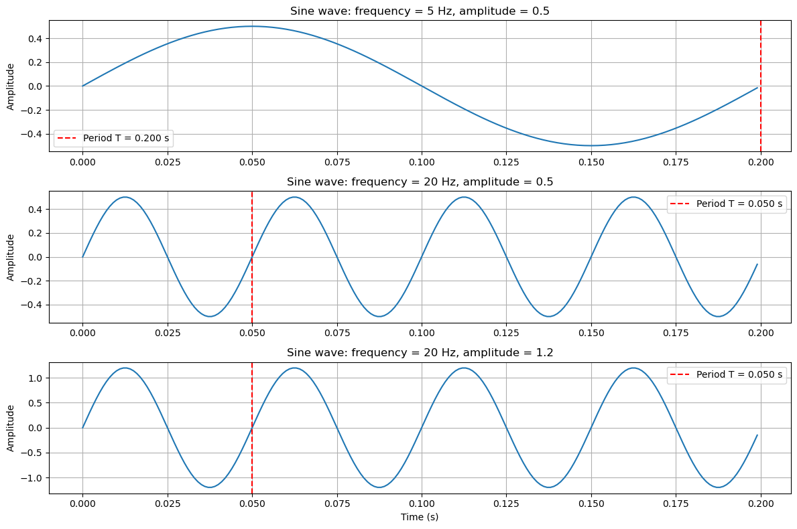
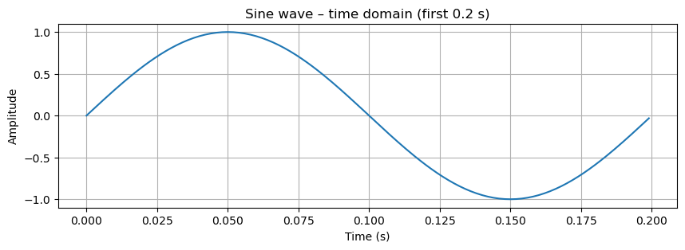
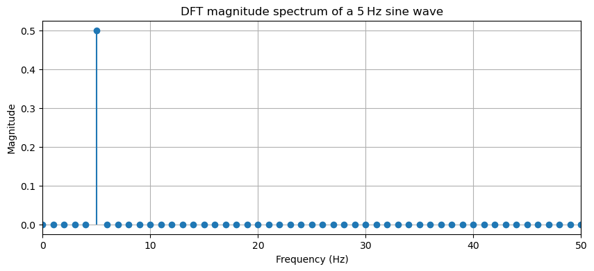
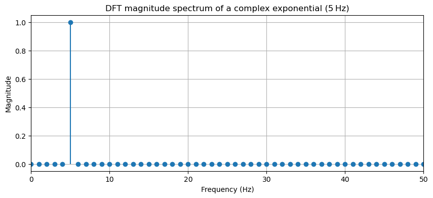
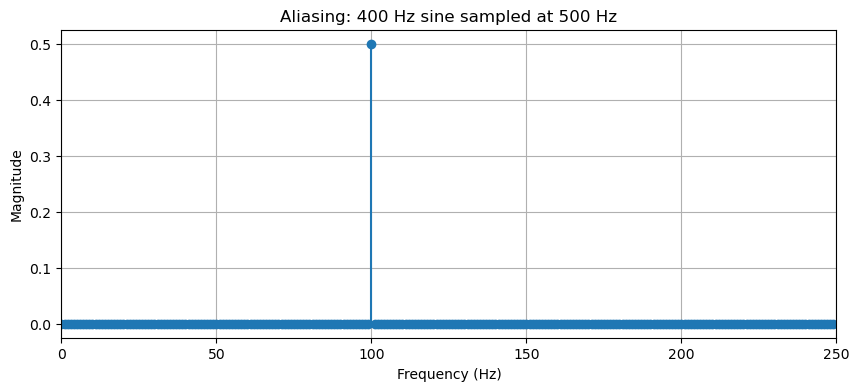
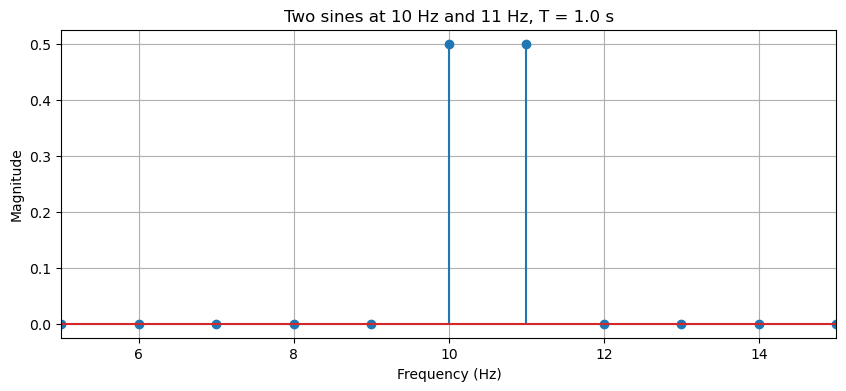
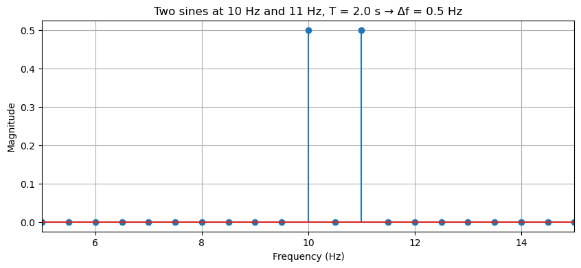

# Understanding the DFT: From Time Domain to Frequency Domain

## 0. Foundations: Frequency, Period, and Magnitude

Before diving into the Discrete Fourier Transform (DFT), we need a clear understanding of three basic signal properties: 
- **frequency**, 
- **period**, 
- and **magnitude** (or amplitude). 

These concepts are the building blocks of the frequency domain.

---

### Period and Frequency

A **periodic signal** repeats itself after a fixed time interval called the **period** $T$ (measured in seconds). 

The **frequency** $f$ is the number of cycles that occur per second, measured in **Hertz (Hz)**. They are inversely related:

$$
f = \frac{1}{T}, \qquad T = \frac{1}{f}.
$$

---

For example, a sine wave with period $T = 0.02$ s has frequency $f = 50$ Hz – it completes 50 cycles every second.

---

Sometimes we use **angular frequency** $\omega$, measured in radians per second:

$$
\omega = 2\pi f = \frac{2\pi}{T}.
$$

This notation simplifies many formulas, e.g., a pure sinusoid can be written as $\sin(\omega t)$ or $\cos(\omega t)$.

---

### Magnitude (Amplitude)

The **magnitude** (or **amplitude**) of a signal describes its strength. 

For a sine wave $A \sin(2\pi f t)$, 
- the amplitude $A$ is the peak deviation from zero. 

---

In the frequency domain, the DFT shows **how much** of each frequency is present – that “how much” is the magnitude.

- A larger amplitude → a taller peak in the spectrum.
- A real sine wave of amplitude $A$ produces two DFT peaks, each of magnitude $A/2$ (because a real sine is the sum of two complex exponentials, as explained later).

---

### Why These Matter for the DFT

The DFT converts a time-domain signal into a set of complex coefficients $y_k$. For each frequency index $k$:

- The **magnitude** $|y_k|$ tells you the amplitude of that frequency component.
- The **phase** (angle of $y_k$) tells you the time shift of that component.
- The **frequency** associated with index $k$ is $f_k = k \cdot \frac{f_s}{N}$, where $f_s$ is the sampling rate and $N$ the number of samples.

---

Understanding period, frequency, and magnitude is essential to correctly interpret DFT plots and to avoid common pitfalls like aliasing (where a high frequency masquerades as a low one due to insufficient sampling).

---

> **In the Quantum Fourier Transform (QFT):** The same fundamental ideas of frequency and magnitude appear, but in a quantum mechanical setting. QFT acts on probability amplitudes encoded in qubit states, revealing periodic structures in quantum algorithms (e.g., Shor’s algorithm). 

### 0.1 Seeing Period, Frequency, and Magnitude in Action


```python

import numpy as np
import matplotlib.pyplot as plt

# Common parameters
fs = 1000          # sampling frequency (Hz)
duration = 0.2     # short duration to see individual cycles (seconds)
t = np.linspace(0, duration, int(fs * duration), endpoint=False)

# 1) Low frequency, low magnitude
f1, A1 = 5, 0.5
sine1 = A1 * np.sin(2 * np.pi * f1 * t)

# 2) Higher frequency, same magnitude
f2, A2 = 20, 0.5
sine2 = A2 * np.sin(2 * np.pi * f2 * t)

# 3) Same frequency as (2) but larger magnitude
f3, A3 = 20, 1.2
sine3 = A3 * np.sin(2 * np.pi * f3 * t)

# Plot all three
plt.figure(figsize=(12, 8))

plt.subplot(3, 1, 1)
plt.plot(t, sine1)
plt.title(f'Sine wave: frequency = {f1} Hz, amplitude = {A1}')
plt.ylabel('Amplitude')
plt.grid(True)
# Mark one period
T1 = 1 / f1
plt.axvline(x=T1, color='r', linestyle='--', label=f'Period T = {T1:.3f} s')
plt.legend()

plt.subplot(3, 1, 2)
plt.plot(t, sine2)
plt.title(f'Sine wave: frequency = {f2} Hz, amplitude = {A2}')
plt.ylabel('Amplitude')
plt.grid(True)
T2 = 1 / f2
plt.axvline(x=T2, color='r', linestyle='--', label=f'Period T = {T2:.3f} s')
plt.legend()

plt.subplot(3, 1, 3)
plt.plot(t, sine3)
plt.title(f'Sine wave: frequency = {f3} Hz, amplitude = {A3}')
plt.xlabel('Time (s)')
plt.ylabel('Amplitude')
plt.grid(True)
plt.axvline(x=T2, color='r', linestyle='--', label=f'Period T = {T2:.3f} s')
plt.legend()

plt.tight_layout()
plt.show()
```


    

    


## 1. Introduction

Signals can be viewed in two complementary ways:
- **Time domain** – how the signal changes over time.
- **Frequency domain** – which frequencies make up the signal and with what amplitudes.

The **Discrete Fourier Transform (DFT)** converts a sampled time‑domain signal into its frequency components. In this notebook we will build intuition by experimenting with simple signals.

---
###  Quick Math Review 

The DFT maps a sequence of $N$ complex numbers $x_0, x_1, \ldots, x_{N-1}$ to another sequence $y_0, y_1, \ldots, y_{N-1}$:

$$
y_k = \frac{1}{\sqrt{N}} \sum_{j=0}^{N-1} x_j \, e^{-2\pi i \, j k / N}
$$

- **Inverse DFT** uses $+$ sign in exponent and same normalization.
- **Complexity:** Naïve computation takes $O(N^2)$ operations.
- **Fast Fourier Transform (FFT):** $O(N \log N)$ classical algorithm.

---

## 2. Our First Signal: A Pure Sine Wave

We generate a sine wave of frequency $f_0 = 5$ Hz, sampled at $f_s = 1000$ Hz for 1 second.


```python
import numpy as np
import matplotlib.pyplot as plt
import ipywidgets as widgets
from IPython.display import display, clear_output
%matplotlib inline
```


```python
fs = 1000          # sampling frequency (Hz)
T = 1.0            # duration (seconds)
N = int(fs * T)    # number of samples
t = np.linspace(0, T, N, endpoint=False)   # time vector

f0 = 5             # frequency of the sine (Hz)
sine = np.sin(2 * np.pi * f0 * t)

# Plot the first 0.2 seconds
plt.figure(figsize=(10, 3))
plt.plot(t[:200], sine[:200])
plt.title('Sine wave – time domain (first 0.2 s)')
plt.xlabel('Time (s)')
plt.ylabel('Amplitude')
plt.grid(True)
plt.show()
```


    

    


### 2.1 Compute and plot the DFT

We use `numpy.fft.fft` and normalise the magnitude by the number of samples `N` to obtain the actual amplitude of the sinusoidal components.

> **Important:** For a real sine wave $\sin(2\pi f_0 t)$, the DFT yields two peaks: one at $+f_0$ and one at $-f_0$ (or, in the one‑sided spectrum, reflected). Each peak has magnitude $A/2$ where $A$ is the sine amplitude. We will see why.


```python
X = np.fft.fft(sine)
# One-sided spectrum (positive frequencies only)
freq = np.fft.fftfreq(N, 1/fs)[:N//2]
mag = np.abs(X[:N//2]) / N   # normalised magnitude

plt.figure(figsize=(10, 4))
plt.stem(freq, mag, basefmt=" ")
plt.xlim(0, 50)   # show up to 50 Hz
plt.xlabel('Frequency (Hz)')
plt.ylabel('Magnitude')
plt.title('DFT magnitude spectrum of a 5 Hz sine wave')
plt.grid(True)
plt.show()
```


    

    


**Observation:** The peak is at 5 Hz with magnitude **0.5**.  
Why 0.5? Because $\sin(2\pi f_0 t) = \frac{e^{j2\pi f_0 t} - e^{-j2\pi f_0 t}}{2j}$.  
Each complex exponential has amplitude $1/2$. The DFT (normalised) shows that half‑amplitude contribution.

## 3. Complex Exponential vs. Real Sine

A complex exponential $e^{j2\pi f_0 t}$ is a single rotating phasor. Its DFT should show **one peak** of magnitude **1**.


```python
complex_exp = np.exp(1j * 2 * np.pi * f0 * t)

Xc = np.fft.fft(complex_exp)
mag_c = np.abs(Xc[:N//2]) / N

plt.figure(figsize=(10, 4))
plt.stem(freq, mag_c, basefmt=" ")
plt.xlim(0, 50)
plt.xlabel('Frequency (Hz)')
plt.ylabel('Magnitude')
plt.title('DFT magnitude spectrum of a complex exponential (5 Hz)')
plt.grid(True)
plt.show()
```


    

    


Now we see a single peak of magnitude **1** at 5 Hz.  
This illustrates that a real sinusoid is the sum of two complex exponentials (positive and negative frequency), hence the factor $1/2$.

## 4. The Clock Mechanism: Visualising Period and Frequency

Imagine a hand on a clock rotating with constant angular speed. The projection of that hand onto the horizontal axis gives a cosine wave, onto the vertical axis a sine wave. The **angular frequency** $\omega = 2\pi f$ determines how many full rotations (periods) occur per second.

Let's create a small animation to see the relationship between the rotating phasor and the resulting sinusoidal signal.


```python
from matplotlib.animation import FuncAnimation
from IPython.display import HTML

# Parameters for the animation
f_anim = 1          # 1 Hz (one full rotation per second)
duration = 2.0      # seconds
frames = 50         # number of frames
time_anim = np.linspace(0, duration, frames)

fig, (ax1, ax2) = plt.subplots(1, 2, figsize=(10, 5))
ax1.set_xlim(-1.2, 1.2)
ax1.set_ylim(-1.2, 1.2)
ax1.set_aspect('equal')
ax1.grid(True)
ax1.set_title('Rotating phasor')
ax1.set_xlabel('Real')
ax1.set_ylabel('Imag')
line, = ax1.plot([], [], 'o-', lw=2)
trace_x, = ax1.plot([], [], 'r--', lw=1)

ax2.set_xlim(0, duration)
ax2.set_ylim(-1.2, 1.2)
ax2.grid(True)
ax2.set_title('Cosine wave (projection on real axis)')
ax2.set_xlabel('Time (s)')
ax2.set_ylabel('Amplitude')
cos_line, = ax2.plot([], [], 'b-', lw=2)

time_data = []
cos_data = []

def init():
    line.set_data([], [])
    trace_x.set_data([], [])
    cos_line.set_data([], [])
    return line, trace_x, cos_line

def update(frame):
    t = time_anim[frame]
    angle = 2 * np.pi * f_anim * t
    x = np.cos(angle)
    y = np.sin(angle)
    line.set_data([0, x], [0, y])

    # Draw the x-projection (vertical line from phasor tip to real axis)
    trace_x.set_data([x, x], [0, y])

    time_data.append(t)
    cos_data.append(x)
    if len(time_data) > 100:
        time_data.pop(0)
        cos_data.pop(0)
    cos_line.set_data(time_data, cos_data)
    return line, trace_x, cos_line

anim = FuncAnimation(fig, update, frames=frames, init_func=init, blit=True, repeat=True)
HTML(anim.to_jshtml())
```

Run the cell above to see the animation. The rotating phasor (blue arrow) sweeps a full circle every $1/f$ seconds. Its projection onto the real axis gives a cosine wave.  
**Exercise:** Change `f_anim` to 2 Hz and re‑run. What changes? The period becomes 0.5 seconds – the wave compresses.

## 5. Effect of Sampling Rate and the Nyquist Theorem

The sampling frequency $f_s$ must be at least twice the highest frequency present in the signal (Nyquist rate). If we sample too slowly, high frequencies **alias** to lower frequencies.

Let's demonstrate aliasing by generating a 400 Hz sine wave but sampling it at $f_s = 500$ Hz (Nyquist = 250 Hz, too low).


```python
fs_low = 500
t_low = np.linspace(0, T, int(fs_low * T), endpoint=False)
f_alias = 400
sine_alias = np.sin(2 * np.pi * f_alias * t_low)

X_alias = np.fft.fft(sine_alias)
freq_low = np.fft.fftfreq(len(t_low), 1/fs_low)[:len(t_low)//2]
mag_alias = np.abs(X_alias[:len(t_low)//2]) / len(t_low)

plt.figure(figsize=(10, 4))
plt.stem(freq_low, mag_alias, basefmt=" ")
plt.xlim(0, 250)
plt.xlabel('Frequency (Hz)')
plt.ylabel('Magnitude')
plt.title(f'Aliasing: 400 Hz sine sampled at {fs_low} Hz')
plt.grid(True)
plt.show()
```


    

    


The peak appears not at 400 Hz but at $f_s - 400 = 100$ Hz – the alias of the 400 Hz component.  
**Rule of thumb:** Always choose $f_s > 2 \times f_{\text{max}}$.

## 6. Frequency Resolution: Duration Matters

The DFT splits the frequency range $[0, f_s)$ into $N$ bins. The spacing between bins (frequency resolution) is $\Delta f = f_s / N = 1/T$.  
If two frequencies are closer than $\Delta f$, they may appear as a single broad peak.

**Example:** Two sine waves at 10 Hz and 11 Hz, duration $T = 1$ s → $\Delta f = 1$ Hz, so they are just resolvable. Let's see.


```python
f1, f2 = 10, 11
two_sines = np.sin(2*np.pi*f1*t) + np.sin(2*np.pi*f2*t)

X_two = np.fft.fft(two_sines)
mag_two = np.abs(X_two[:N//2]) / N

plt.figure(figsize=(10, 4))
plt.stem(freq, mag_two)   # use plot instead of stem for clarity
plt.xlim(5, 15)
plt.xlabel('Frequency (Hz)')
plt.ylabel('Magnitude')
plt.title(f'Two sines at {f1} Hz and {f2} Hz, T = {T} s')
plt.grid(True)
plt.show()
```


    

    


Now increase the duration to 2 seconds ($\Delta f = 0.5$ Hz) and recompute.


```python
T_long = 2.0
t_long = np.linspace(0, T_long, int(fs * T_long), endpoint=False)
two_sines_long = np.sin(2*np.pi*f1*t_long) + np.sin(2*np.pi*f2*t_long)

X_long = np.fft.fft(two_sines_long)
freq_long = np.fft.fftfreq(len(t_long), 1/fs)[:len(t_long)//2]
mag_long = np.abs(X_long[:len(t_long)//2]) / len(t_long)

plt.figure(figsize=(10, 4))
plt.stem(freq_long, mag_long)# use plot instead of stem for clarity
plt.xlim(5, 15)
plt.xlabel('Frequency (Hz)')
plt.ylabel('Magnitude')
plt.title(f'Two sines at {f1} Hz and {f2} Hz, T = {T_long} s → Δf = 0.5 Hz')
plt.grid(True)
plt.show()
```


    

    


The two peaks are now clearly separated.  
**Conclusion:** To resolve close frequencies, you need a longer observation time.

## 7. Interactive Demo: Explore Amplitude, Frequency, and Sampling

Use the widget below to vary the frequency of a sine wave and see its DFT update in real time.


```python
def update_plot(frequency=5, amp=1.0, fs=1000):
    # Fixed duration (can be changed if you add another slider)
    T_dur = 1.0
    N_local = int(fs * T_dur)
    t_local = np.linspace(0, T_dur, N_local, endpoint=False)

    # Generate sine wave
    sig = amp * np.sin(2 * np.pi * frequency * t_local)

    # Compute DFT
    X = np.fft.fft(sig)
    freq_axis = np.fft.fftfreq(N_local, 1/fs)[:N_local//2]
    mag = np.abs(X[:N_local//2]) / N_local

    # Plotting
    plt.figure(figsize=(12, 5))

    # Time domain (show first 0.1 seconds, or less if duration is short)
    plt.subplot(1,2,1)
    time_show = min(0.2, T_dur)
    samples_show = int(fs * time_show)
    plt.plot(t_local[:samples_show], sig[:samples_show])
    plt.xlim(0, time_show)
    plt.xlabel('Time (s)')
    plt.ylabel('Amplitude')
    plt.title(f'Time domain (fs = {fs} Hz)')
    plt.grid(True)

    # Frequency domain (up to fs/2)
    plt.subplot(1,2,2)
    plt.stem(freq_axis, mag, basefmt=" ")
    plt.xlim(0, fs/2)
    plt.xlabel('Frequency (Hz)')
    plt.ylabel('Magnitude')
    plt.title('Frequency domain (DFT)')
    plt.grid(True)
    plt.tight_layout()
    plt.show()

# Create interactive widgets
widgets.interact(update_plot,
                 frequency=widgets.FloatSlider(min=1, max=200, step=1, value=5, description='Signal freq (Hz)'),
                 amp=widgets.FloatSlider(min=0.1, max=2.0, step=0.1, value=1.0, description='Amplitude'),
                 fs=widgets.IntSlider(min=50, max=2000, step=10, value=1000, description='Sampling freq (Hz)'));
```

**Try:**  
- Increase the frequency above 500 Hz (Nyquist). You will see aliasing because the signal is still sampled at 1000 Hz – wait, 1000 Hz Nyquist is 500 Hz, so above 500 Hz will alias.  
- Change amplitude – the DFT peak magnitude changes proportionally.

---

## 8. Summary

- The DFT decomposes a signal into its constituent frequencies.
- A real sine wave of amplitude $A$ appears as two peaks of magnitude $A/2$ (one positive, one negative frequency).
- A complex exponential gives a single peak of magnitude $A$.
- The sampling frequency must be at least twice the highest frequency to avoid aliasing.
- The frequency resolution $\Delta f = 1/T$ improves with longer signal duration.
- The rotating phasor (clock hand) elegantly links time‑domain periodicity to a single frequency component.

---

## Further Exploration

- **Zero‑padding:** Add zeros to the end of a signal before taking the FFT to interpolate the spectrum (does not improve resolution but makes peaks look smoother).
- **Windowing:** Apply a window (e.g., Hann) to reduce spectral leakage when frequencies are not exactly aligned with DFT bins.
- **Real‑world signals:** Try loading a short audio recording and look at its spectrum.

