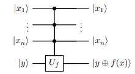

# Lecture 7: Quantum Phase Estimation  
*From Controlled‑U to Eigenvalues – The Swiss Army Knife of Quantum Algorithms*

---

## Lecture Overview 📋

1. **Quick Review** – Oracle model, controlled operations, Hadamard basis  
2. **Controlled‑U and Phase Kickback** – The fundamental building block  
3. **Powers of Unitaries** – $U$, $U^2$, $U^4$, … and binary fractions  
4. **Two‑Qubit Example** – Controlling $U$ and $U^2$ together  
5. **Connection to QFT** – How binary numbers become phases  
6. **Quantum Phase Estimation (QPE)** – The general algorithm  
7. **Application: Finding Eigenvalues** – And why factoring is eigenvalue estimation  
8. **Complexity and Circuit Implementation** – Costs and challenges  
9. **Iterative Phase Estimation** – A qubit‑efficient variant  
10. **PennyLane Demos** – Code for phase estimation  
11. **Exercises and Next Steps**

---

## Quick Review – The Oracle Model and Controlled Operations 🔄

### The Oracle as a Black Box

In quantum algorithms, we often assume access to a **unitary** $U_f$ that implements a function $f$:

$$
U_f |x\rangle|y\rangle = |x\rangle|y \oplus f(x)\rangle
$$

This is the **standard oracle** we used in Deutsch–Jozsa, Bernstein–Vazirani, and Simon’s algorithm.


---

### Controlled Gates

A **controlled‑U** gate applies $U$ to the target qubit(s) **only if** the control qubit is $|1\rangle$:


- If control = $|0\rangle$: target unchanged.  
- If control = $|1\rangle$: target undergoes $U$.

The matrix (for a single control and $U$ a $2\times2$ matrix) is:

$$
\text{controlled-}U = \begin{bmatrix}
I & 0 \\
0 & U
\end{bmatrix}
$$

---



---

### Phase kick-back

When $U$ changes phase of the target; this phase is **kicked back** to the control register.

---

#### When do we have phase-kick back?


---

### The Hadamard Basis – $|+\rangle$ and $|-\rangle$

Recall:

$$
|+\rangle = \frac{|0\rangle+|1\rangle}{\sqrt{2}}, \qquad
|-\rangle = \frac{|0\rangle-|1\rangle}{\sqrt{2}}
$$

These states are the **eigenstates** of the Pauli‑$X$ gate:

$$
X|+\rangle = +|+\rangle, \quad X|-\rangle = -|-\rangle
$$

They are central to phase kickback.

---

## Controlled‑U and Phase Kickback 🦵

### The Basic Idea

Suppose the target qubit is in an **eigenstate** of $U$ with eigenvalue $e^{i\phi}$:

$$
U|\psi\rangle = e^{i\phi} |\psi\rangle
$$

Now consider a controlled‑$U$ with the control qubit in a superposition:

1. **Control = $|0\rangle$:** target unchanged.
2. **Control = $|1\rangle$:** target gets multiplied by $e^{i\phi}$.

---

### Kickback with $|+\rangle$

Start with the control in $|+\rangle = \frac{|0\rangle+|1\rangle}{\sqrt{2}}$ and the target in the eigenstate $|\psi\rangle$:

$$
\frac{1}{\sqrt{2}}(|0\rangle + |1\rangle) \otimes |\psi\rangle
$$

Apply controlled‑$U$:

$$
\frac{1}{\sqrt{2}}\big( |0\rangle|\psi\rangle + |1\rangle U|\psi\rangle \big)
= \frac{1}{\sqrt{2}}\big( |0\rangle|\psi\rangle + e^{i\phi} |1\rangle|\psi\rangle \big)
$$

Factor out $|\psi\rangle$:

$$
= \frac{|0\rangle + e^{i\phi}|1\rangle}{\sqrt{2}} \otimes |\psi\rangle
$$

**Observation:** The target state $|\psi\rangle$ is **unchanged**! The phase $e^{i\phi}$ has been **kicked back** onto the control qubit. 🎯

---

### Kickback with $|-\rangle$

What if the control starts in $|-\rangle = \frac{|0\rangle - |1\rangle}{\sqrt{2}}$?

$$
\frac{1}{\sqrt{2}}(|0\rangle - |1\rangle) \otimes |\psi\rangle
$$

After controlled‑$U$:

$$
\frac{1}{\sqrt{2}}\big( |0\rangle|\psi\rangle - e^{i\phi} |1\rangle|\psi\rangle \big)
= \frac{|0\rangle - e^{i\phi}|1\rangle}{\sqrt{2}} \otimes |\psi\rangle
$$

Again the target is unchanged, and a phase appears on the $|1\rangle$ component of the control.

---

### The General Principle

> **Phase Kickback:** If a controlled‑$U$ acts on a control qubit and a target that is an eigenstate of $U$, the eigenvalue $e^{i\phi}$ appears as a relative phase on the $|1\rangle$ component of the control, while the target remains in the eigenstate.

This is the core mechanism behind **quantum phase estimation**.

---

### Extracting the Phase via Hadamard

$$
\frac{1}{\sqrt{2}}\big( |0\rangle|\psi\rangle + e^{i\phi} |1\rangle|\psi\rangle \big)
= \frac{|0\rangle + e^{i\phi}|1\rangle}{\sqrt{2}} \otimes |\psi\rangle
$$

If we apply a **Hadamard gate** to the control qubit **after** the phase kickback, we can extract information about $\phi$.

---

Let’s test with control initially in $|0\rangle$:

1. $|0\rangle \xrightarrow{H} |+\rangle$
2. Controlled‑$U$ with eigenstate target: $|+\rangle \to \frac{|0\rangle + e^{i\phi}|1\rangle}{\sqrt{2}}$
3. Apply $H$ again:

$$
H\left(\frac{|0\rangle + e^{i\phi}|1\rangle}{\sqrt{2}}\right)
= \frac{1+e^{i\phi}}{2}|0\rangle + \frac{1-e^{i\phi}}{2}|1\rangle
$$

The probability of measuring $|0\rangle$ is:

$$
P(0) = \left|\frac{1+e^{i\phi}}{2}\right|^2 = \frac{1+ cos\phi}{2} = \cos^2\left(\frac{\phi}{2}\right)
$$

Similarly, $P(1) = \sin^2\left(\frac{\phi}{2}\right)$.

---

**Result:** The measurement probabilities depend on the unknown phase $\phi$! This is the first glimpse of how we can estimate $\phi$ using quantum circuits.

---

## The Key Mathematical Foundation: Functions of Matrices

**functions of matrices are functions of eigenvalues**:

$$
f(U)|\psi\rangle = f(\lambda)|\psi\rangle
$$

where $\lambda$ is the eigenvalue for eigenvector $|\psi\rangle$.

---

### The Key Observation

If $U|\psi\rangle = e^{i\phi}|\psi\rangle$, then for any integer $k$:

$$
U^k |\psi\rangle = e^{i k \phi} |\psi\rangle
$$

The eigenvalue gets raised to the $k$‑th power: $(e^{i\phi})^k = e^{i k \phi}$.


---

### Binary Representation of Phases

Suppose the phase $\phi$ is of the form:

$$
\phi = 2\pi \times \theta, \qquad \theta \in [0,1)
$$

We can write $\theta$ as a **binary fraction**:

$$
\theta = 0.\theta_1\theta_2\theta_3\ldots\theta_n = \sum_{j=1}^n \theta_j 2^{-j}, \quad \theta_j \in \{0,1\}
$$

For example, $\theta = 0.75 = 0.11_2$ means:

$$
\theta = 1\cdot 2^{-1} + 1\cdot 2^{-2} = 0.5 + 0.25 = 0.75
$$

---

### The "Decimal Point Shifting" Trick

Consider $\theta = 0.\theta_1\theta_2\theta_3\ldots$

Multiply by $2$ (the bits shift):   
- $2\theta = \theta_1.\theta_2\theta_3\ldots$ 

Multiply by $2^k$:   
  - $2^k\theta = \theta_1\theta_2\ldots\theta_k.\theta_{k+1}\ldots$

---

This shifting is exactly what happens when we use **powers of $U$**:

- $U$ gives phase $e^{i 2\pi \theta}$ (i.e., $2\pi \times 0.\theta_1\theta_2\theta_3\ldots$)
- $U^2$ gives phase $e^{i 2\pi (2\theta)} = e^{i 2\pi (\theta_1.\theta_2\theta_3\ldots)}$  

---
$e^{i 2\pi (\theta_1.\theta_2\theta_3\ldots)}=e^{i 2\pi (\theta_1)}\times e^{i 2\pi (0.\theta_2\theta_3\ldots)}$ 

- $e^{i 2\pi \theta_1} = 1$ (since $\theta_1\in\{0,1\}$), 

so the effective phase is $e^{i 2\pi \times 0.\theta_2\theta_3\ldots}$.

---

- $U^4$ gives phase $e^{i 2\pi (4\theta)} = e^{i 2\pi (\theta_1\theta_2.\theta_3\ldots)}$  
  The effective fractional part is $0.\theta_3\theta_4\ldots$.

---

### Example: $\theta = 0.75 = 0.11_2$

$$
\phi = 2\pi\theta, \quad \theta \in [0,1)
$$

Example:

$$
\theta = 0.75_{10} = 0.11_2
$$

---

**Multiplying by 2 Shifts the Binary Point**

$$
0.11_2 \times 2 = 1.1_2
$$

- Integer part $1$ gives phase $2\pi$ (invisible)
- Fractional part $0.1_2$ is the effective phase

---

**Phase from $U$**

$$
U \;\longleftrightarrow\; \text{multiply by } 2^0 = 1
$$

$$
\text{Fraction} = 0.11_2 = \frac{1}{2} + \frac{1}{4} = 0.75
$$

$$
\phi = 2\pi \times 0.75 = 1.5\pi \quad\Longrightarrow\quad e^{i1.5\pi} = -i
$$

---

**Phase from $U^2$**

$$
U^2 \;\longleftrightarrow\; \text{multiply by } 2^1 = 2
$$

$$
0.11_2 \times 2 = 1.1_2 \;\longrightarrow\; \text{effective fraction } 0.1_2
$$

$$
0.1_2 = \frac{1}{2} = 0.5
$$

$$
\phi = 2\pi \times 0.5 = \pi \quad\Longrightarrow\quad e^{i\pi} = -1
$$

---

**Phase from $U^4$**

$$
U^4 \;\longleftrightarrow\; \text{multiply by } 2^2 = 4
$$

$$
0.11_2 \times 4 = 11.0_2 \;\longrightarrow\; \text{effective fraction } 0.0_2
$$

$$
0.0_2 = 0
$$

$$
\phi = 2\pi \times 0 = 0 \quad\Longrightarrow\quad e^{i0} = 1
$$

---

**The General Pattern**

For $\theta = 0.\theta_1\theta_2\theta_3\ldots_2$:

$$
U^{2^j} \;\longleftrightarrow\; 2^j\theta = \theta_1\cdots\theta_j \,.\,\theta_{j+1}\theta_{j+2}\ldots_2
$$

$$
e^{i 2\pi (2^j\theta)} = e^{i 2\pi (0.\theta_{j+1}\theta_{j+2}\ldots_2)}
$$

Each power of $U$ "shifts out" the most significant bit of $\theta$.


---

### Two‑Qubit Example – Controlling $U$ and $U^2$ 


We use **two control qubits** and one target qubit prepared in an eigenstate $|\psi\rangle$ of $U$.

- **Top control qubit** (call it $q_1$) – controls $U^2$
- **Bottom control qubit** (call it $q_0$) – controls $U^1 = U$

We write the combined state with the **most significant qubit first**: $|q_1 q_0\rangle$.


---

- Target eigenstate $|\psi\rangle$ with $U|\psi\rangle = e^{i 2\pi \theta}|\psi\rangle$, $\theta = 0.11_2$.

**Gates**  
- $q_0$ controls $U$ (multiplies phase by $1 \cdot \theta$).  
- $q_1$ controls $U^2$ (multiplies phase by $2 \cdot \theta$).

---

**What Happens to Each Control Qubit?**

Start with both controls in $|+\rangle = \frac{|0\rangle + |1\rangle}{\sqrt{2}}$.

**For $q_0$ (controls $U$):**  
When $q_0 = |1\rangle$, the state picks up phase $e^{i 2\pi \theta}$.  
So the state of $q_0$ becomes:

$$
\frac{|0\rangle + e^{i 2\pi \cdot 0.11_2} |1\rangle}{\sqrt{2}}
$$

---

**For $q_1$ (controls $U^2$):**  
When $q_1 = |1\rangle$, the state picks up phase $e^{i 2\pi (2\theta)}$.  
$2\theta = 0.11_2 \times 10_2 = 1.1_2$.  
The integer part $1$ gives $e^{i 2\pi} = 1$, so the effective phase is $e^{i 2\pi \cdot 0.1_2}$.

Thus the state of $q_1$ becomes:

$$
\frac{|0\rangle + e^{i 2\pi \cdot 0.1_2} |1\rangle}{\sqrt{2}}
$$

---

**The Full State is a Tensor Product**

the **control register remains in a product state** with the target:

$$
|\psi_{\text{controls}}\rangle \otimes |\psi\rangle
$$

where

$$
|\psi_{\text{controls}}\rangle = 
\left( \frac{|0\rangle + e^{i 2\pi \cdot 0.1_2}|1\rangle}{\sqrt{2}} \right)_{q_1}
\otimes
\left( \frac{|0\rangle + e^{i 2\pi \cdot 0.11_2}|1\rangle}{\sqrt{2}} \right)_{q_0}
$$

---

**The control-register is Exactly the QFT Tensor Product**

Recall the factorised form of the QFT for $n=2$ qubits. For an input state $|j_1 j_2\rangle$:

$$
\text{QFT}|j_1 j_2\rangle = 
\frac{1}{\sqrt{2}}
\Bigl(|0\rangle + e^{2\pi i \,0.j_2}|1\rangle\Bigr)_{q_0}
\otimes
\frac{1}{\sqrt{2}}
\Bigl(|0\rangle + e^{2\pi i \,0.j_1 j_2}|1\rangle\Bigr)_{q_1}
$$

*(Note: The usual QFT formula places the least significant qubit first in the tensor product; the order can be swapped with SWAPs. Here $q_0$ is LSB, $q_1$ is MSB.)*

Compare with our state:

- $q_0$ has phase $e^{2\pi i \, 0.11_2}$ → matches $0.j_2$ with $j_2 = 1$.
- $q_1$ has phase $e^{2\pi i \, 0.1_2}$ → matches $0.j_1 j_2$ with $j_1 = 1$, $j_2 = 1$.

So our control register is exactly $\text{QFT}|11\rangle$ (up to qubit ordering).

---

### Extracting the Binary Digits

- Applying the **inverse QFT** to the control register ($|\psi_{\text{controls}}\rangle$) yields the computational basis state $|11\rangle$. 
- A measurement then gives $11$, revealing that $\theta = 0.11_2$.

---

**Key takeaway:**  
- Each control qubit ends up in a state $|0\rangle + e^{i 2\pi \cdot (\text{binary fraction})}|1\rangle$.  
- The binary fractions are precisely those appearing in the QFT tensor product.  
- Therefore, inverse QFT directly reads out the binary digits of $\theta$.


---

### Alternative View: Recall the Quantum Fourier Transform

In Lecture 6, we saw that the QFT maps a computational basis state $|k\rangle$ to:

$$
\text{QFT}|k\rangle = \frac{1}{\sqrt{N}} \sum_{j=0}^{N-1} e^{2\pi i \, j k / N} |j\rangle
$$

For $N=2^n$, the QFT encodes the integer $k$ into **phases** of the superposition.

---

### The Inverse Relationship

The state we produced in the two‑qubit phase estimation:

$$
\frac{1}{2}\sum_{x=0}^{3} e^{i 2\pi (x \theta)} |x\rangle
$$

Look familiar? If we write $\theta = k / 4$ for some integer $k$ (i.e., $\theta$ is a 2‑bit binary fraction), then:

$$
e^{i 2\pi (x \theta)} = e^{2\pi i \, x k / 4}
$$

This is **exactly** the coefficient that appears in the **inverse QFT** of $|k\rangle$!

---


### For Our Example $\theta = 0.11_2$

The state after phase kickback is:

$$
\frac{1}{2}\Big( |00\rangle - i|01\rangle - |10\rangle + i|11\rangle \Big)
$$

If we apply the **inverse QFT** (or, depending on convention, the QFT) to this state, we get back $|11\rangle$ – the binary representation of $\theta$! 


---

## Quantum Phase Estimation (QPE) – The General Algorithm 

### Problem Statement

Given:
- A unitary operator $U$ (as a controlled gate)
- An eigenstate $|\psi\rangle$ such that $U|\psi\rangle = e^{i 2\pi \theta} |\psi\rangle$ with unknown $\theta \in [0,1)$

**Goal:** Estimate $\theta$ to $n$ bits of precision.

---

### The Algorithm

1. **Initialization:**
   - First register: $n$ qubits in $|0\rangle^{\otimes n}$
   - Second register: the eigenstate $|\psi\rangle$ (prepared somehow)

2. **Create superposition:**
   Apply $H^{\otimes n}$ to the first register:
   $$
   \frac{1}{\sqrt{2^n}} \sum_{x=0}^{2^n-1} |x\rangle |\psi\rangle
   $$

3. **Apply controlled‑$U^{2^j}$:**
   For each qubit $j$ (from 0 to $n-1$), apply controlled‑$U^{2^j}$ with the $j$‑th qubit as control and $|\psi\rangle$ as target.
   
   This kicks back phases $e^{i 2\pi (2^j \theta)}$:
   $$
   \frac{1}{\sqrt{2^n}} \sum_{x=0}^{2^n-1} e^{i 2\pi \theta x} |x\rangle |\psi\rangle
   $$

4. **Apply inverse QFT:**
   Apply $\text{QFT}^\dagger$ to the first register.
   This transforms the state to a peak around $|2^n \theta\rangle$ (rounded to nearest integer).

5. **Measure:**
   Measure the first register to obtain an integer $y \in \{0,\ldots,2^n-1\}$.
   The estimate is $\tilde{\theta} = y / 2^n$.

---

### Accuracy and Success Probability

- If $\theta$ can be exactly represented with $n$ bits, the algorithm yields $\theta$ with **certainty**.
- If $\theta$ is not an exact binary fraction, the measurement gives the closest $n$‑bit approximation with probability $\ge 4/\pi^2 \approx 0.405$.
- By adding extra qubits and repeating, we can boost success probability arbitrarily close to 1.

---


## Application – Finding Eigenvalues (and Factoring) 

Many quantum algorithms reduce to **eigenvalue estimation**:

- **Shor’s factoring algorithm:** Find the order $r$ of $a \bmod N$. The unitary $U|y\rangle = |a y \bmod N\rangle$ has eigenvalues $e^{i 2\pi s/r}$ for $s=0,\ldots,r-1$. The phase $\theta = s/r$ directly gives the period $r$ via continued fractions.

- **Quantum chemistry:** Finding ground state energies of molecules (eigenvalues of the Hamiltonian).

- **Optimization:** Finding eigenvalues of certain matrices.

---

### Shor’s Algorithm Revisited 

**The modular exponentiation oracle $U_f$**

In Lecture 6c we assumed a unitary $U_f$ that computes the function $f(x)=a^x \bmod N$:

$$
U_f \, |x\rangle |0\rangle = |x\rangle |a^x \bmod N\rangle .
$$

This is the oracle used in the period‑finding circuit: after applying $U_f$ to a superposition over $x$, measuring the work register collapses the input register to a periodic comb $|x_0 + j r\rangle$.

---

**Building $U_f$ from controlled modular multiplications**

Exponentiation by repeated squaring expresses $a^x$ as a product of powers $a^{2^j}$:

$$
a^x = \prod_{j=0}^{m-1} (a^{2^j})^{x_j}, \qquad x = \sum_{j=0}^{m-1} x_j 2^j,\; x_j \in \{0,1\}.
$$

To compute this product into a work register, we need a **controlled modular multiplication** for each $j$:

$$
\text{c-}U_{a^{2^j}} \; : \; |x_j\rangle |y\rangle \;\longmapsto\; |x_j\rangle |y \cdot (a^{2^j})^{x_j} \bmod N\rangle .
$$

---

Define the basic modular multiplication unitary

$$
U_a \, |y\rangle = |a y \bmod N\rangle .
$$

Then $U_{a^{2^j}} = (U_a)^{2^j}$, so the controlled gates required are exactly

$$
\text{controlled-}U_a,\; \text{controlled-}U_a^2,\; \text{controlled-}U_a^4,\; \dots,\; \text{controlled-}U_a^{2^{m-1}} .
$$

Thus the modular exponentiation circuit is **built from controlled powers of $U_a$**.

---

**Phase estimation with $U_a$ uses the same controlled powers**

The Quantum Phase Estimation (QPE) algorithm requires applying controlled powers of a unitary to an eigenstate. If we choose the unitary to be $U_a$, the needed gates are precisely the ones listed above. Hence **the same hardware that computes $a^x \bmod N$ can be repurposed to run phase estimation on $U_a$**.

---

### Eigenstates and eigenvalues of $U_a$

Because $a^r \equiv 1 \pmod N$, we have $U_a^r = I$ on the subspace spanned by $\{|a^k \bmod N\rangle\}$. The eigenvalues of $U_a$ are therefore $r$‑th roots of unity:

$$
\lambda_s = e^{2\pi i \, s / r}, \qquad s = 0, 1, \dots, r-1 .
$$

The corresponding eigenstates are

$$
|u_s\rangle = \frac{1}{\sqrt{r}} \sum_{k=0}^{r-1} e^{-2\pi i \, s k / r} \, |a^k \bmod N\rangle .
$$

---

**Verifying the Eigenvalue Equation for $|u_s\rangle$**

We start with the definition of the eigenstate:

$$
|u_s\rangle = \frac{1}{\sqrt{r}} \sum_{k=0}^{r-1} e^{-2\pi i \, s k / r} \, |a^k \bmod N\rangle .
$$

Apply the unitary $U_a$ to $|u_s\rangle$:

$$
U_a |u_s\rangle = \frac{1}{\sqrt{r}} \sum_{k=0}^{r-1} e^{-2\pi i \, s k / r} \; U_a |a^k \bmod N\rangle .
$$

By definition, $U_a |y\rangle = |a y \bmod N\rangle$, so:

$$
U_a |a^k \bmod N\rangle = |a \cdot a^k \bmod N\rangle = |a^{k+1} \bmod N\rangle .
$$

Thus we have:

$$
U_a |u_s\rangle = \frac{1}{\sqrt{r}} \sum_{k=0}^{r-1} e^{-2\pi i \, s k / r} \, |a^{k+1} \bmod N\rangle .
$$

---

**Eigenvalue Equation**

$$
\begin{aligned}
U_a |u_s\rangle 
&= \frac{1}{\sqrt{r}} \sum_{k=0}^{r-1} e^{-2\pi i s k / r} \, |a^{k+1} \bmod N\rangle \\[4pt]
&= \frac{1}{\sqrt{r}} \sum_{j=1}^{r} e^{-2\pi i s (j-1) / r} \, |a^j \bmod N\rangle \qquad (j = k+1) \\[4pt]
&= \frac{1}{\sqrt{r}} \sum_{j=1}^{r} \left( e^{-2\pi i s j / r} \cdot e^{2\pi i s / r} \right) |a^j \bmod N\rangle \\[4pt]
&= e^{2\pi i s / r} \cdot \frac{1}{\sqrt{r}} \sum_{j=1}^{r} e^{-2\pi i s j / r} \, |a^j \bmod N\rangle .
\end{aligned}
$$

Because $a^r \equiv 1 \pmod N$, the term $j=r$ is equal to $j=0$: $|a^r \bmod N\rangle = |1\rangle = |a^0 \bmod N\rangle$, and $e^{-2\pi i s r / r} = e^{-2\pi i s} = 1$. Thus the sum over $j=1,\dots,r$ is identical to the sum over $j=0,\dots,r-1$:

$$
\sum_{j=1}^{r} e^{-2\pi i s j / r} \, |a^j \bmod N\rangle = \sum_{j=0}^{r-1} e^{-2\pi i s j / r} \, |a^j \bmod N\rangle = \sqrt{r} \, |u_s\rangle .
$$

Therefore:

$$
U_a |u_s\rangle = e^{2\pi i s / r} \, |u_s\rangle .
$$

---

**Note on the shift:**  
The shift $j = k+1$ changes the exponent from $e^{-2\pi i s k / r}$ to $e^{-2\pi i s (j-1) / r}$. To restore the original form $e^{-2\pi i s j / r}$, we multiply by $e^{2\pi i s / r}$, which becomes the eigenvalue. This is the algebraic essence of the derivation.

---


### Summary of the Derivation

$$
\begin{aligned}
U_a |u_s\rangle
&= \frac{1}{\sqrt{r}} \sum_{k=0}^{r-1} e^{-2\pi i s k / r} \, |a^{k+1} \bmod N\rangle && \text{(definition)} \\[4pt]
&= \frac{1}{\sqrt{r}} \sum_{j=0}^{r-1} e^{-2\pi i s (j-1) / r} \, |a^j \bmod N\rangle && \text{(index shift } j = k+1 \text{ modulo } r) \\[4pt]
&= e^{2\pi i s / r} \cdot \frac{1}{\sqrt{r}} \sum_{j=0}^{r-1} e^{-2\pi i s j / r} \, |a^j \bmod N\rangle && \text{(factor out constant phase)} \\[4pt]
&= e^{2\pi i s / r} \, |u_s\rangle && \text{(recognise } |u_s\rangle \text{)} .
\end{aligned}
$$

This explicitly shows that $|u_s\rangle$ is an eigenstate of $U_a$ with eigenvalue $e^{2\pi i s / r}$. The key step is the cyclic shift of the index, which introduces the multiplicative phase factor.

---

**How to prepare the target state**

We cannot prepare a specific $|u_s\rangle$ because $r$ and $s$ are unknown. 

---

However, the state $|1\rangle = |a^0 \bmod N\rangle$ is trivial to prepare. Observe:

$$
\frac{1}{\sqrt{r}} \sum_{s=0}^{r-1} |u_s\rangle
= \frac{1}{r} \sum_{k=0}^{r-1} \left( \sum_{s=0}^{r-1} e^{-2\pi i s k / r} \right) |a^k \bmod N\rangle .
$$

The inner sum over $s$ is $r$ when $k=0$, and $0$ otherwise. Thus only $k=0$ survives:

$$
\frac{1}{\sqrt{r}} \sum_{s=0}^{r-1} |u_s\rangle = |a^0 \bmod N\rangle = |1\rangle .
$$

Therefore, $|1\rangle$ is a uniform superposition of **all** eigenstates $|u_s\rangle$.

---

### Why $|1\rangle$ is the Sum of All Eigenstates

Let us sum all $r$ eigenstates with equal amplitude:

$$
\frac{1}{\sqrt{r}} \sum_{s=0}^{r-1} |u_s\rangle
= \frac{1}{\sqrt{r}} \sum_{s=0}^{r-1} \frac{1}{\sqrt{r}} \sum_{k=0}^{r-1} e^{-2\pi i \, s k / r} \, |a^k \bmod N\rangle
$$

Swap the sums:

$$
= \frac{1}{r} \sum_{k=0}^{r-1} \left( \sum_{s=0}^{r-1} e^{-2\pi i \, s k / r} \right) |a^k \bmod N\rangle
$$

---


For a fixed $k$, the sum $\sum_{s=0}^{r-1} e^{-2\pi i \, s k / r}$ is:

- If $k = 0$: every term is $e^0 = 1$, so the sum is $r$.
- If $k \neq 0$: the sum of the $r$‑th roots of unity is $0$.

Therefore, only the $k = 0$ term survives:

$$
\frac{1}{r} \sum_{k=0}^{r-1} \big( r \cdot \delta_{k,0} \big) |a^k \bmod N\rangle
= |a^0 \bmod N\rangle
= |1\rangle
$$

---


$$
\frac{1}{\sqrt{r}} \sum_{s=0}^{r-1} |u_s\rangle = |1\rangle
$$

The easily prepared state $|1\rangle$ is a uniform superposition of **all** the eigenstates $|u_s\rangle$.

---

### Why This Matters for Phase Estimation

- We cannot prepare a specific $|u_s\rangle$ because we do not know $r$ or $s$.
- But we **can** prepare $|1\rangle$ trivially.

---

### Phase Estimation on the Superposition $|1\rangle$

Recall $|1\rangle = \frac{1}{\sqrt{r}} \sum_{s=0}^{r-1} |u_s\rangle$. We run QPE with $m$ qubits in the first register and $|1\rangle$ in the second.

**Step 1 – Controlled‑$U_a$ powers**

For a single eigenstate $|u_s\rangle$ with eigenvalue $e^{2\pi i \phi_s}$, where $\phi_s = s/r$, the first register becomes:

$$
\frac{1}{\sqrt{2^m}} \sum_{x=0}^{2^m-1} e^{2\pi i \, x \, \phi_s} \, |x\rangle .
$$

By linearity, the full state after controlled operations is:

$$
\frac{1}{\sqrt{r}} \sum_{s=0}^{r-1} \left( \frac{1}{\sqrt{2^m}} \sum_{x=0}^{2^m-1} e^{2\pi i \, x \, \phi_s} \, |x\rangle \right) \otimes |u_s\rangle .
$$

---

**Step 2 – Inverse Quantum Fourier Transform**

The inverse QFT maps $\frac{1}{\sqrt{2^m}} \sum_x e^{2\pi i x \phi} |x\rangle$ to a state concentrated at the $m$‑bit integer $2^m \phi$ (rounded). For $\phi = \phi_s$, this integer is an $m$‑bit binary approximation of the phase:

$$
\text{QFT}^\dagger \left( \frac{1}{\sqrt{2^m}} \sum_{x=0}^{2^m-1} e^{2\pi i \, x \, \phi_s} \, |x\rangle \right) \approx |\,\text{bin}_m(\phi_s)\,\rangle .
$$

Applying QFT$^\dagger$ to the first register therefore gives:

$$
\frac{1}{\sqrt{r}} \sum_{s=0}^{r-1} |\,\text{bin}_m(\phi_s)\,\rangle \otimes |u_s\rangle .
$$

---

**Step 3 – Measurement and Phase Recovery**

Measuring the first register yields an $m$‑bit binary string that directly encodes an approximation to $\phi_s$ for some random $s$. Interpreting the measurement outcome $c$ as an integer, we have:

$$
\frac{c}{2^m} \approx \phi_s = \frac{s}{r} .
$$

The continued fraction algorithm then recovers the denominator $r$ from the fraction $c/2^m$.

---

**Recall that we Know $c$ and $2^m$ but not $s$ or $r$**
The fraction $c/2^m$ is a known rational number that approximates the unknown fraction $s/r$.

Any rational number $x = c/2^m$ can be expanded as a continued fraction:

$$
x = a_0 + \cfrac{1}{a_1 + \cfrac{1}{a_2 + \cfrac{1}{\ddots}}} .
$$

Truncating this expansion at various depths gives a sequence of **convergents** $p/q$, which are the best rational approximations to $x$ with small denominators.

Because $c/2^m \approx s/r$, the fraction $s/r$ will appear (or be very close to) one of the convergents $p/q$. We simply check each convergent's denominator $q$ by testing whether $a^q \equiv 1 \pmod N$.

---


**Example ($N=15$, $a=7$, $r=4$)**

Possible phases: $\phi_s \in \{0, 1/4, 2/4, 3/4\}$.

- If $s=1$: $\phi_1 = 1/4 = 0.25$. With $m=8$, $c \approx 64$. $c/2^8 = 64/256 = 1/4$. Continued fraction gives denominator $4$ → $r=4$.
- If $s=2$: $\phi_2 = 2/4 = 1/2$. $c \approx 128$. $128/256 = 1/2$. Convergent $1/2$ gives denominator $2$. But $7^2 \bmod 15 = 4 \neq 1$, so we reject $r=2$ and try another measurement.
- If $s=3$: $\phi_3 = 3/4 = 0.75$. $c \approx 192$. $192/256 = 3/4$. Convergent $3/4$ gives denominator $4$ → $r=4$.

---


**The two perspectives are equivalent**

- **Period‑finding view (Lecture 6c):** $U_f$ creates entanglement between $|x\rangle$ and $|a^x \bmod N\rangle$; measuring the work register gives a periodic comb; QFT reveals the period spacing.
- **Phase‑estimation view (Lecture 7):** Controlled powers of $U_a$ kick back phases $e^{2\pi i s/r}$ onto control qubits; the inverse QFT reads out the binary fraction $s/r$.

Both views rely on the same controlled‑$U_a^{2^j}$ gates. Phase estimation simply interprets the output differently – it transfers phase information to the control register instead of storing a product in a work register.

---


### General Unitary $U = e^{i 2\pi H}$

If $U = e^{i 2\pi H}$ for some Hermitian $H$, then:

- Eigenvectors of $U$ are the same as eigenvectors of $H$.
- Eigenvalues of $U$ are $e^{i 2\pi \lambda}$ where $\lambda$ are eigenvalues of $H$.
- Phase estimation directly yields the eigenvalues $\lambda$ of $H$.

This is crucial for **quantum simulation** – we can compute energies of physical systems.

---

## Complexity and Circuit Implementation 🛠️

### Gate Count

For $n$‑bit precision:
- $n$ Hadamard gates (initialization)
- Controlled‑$U^{2^j}$ for $j=0,\ldots,n-1$
- Inverse QFT: $O(n^2)$ gates

If implementing $U^{2^j}$ requires $O(\text{poly}(j))$ gates (e.g., modular exponentiation in Shor), total cost is $O(n^2)$ plus the cost of controlled‑$U$ powers.

---

### Implementing Powers of $U$

The most challenging part is **efficiently implementing** $U^{2^j}$. For Shor’s algorithm, modular exponentiation can be done with $O(n^3)$ gates using fast multiplication circuits.

For general $U$, we may need to **Trotterize** (in simulation) or rely on hardware that naturally implements $U$.

---

### Circuit Depth

Phase estimation is relatively deep – it requires many sequential controlled operations. This is a challenge for near‑term noisy devices, but it’s the backbone of many quantum algorithms.

---

## Iterative Phase Estimation 🔁

### The Idea

Standard QPE uses $m$ control qubits and an $m$‑qubit inverse QFT. Can we do it with **fewer qubits**?

Yes! **Iterative (or semi‑classical) phase estimation** uses **one** control qubit and reuses it multiple times, with classical feedback.

---

### The Iterative Circuit


1. Start with the **least significant bit**.
2. Use one control qubit, apply controlled‑$U^{2^{m-1}}$, measure.
3. Based on the measurement, apply a classically controlled rotation to compensate the phase for the next bit.
4. Repeat for $m-2, \ldots, 0$.

---

### Advantages

- **Qubit‑efficient:** Only one control qubit + the eigenstate register.
- **Depth vs. width tradeoff:** More measurements and classical processing, but shallower quantum circuit.

Iterative phase estimation is often more practical for near‑term devices.

---

## PennyLane Demos 💻

### 1. Basic Phase Kickback with One Qubit

```python
import pennylane as qml
import numpy as np

dev = qml.device('default.qubit', wires=2)

@qml.qnode(dev)
def phase_kickback(phi):
    # Target qubit in |1> (eigenstate of RZ)
    qml.PauliX(wires=1)
    
    # Control in |+>
    qml.Hadamard(wires=0)
    
    # Controlled-U: U = RZ(2*phi)
    qml.CRZ(2 * phi, wires=[0, 1])
    
    # Apply H to control
    qml.Hadamard(wires=0)
    
    return qml.probs(wires=0)

phi = np.pi / 2  # 90 degrees
probs = phase_kickback(phi)
print(f"P(0) = {probs[0]:.3f}, P(1) = {probs[1]:.3f}")
print(f"Expected: P(0) = cos^2(phi/2) = {np.cos(phi/2)**2:.3f}")
```

---

### 2. Two‑Qubit Phase Estimation (Exact $\theta$)

```python
dev2 = qml.device('default.qubit', wires=3)  # 2 control + 1 target

@qml.qnode(dev2)
def two_qubit_pe(theta):
    # Prepare eigenstate |1> on target
    qml.PauliX(wires=2)
    
    # Superposition on controls
    for i in range(2):
        qml.Hadamard(wires=i)
    
    # Controlled-U^2 on first control (j=1)
    qml.ctrl(qml.RZ, control=1)(2 * 2 * np.pi * theta, wires=2)
    
    # Controlled-U on second control (j=0)
    qml.ctrl(qml.RZ, control=0)(2 * 1 * np.pi * theta, wires=2)
    
    # Inverse QFT on 2 qubits
    qml.adjoint(qml.QFT)(wires=[0,1])
    
    return qml.probs(wires=[0,1])

# Test theta = 0.75 = 3/4 = 0.11_2
theta = 0.75
probs = two_qubit_pe(theta)
print("Probabilities for |00>,|01>,|10>,|11>:")
print(probs.round(3))
# Should peak at |11>
```

---

### 3. General Phase Estimation with PennyLane's Template

```python
n_est = 4  # estimation qubits
dev_pe = qml.device('default.qubit', wires=n_est + 1)

@qml.qnode(dev_pe)
def qpe(theta):
    # Prepare eigenstate |1>
    qml.PauliX(wires=n_est)
    
    # Phase estimation circuit
    qml.QuantumPhaseEstimation(
        unitary=qml.RZ(2 * np.pi * theta, wires=n_est),
        estimation_wires=range(n_est)
    )
    
    return qml.probs(wires=range(n_est))

theta = 0.3125  # = 5/16 = 0.0101_2
probs = qpe(theta)
most_likely = np.argmax(probs)
print(f"Most likely outcome: {most_likely} (binary {format(most_likely, '04b')})")
print(f"Estimated theta: {most_likely / 2**n_est:.4f} (true = {theta:.4f})")
```

---

## Summary and Key Takeaways 🎯

### What We Learned

1. **Phase kickback** is the fundamental mechanism: a controlled‑$U$ with target in an eigenstate transfers the eigenvalue phase to the control qubit.
2. **Powers of $U$** shift the binary digits of the phase, allowing us to read off bits sequentially.
3. **Quantum Phase Estimation (QPE)** combines these ideas with the inverse QFT to estimate an unknown phase $\theta$ to $n$‑bit precision.
4. **Applications** include Shor’s algorithm (period finding = eigenvalue estimation), quantum chemistry, and more.
5. **Iterative QPE** reduces qubit requirements at the cost of classical feedback.

---

### Complexity Summary

| Algorithm Step | Gate Count |
|----------------|------------|
| Hadamard initialization | $O(n)$ |
| Controlled‑$U^{2^j}$ | Depends on $U$ |
| Inverse QFT | $O(n^2)$ |
| **Total** | $O(n^2)$ + cost of $U$ |

---

## Exercises 📝

1. **Phase Kickback Verification**  
   For $U = Z$ (Pauli‑Z) and target $|1\rangle$, compute the state after controlled‑$Z$ with control initially in $|+\rangle$. Show that the control becomes $|-\rangle$. What is the phase kickback?

2. **Binary Fraction Practice**  
   Express $\theta = 0.625$ as a binary fraction. What are the phases for $U$, $U^2$, $U^4$?

3. **Two‑Qubit QPE by Hand**  
   For $\theta = 0.625$ ($=5/8 = 0.101_2$), simulate the 2‑qubit QPE circuit by hand and verify that the final state peaks at $|10\rangle$ (since $2^2 \times 0.625 = 2.5$, the closest integer is 2, which is $10_2$).

4. **PennyLane Simulation**  
   Modify the general QPE code to estimate $\theta = 0.123$. How many estimation qubits are needed to get an accuracy of $\pm 0.01$? What is the success probability?

5. **Iterative QPE**  
   Implement iterative phase estimation for $n=3$ bits in PennyLane. Compare the circuit depth with the standard QPE.

6. **Shor's Eigenstate Sum**  
   Prove that $\frac{1}{\sqrt{r}} \sum_{s=0}^{r-1} |u_s\rangle = |1\rangle$ for the modular exponentiation unitary. Then explain why this allows us to use $|1\rangle$ as the input to phase estimation.

---

## Next Lecture Preview ⏩

**Grover’s Search Algorithm**
- Unstructured search problem
- Amplitude amplification
- Geometric interpretation
- Optimality and applications

---

## AI Tool Demo 🤖

This lecture's content and code were prepared with the assistance of AI (DeepSeek). The explanations, examples, and PennyLane code were generated iteratively based on the course plan.

**Remember:** AI tools are powerful assistants, but always verify the mathematics, run the code, and understand the underlying concepts. Quantum computing requires both intuition and rigorous understanding – the AI can help build intuition, but you must own the rigor.

---

*“Phase estimation is the Swiss Army knife of quantum algorithms – once you can estimate eigenvalues, you can factor numbers, simulate physics, and solve linear systems.”* 🚀