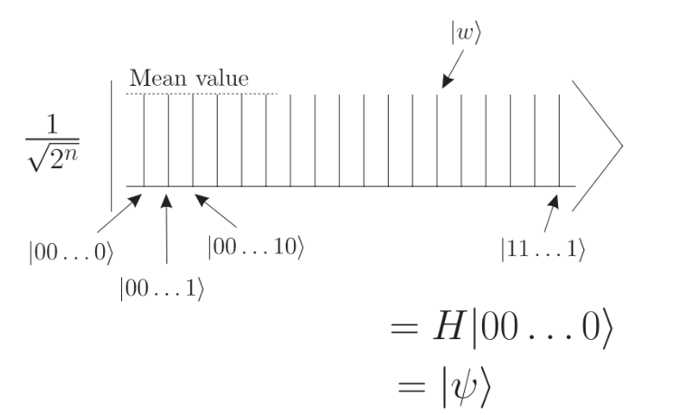
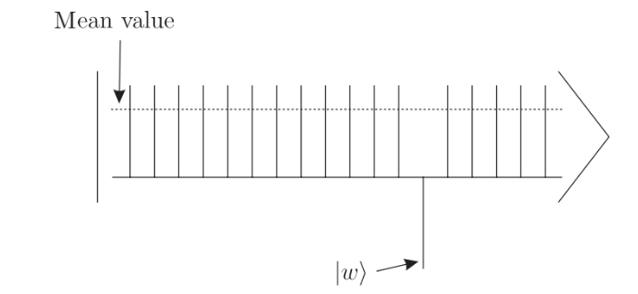
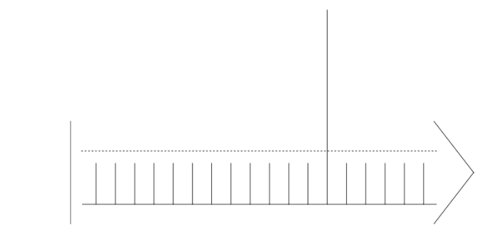
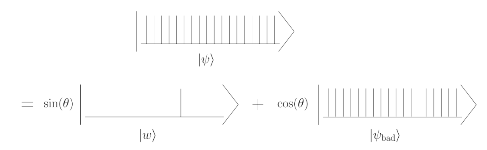
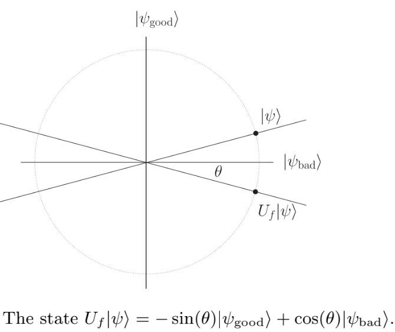
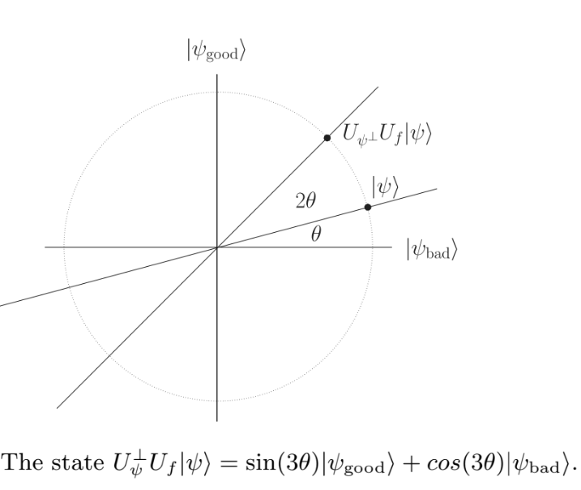
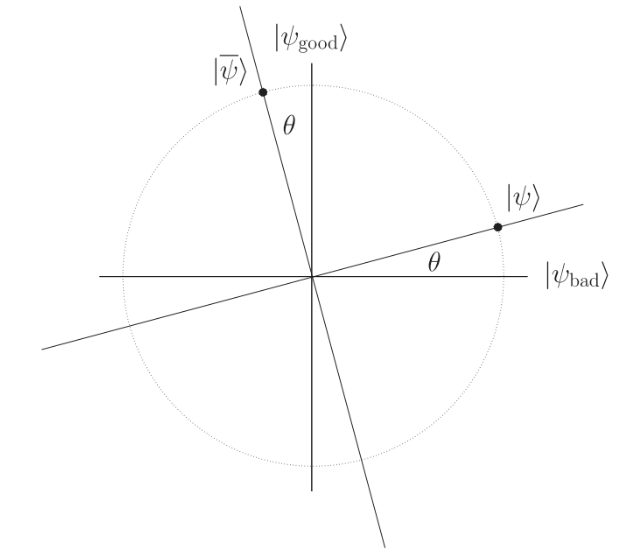
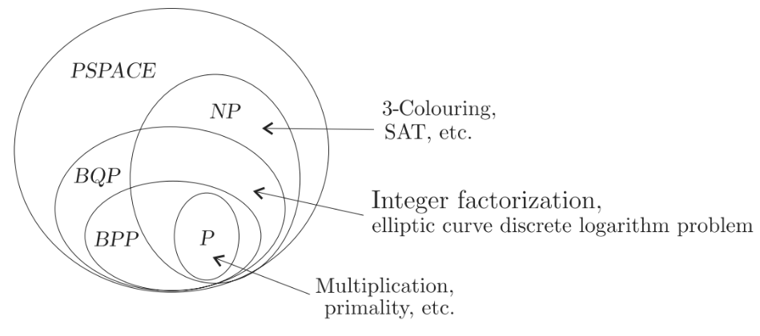

# Lecture 9 – Grover, Quantum Optimization, and Machine Learning  
*Last Lecture – with a Glimpse at Error Correction*
*prepared with the help of DeepSeek AI, diagrams are copied from textbook: An Introduction to Quantum Computing, Kaye, Laflamme, Mosca*

---
# Lecture 9a – Grover's Search Algorithm (45 min) – *Corrected & Complete*

---

## Unstructured Search Problem

```
Database with N items (unsorted)
Find the one item that satisfies a condition (the "marked" item)

Classical: try one by one → O(N) steps in worst case
Quantum: Grover's algorithm → O(√N) steps
```

**Example:**  
- N = 1,000,000  
- Classical: up to 1,000,000 checks  
- Grover: about 1,000 checks  

> Quadratic speedup – not exponential like Shor, but still powerful.

---

## The Oracle – Marking the Solution

```
Define f(x) = 1 if x is the solution, else 0

Quantum oracle:  U_ω |x⟩ = (-1)^{f(x)} |x⟩

Effect: flips the sign of the solution state only.

Example with N=4 (states |00⟩, |01⟩, |10⟩, |11⟩)
If solution = |11⟩:

U_ω |11⟩ = -|11⟩
U_ω |x⟩ = +|x⟩ for all other x
```

**Circuit trick:** Use phase kickback (same as Deutsch‑Jozsa).

---

## Grover's Algorithm – Geometric Intuition (from Kaye, Laflamme, Mosca )

```
Start with equal superposition:
|s⟩ = (1/√N) Σ|x⟩
```


---

1. Oracle U_ω : reflects amplitude of solution (negates it)
   


---

1. Diffusion operator D : reflects about the mean (inversion about the mean) 



---

Together: rotate the state toward the solution
```
Initial |s⟩ ---(U_ω)---> reflected ---(D)---> closer to |ω⟩
Repeat about √N times → state nearly |ω⟩ → measure → solution
```

---

## Diffusion Operator D

Diffusion matrix: $D_{ii} = -1 + \frac{2}{N}$, $D_{ij} = \frac{2}{N}$ for $i \neq j$.

```
D = 2|s⟩⟨s| - I
```

Effect: amplifies the marked state, suppresses others.

```
Matrix for N=4 (H⊗² then phase then H⊗²):
D = H⊗² [ 2|0⟩⟨0| - I ] H⊗²
```

**No need to memorize – just know it's a "reflection about the average".**

---

## Grover's Algorithm – Step by Step (N=4 example)

```
Step 1: Initialize |00⟩
Step 2: Apply H⊗² → |s⟩ = (|00⟩+|01⟩+|10⟩+|11⟩)/2
Step 3: Apply oracle U_ω (flip sign of |11⟩)
        → (|00⟩+|01⟩+|10⟩-|11⟩)/2
Step 4: Apply diffusion D
        → after one iteration, state becomes |11⟩ with high probability
Step 5: Measure → |11⟩ (the solution)

Number of iterations = π/4 √N ≈ 1 for N=4
```

---

## Why √N? (Intuitive)

```
Each Grover iteration rotates the state by angle θ ≈ 2/√N
Initial amplitude of solution = 1/√N (small)

After k iterations, amplitude ≈ sin((2k+1)θ) with θ ≈ 1/√N

Maximum when (2k+1)θ ≈ π/2 → k ≈ π/4 √N
```

> **Takeaway:** Quadratic speedup is optimal – no quantum algorithm can do better for unstructured search.

---

## Applications of Grover

```
• Database search (any unsorted list)
• Brute‑force key search (breaks AES‑128, but AES‑256 survives)
• Solving NP‑complete problems? Still exponential – only quadratic gain inside exponential.
• Pattern matching, collision finding
• Quantum optimization subroutines
```

**Important:** Grover gives √N speedup, not exponential. So NP‑complete problems remain hard.

---

## Generalization as Amplitude Amplification

Consider marked and unmarked parts separately 



---
We can generalize this into two orthogonal subspaces for any state:  
- $|\psi_{\text{good}}\rangle$ = subspace of solutions  
- $|\psi_{\text{bad}}\rangle$ = subspace of non‑solutions  
Initial state:  

$$  
|\psi\rangle = \sin\theta\,|\psi_{\text{good}}\rangle + \cos\theta\,|\psi_{\text{bad}}\rangle  
$$

Also define

$$  
|\tilde{\psi}\rangle = \cos\theta\,|\psi_{\text{good}}\rangle - \sin\theta\,|\psi_{\text{bad}}\rangle  
$$

---

Define a reflection operator $U_f$ that flips the sign of good states:  

$$  
U_f |\psi_{\text{good}}\rangle = -|\psi_{\text{good}}\rangle,\quad U_f |\psi_{\text{bad}}\rangle = +|\psi_{\text{bad}}\rangle  
$$

---

Then $U_f |\psi\rangle = -\sin\theta\,|\psi_{\text{good}}\rangle + \cos\theta\,|\psi_{\text{bad}}\rangle$  
(reflection about the bad subspace).



---

$$  
U_f |\psi\rangle = − sin(\theta)|\psi_{good}\rangle + cos(\theta)|\psi_{bad}\rangle == cos(2\theta)|\psi\rangle- sin(2\theta)|\bar{\psi}\rangle  
$$

---
Define another reflection about $|\psi\rangle$:  
$U_\psi = 2|\psi\rangle\langle\psi| - I$.


The product $U_\psi U_f$ rotates the state by $2\theta$ towards $|\psi_{\text{good}}\rangle$.



---
After $k$ iterations: amplitude $\sin((2k+1)\theta)$.  
Maximized when $(2k+1)\theta = \pi/2$ → $k \approx \pi/(4\theta)$.

**Grover corresponds to $\sin\theta = 1/\sqrt{N}$ (one marked state).**  
Then $k \approx \pi/4 \sqrt{N}$.

---

**Diagram (from Kaye, Laflamme, Mosca):**



---

## Amplitude Amplification – General Use

```
Instead of one marked state, we may have M good states.
Initial amplitude = √(M/N). Then θ = arcsin(√(M/N)).
Iterations needed = O(√(N/M)).

Used in:
• Quantum counting (estimate M)
• Quantum minimum finding (optimization)
• Amplitude estimation (combined with phase estimation)
```

---

## Optimization Through Grover Search – The Idea

```
Problem: Given a function f : {0,1}ⁿ → ℝ (fitness values)
Find x that minimizes f(x) (or maximizes)

Classical approach: evaluate all 2ⁿ possibilities → O(2ⁿ)

Quantum approach: use Grover to find the minimum with O(√(2ⁿ)) queries
```

**Key insight:** Grover searches for a "marked" item.  
If we can mark the current best candidate, we can iteratively find better ones.

---

## Representing the Solution Space

Let the set of all possible bitstrings be $x = 0, 1, \dots, 2^n - 1$.

Each $x$ has a fitness value $f(x)$.

We assume we have a quantum oracle that can prepare:

$$  
\frac{1}{\sqrt{2^n}} \sum_{x=0}^{2^n-1} |f(x)\rangle |x\rangle
$$

This is a **superposition of (fitness, solution) pairs**.

---

## How to Encode $f(x)$ – Generic Form

We need a unitary $U_f$ that computes $f(x)$ into a second register:

$$  
U_f |x\rangle |0\rangle = |x\rangle |f(x)\rangle
$$

Then, apply Hadamard to the first register:

$$  
H^{\otimes n}|0\rangle^{\otimes n} = \frac{1}{\sqrt{2^n}} \sum_{x=0}^{2^n-1} |x\rangle
$$

Then apply $U_f$:

$$  
\frac{1}{\sqrt{2^n}} \sum_{x=0}^{2^n-1} |x\rangle |f(x)\rangle
$$

**Note:** The order of registers can be swapped – we usually put the fitness value first for easier comparison.

---

## Finding the Minimum – The Dürr‑Høyer Algorithm

```
Algorithm (quantum minimum finding):

1. Pick a random threshold y (or initial candidate)
2. Use Grover to find any x such that f(x) < y
   (mark states with f(x) < y)
3. If found, set y = f(x) and repeat
4. After O(√N) iterations, you have the global minimum
```

**Why it works:** Each Grover search reduces the threshold, and the cost is dominated by the last search.

---

## Marking the Solution Conditioned on $f(x)$

To use Grover, we need an oracle that marks states where $f(x) < y$.

We can construct a **comparator circuit** that:

- Takes $|f(x)\rangle$ and $|y\rangle$ (y stored in a register)
- Flips an ancilla qubit if $f(x) < y$
- Then use that ancilla as the control for a phase flip (via phase kickback)

The oracle operation:

$$  
U_{\text{mark}} |x\rangle |f(x)\rangle |y\rangle |0\rangle = (-1)^{[f(x) < y]} |x\rangle |f(x)\rangle |y\rangle |0\rangle  
$$

---

## Simplified Circuit Diagram

```
|0⟩──H──┤      ├──┤      ├── ...
        │  U_f │  │comparator│
|x⟩─────┤      ├──┤(f(x)<y?) ├── phase kickback
        │      │  │          │
|y⟩─────────────┤          ├──
                └──────────┘
```

The comparator compares two binary numbers (fitness values) and flips an ancilla qubit if the first is smaller.

---

## Example: CNF Satisfiability as Optimization

A Boolean formula in **Conjunctive Normal Form (CNF)**:

$$(x_1 \lor \lnot x_2) \land (\lnot x_1 \lor x_3) \land (x_2 \lor \lnot x_3)$$

We want to find an assignment that satisfies the most clauses (MAX‑SAT) or all clauses (SAT).

**Define $f(x)$ = number of unsatisfied clauses** (or negative of satisfied clauses).  
Minimizing unsatisfied clauses = finding satisfying assignment when minimum = 0.

---

## CNF Example – Encoding $f(x)$

For 3 variables, there are $2^3 = 8$ assignments.

Let $f(x)$ = number of FALSE clauses for assignment $x$.

Using the state preparation:

$$
\frac{1}{\sqrt{8}} \sum_{x=0}^{7} |f(x)\rangle |x_1 x_2 x_3\rangle
$$

Now run minimum finding:

- Initially, pick random $y$ (e.g., $y=3$)
- Grover search for any $x$ with $f(x) < 3$
- Keep updating $y$ until no improvement
- The final $x$ is the optimal assignment

---

## Complexity

| Problem | Classical | Quantum (Grover‑based) |
|---------|-----------|------------------------|
| Minimum finding (unstructured) | O(N) | O(√N) |
| SAT / MAX‑SAT | O(2ⁿ) | O(√(2ⁿ)) = O(2ⁿ/²) |
| Generic optimization | O(2ⁿ) evaluations | O(√(2ⁿ)) oracle queries |

**Note:** This is quadratic speedup – not exponential. For n=100, 2⁵⁰ ≈ 10¹⁵ – still huge but much smaller than 2¹⁰⁰ ≈ 10³⁰.

---

## Summary – Optimization via Grover

```
✅ Use Grover to search for better solutions iteratively
✅ Structure: prepare superposition of (fitness, solution)
✅ Oracle marks states with fitness < current threshold
✅ Quadratic speedup over classical brute‑force
✅ Applicable to any optimization problem (SAT, TSP, etc.)
```

**Limitation:** The comparator circuit must be efficient. For many problems, constructing $U_f$ is the bottleneck.

---

## Grover vs. Shor

| Feature | Shor | Grover |
|---------|------|--------|
| Speedup | Exponential | Quadratic |
| Problem structure | Uses periodicity (hidden subgroup) | Unstructured search |
| Breaks RSA/ECC | ✅ | ❌ |
| Breaks AES‑128 | ❌ (requires ~2⁶⁴ steps) | ✅ (2⁶⁴ quantum steps → borderline) |
| Real‑world use | Factoring, discrete log | Any search problem |

---


## Lecture 9b – Quantum Optimization: QAOA and VQE 

---

## What is Quantum Optimization?

```
Find minimum of a cost function C(z) where z ∈ {0,1}ⁿ

Classical hard problems:
• Traveling salesman
• Max‑Cut
• Portfolio optimization
• Protein folding
```

**Quantum approach:** Use variational circuits with classical feedback.

---

## Variational Quantum Algorithms – The Big Idea

```
┌─────────────────────────────────────────────────────────┐
│                    Hybrid Quantum‑Classical             │
├─────────────────────────────────────────────────────────┤
│                                                         │
│   Classical computer ──(parameters θ)──► Quantum circuit│
│         ▲                                      │        │
│         │                                      ▼        │
│         └──(update θ)─── Measure cost ◄────────┘        │
│                                                         │
└─────────────────────────────────────────────────────────┘
```

**Why?** Noisy intermediate‑scale quantum (NISQ) devices have limited qubits – variational methods work with shallow circuits.

---

## VQE – Variational Quantum Eigensolver

```
Problem: Find ground state energy of a molecule (chemistry)

Hamiltonian H (matrix representing energy)
Ground state |ψ₀⟩ with minimal eigenvalue E₀

Method:
1. Prepare trial state |ψ(θ)⟩ using parameterized circuit
2. Measure ⟨ψ(θ)|H|ψ(θ)⟩
3. Classically update θ to minimize energy
4. Repeat → converge to E₀

Applications: Drug design, battery materials
```

---

## VQE – Circuit Diagram

```
|0⟩ ──RY(θ₁)──RZ(θ₂)──●──RY(θ₃)── → measure
|0⟩ ──RY(θ₄)──RZ(θ₅)──X──RY(θ₆)── → measure

Parameters θ = (θ₁,...,θ₆)
Cost = ⟨H⟩ = Σ h_i ⟨P_i⟩ (Pauli expectation values)

Classical optimizer: gradient descent, SPSA, COBYLA
```

> **Simple example:** H = Z₁⊗Z₂ (two qubits). Circuit learns to prepare |00⟩ or |11⟩ depending on sign.

---

## QAOA – Quantum Approximate Optimization Algorithm

```
Specifically for combinatorial optimization (Max‑Cut, etc.)

Problem: Given cost function C(z) = Σ C_α(z) (sum of local terms)
Goal: Find z that maximizes C(z)

QAOA steps:
1. Start with |s⟩ = |+⟩⊗ⁿ (equal superposition)
2. Apply alternating layers:
   - Cost layer: e^{-iγ C} (phase based on cost)
   - Mixer layer: e^{-iβ Σ X_j} (spread amplitude)
3. Repeat p times (p=1,2,3,...)
4. Measure → get candidate solution
5. Classically optimize γ,β
```

---

## QAOA – Visual for Max‑Cut (2 qubits)

```
Graph: 0───1   (one edge)

Cost: C(z) = (1 - z₀z₁)/2  (z ∈ {+1,-1})
Max‑cut: cut edge when z₀ ≠ z₁ → C=1

QAOA with p=1:
|ψ(γ,β)⟩ = e^{-iβ(X₀+X₁)} e^{-iγ C} |++⟩

Measure → probability of |01⟩ and |10⟩ increased for optimal γ,β

Result: Finds max cut with high probability.
```

---

## VQE vs. QAOA – Comparison

| | VQE | QAOA |
|--|-----|------|
| Goal | Ground state energy | Max cut / combinatorial |
| Hamiltonian | Physical (chemistry) | Problem‑specific (cost) |
| Ansatz | Usually hardware‑efficient | Alternating cost+ mixer |
| Depth | Often shallow | p layers (p increases with problem size) |
| Known speedup? | Heuristic | Provable for some cases? Not exponential |

> Both are **heuristic** – no guaranteed exponential speedup, but useful near‑term.

---

## Applications of Quantum Optimization

```
• Logistics: delivery route optimization (TSP)
• Finance: portfolio rebalancing, arbitrage
• Machine learning: training binary neural nets
• Energy: power grid scheduling
• Drug discovery: protein folding (VQE)
```

**Reality check:** For small problems, classical solvers often win. For large problems, quantum advantage is not yet proven but actively researched.

---

## Lecture 9c – Quantum Machine Learning + Error Correction

---

## Quantum Machine Learning – What Can It Do?

```
Three main directions:

1. Quantum data (from quantum sensors) – process using QML
2. Classical data encoded into quantum states – potential speedups
3. Quantum circuits as neural networks (differentiable)
```

**Examples:**  
- Quantum kernel methods (like SVM)  
- Quantum neural networks (small, noisy)  
- Generative models (quantum circuit Born machines)

---

## A Simple Quantum Classifier – Data Encoding

```
Input: classical data point x (e.g., 2D feature)

Encode into quantum state: e.g., angle encoding
|ψ(x)⟩ = RY(x₁) RZ(x₂) |0⟩

Then apply trainable circuit V(θ)
Measure ⟨Z⟩ → output (class 0 or 1)
```

Same structure as our sin(x) predictor from Lecture 2 (now with two features).

---

## Potential Speedups in QML

```
• Kernel estimation: classically O(n²), quantum O(n) (via interference)
• Linear algebra: HHL algorithm for solving linear systems (exponential speedup under conditions)
• Sampling from probability distributions (quantum advantage in some generative tasks)

But: Data loading is often the bottleneck – classical to quantum encoding takes O(n) time.
```

> **Caveat:** Quantum machine learning is still experimental. No practical advantage yet for real‑world datasets.

---

## Quantum Error Correction – Why Needed

```
Problem: Qubits are fragile – decoherence, gate errors, measurement errors

Without correction: quantum computation fails after ~100-1000 gates

Solution: Quantum Error Correction (QEC) – encode logical qubit into many physical qubits

Example: Shor's code (9 qubits → 1 logical qubit)
          Surface code (popular, ~1000 physical qubits per logical qubit)
```

---

## Simplified Idea – Repetition Code (Classical vs. Quantum)

```
Classical repetition: 0 → 000, 1 → 111
Flip one bit → majority vote corrects it.

Quantum is harder – cannot clone, must detect errors without measuring.

Steane code (7 qubits), surface code (2D lattice of qubits)

Threshold theorem: If physical error rate below threshold, we can make logic error arbitrarily small by adding more qubits.
```

**Current state:** Breakthroughs in 2024‑2025 – Google, Quantinuum demonstrated logical qubits with error suppression.

---

## Future Outlook – The Roadmap

```
Now (2025): NISQ era – noisy, ~50‑100 qubits, no error correction
          → variational algorithms (VQE, QAOA), small demonstrations

3‑5 years: Logical qubits with surface code (thousands of physical qubits)
          → first fault‑tolerant algorithms

10+ years: 1M+ physical qubits → Shor, Grover on useful scales
```

> **Your generation** will build the fault‑tolerant quantum computers.

---

## Summary – What We Learned This Semester

| Week | Topic | Key takeaway |
|------|-------|---------------|
| 1‑2 | Qubits, Bloch sphere, gates | Superposition, measurement |
| 3 | Entanglement, Bell states | Spooky correlation |
| 4 | Density matrices, partial trace | Mixed states |
| 5 | Deutsch‑Jozsa, Bernstein‑Vazirani | Superposition + interference |
| 6‑7 | Shor, period finding, phase estimation | Exponential speedup for factoring |
| 8 | Post‑quantum crypto, blockchain | RSA/ECC break, migration to PQC |
| 9 | Grover, QAOA, VQE, error correction | Quadratic speedup, near‑term algorithms |

---

## Final Message to Students


This diagram (from Kaye, Laflamme, Mosca) illustrates the known relationships between some of the most important complexity classes. At present, none of the inclusions are known to be strict.

```
Quantum computing is not "faster" – it's a different kind of computation.

You learned:
• The math (linear algebra, complex numbers)
• The algorithms (Shor, Grover, VQE)
• The impact (breaking crypto, new materials, AI)

Your generation will shape the quantum future.

Take this knowledge and build something amazing.
```

---

---

## Exercises – Lecture 9a

### 1. Grover’s Algorithm – Manual Implementation (2 qubits)

Implement Grover’s algorithm for N=4 with the marked state `|10⟩` using PennyLane.

**Tasks:**
- Create a circuit with 2 qubits.
- Apply Hadamard gates to create equal superposition.
- Build an oracle that flips the sign of `|10⟩`.
- Build the diffusion operator (can use `qml.templates.GroverOperator` or implement manually).
- Run 1 iteration and measure. Repeat with optimal number of iterations.
- Print the probabilities.

```python
import pennylane as qml
import numpy as np

dev = qml.device('default.qubit', wires=2)

@qml.qnode(dev)
def grover_iteration(iterations=1):
    # Your code here
    return qml.probs(wires=[0,1])

# Test with iterations = 1 and iterations = 1 (optimal for N=4)
```

**Expected outcome:** Probability > 90% for `|10⟩` after 1 iteration.

---

### 2. Diffusion Operator – Manual Construction

Without using `qml.templates.GroverOperator`, manually construct the diffusion matrix for 2 qubits.

**Tasks:**
- Define `D = 2|s⟩⟨s| - I` where `|s⟩ = H⊗²|00⟩`.
- Write a PennyLane function that applies this operator using only Hadamard, X, and multi-controlled Z (or CNOT).
- Verify that it works by applying it to a state and comparing with the theoretical matrix.

**Hints:**  
`D = H⊗² (2|00⟩⟨00| - I) H⊗²`.  
`2|00⟩⟨00| - I` can be implemented as: apply `X` on all qubits, then a controlled-Z with all controls, then `X` again.

---

### 3. Amplitude Amplification for Multiple Solutions

Suppose there are M = 2 marked states out of N = 4 (e.g., `|01⟩` and `|10⟩`).  

**Tasks:**
- Compute the initial angle $\theta = \arcsin(\sqrt{M/N})$.
- Calculate the optimal number of Grover iterations.
- Implement the oracle that flips the sign of both marked states.
- Run the circuit and report the final probability of measuring a marked state.
- Compare with theoretical maximum.

---

### 4. Quantum Minimum Finding (Dürr‑Høyer) – Simple Simulation

Given a list of 4 numbers `[5, 2, 7, 1]` (mapping to basis states `|00⟩,|01⟩,|10⟩,|11⟩`):

**Tasks:**
- Build a PennyLane circuit that prepares the superposition of `|x⟩|f(x)⟩` (use a small encoding circuit for f(x)).
- Implement a comparator that marks states where `f(x) < y` (for a given threshold y).
- Simulate the minimum finding algorithm manually (not looping, but show one Grover search to find a value below a threshold).
- Measure and identify an x with f(x) below the threshold.

**Note:** Since N is very small, you can hardcode the oracle and comparator.

---

### 5. Challenge – MAX‑SAT with Grover

Consider a 2‑variable CNF formula: `(x₁ ∨ x₂) ∧ (¬x₁ ∨ x₂) ∧ (x₁ ∨ ¬x₂)`.  
The formula has 3 clauses.

**Tasks:**
- Enumerate all 4 assignments and compute the number of unsatisfied clauses.
- Build a quantum circuit that prepares `${1}/{2}∑_{x} |f(x)⟩|x⟩$` (f(x) = unsatisfied clauses).
- Use the Dürr‑Høyer idea to find the minimum (simulate one Grover search to find any assignment with f(x) < 2).
- Verify that the minimum is 0 (satisfiable) and find the satisfying assignment(s).

**Optional:** Run the full iterative algorithm in a classical loop calling PennyLane to update the threshold.

---

## Bonus – Visualization (Optional)

Plot the probability of measuring the marked state as a function of the number of Grover iterations for N=16 with 1 marked state. Compare with the theoretical curve `sin²((2k+1)θ)` where `θ = arcsin(1/√16) = arcsin(0.25)`.

Use PennyLane to collect data and matplotlib to plot.

Here are simple exercises for **Lecture 9b** (QAOA and VQE) and **Lecture 9c** (Quantum Machine Learning + Error Correction). They are designed to be doable in PennyLane with minimal math overhead.

---

## Exercises – Lecture 9b (QAOA and VQE)

### 1. VQE for a Single Qubit Hamiltonian

Consider a single qubit Hamiltonian:  
$H = Z$ (Pauli‑Z). The ground state is $|1\rangle$ with energy $-1$.

**Tasks:**
- Create a PennyLane circuit with 1 qubit and one trainable parameter $\theta$ (e.g., `RY(theta)`).
- Compute the expectation value $\langle H \rangle$.
- Use a classical optimizer (e.g., `qml.GradientDescentOptimizer`) to minimize the energy.
- Print the final energy and the optimal parameter. Verify that the circuit learns to output $|1\rangle$.

```python
import pennylane as qml

dev = qml.device('default.qubit', wires=1)

@qml.qnode(dev)
def circuit(theta):
    qml.RY(theta, wires=0)
    return qml.expval(qml.PauliZ(0))

# Optimize theta to minimize ⟨Z⟩
```

---

### 2. VQE for a Two‑Qubit Hamiltonian (Heisenberg XXX)

Use the Hamiltonian $H = X_0 X_1 + Y_0 Y_1 + Z_0 Z_1$ (Heisenberg interaction).  
The ground state energy for this Hamiltonian is $-3$ (for the singlet state).

**Tasks:**
- Create a parameterized circuit with at least 2 parameters (e.g., two `RY` and a `CNOT`).
- Measure the expectation value of $H$ using `qml.Hamiltonian` or manually summing Pauli terms.
- Optimize to find the minimum energy.
- Report the final energy and the probability distribution of the two qubits.

**Hint:** You can define `H = qml.Hamiltonian([1,1,1], [qml.PauliX(0)@qml.PauliX(1), qml.PauliY(0)@qml.PauliY(1), qml.PauliZ(0)@qml.PauliZ(1)])`.

---

### 3. QAOA for Max‑Cut on Two Nodes (One Edge)

Graph: two nodes connected by one edge. Max‑cut cuts the edge when the two bits are different.

**Tasks:**
- Define the cost Hamiltonian: $H_C = \frac{1}{2}(I - Z_0 Z_1)$ (or simpler: $H_C = -Z_0 Z_1$ gives same ground state).
- Define the mixer Hamiltonian: $H_M = X_0 + X_1$.
- Implement QAOA with $p=1$: $e^{-i\gamma H_C} e^{-i\beta H_M} |++\rangle$.
- Use PennyLane to compute the expectation value of $H_C$ (the cut value) as a function of $\gamma, \beta$.
- Classically optimize $\gamma, \beta$ to maximize the cut.
- Measure the final state and report the probability of getting `01` or `10`.

**Simpler alternative:** Hardcode the angles for $p=1$ and just simulate the circuit to see that the probability of `01` and `10` increases compared to `00` and `11`.

---

### 4. Compare VQE and QAOA (Conceptual)

**Task:** Explain in one paragraph why VQE is used for chemistry (continuous energy minimization) while QAOA is used for combinatorial optimization (binary cost functions). Then modify the two‑qubit VQE exercise to maximize $H_C = Z_0 Z_1$ (instead of minimize) and show that the optimal state is `00` or `11`.

---

## Exercises – Lecture 9c (QML and Error Correction)

### 1. Quantum Classifier for AND Gate

**Task:** Train a small quantum circuit to act as an AND gate. Inputs: two bits encoded as $|x_1 x_2\rangle$. Output: measure `Z` on a single qubit, mapping to 0 (false) or 1 (true) according to AND truth table.

**Steps:**
- Encode inputs using `qml.BasisState` or angle encoding.
- Use a parameterized circuit with a few `RY` and `CNOT` gates.
- Define a cost function (e.g., mean squared error between measured $\langle Z \rangle$ and target label).
- Train using Adam or GradientDescentOptimizer.
- Test on all 4 inputs.

**Expected outcome:** The circuit should output near `1` only for `|11⟩`.

---

### 2. Data Encoding Comparison

**Task:** Compare **basis encoding** ($|x\rangle$ directly) vs. **angle encoding** ($\bigotimes_i RY(x_i)|0\rangle$) for a simple classification task.

- Create a synthetic dataset of 2D points (two classes, linearly separable).
- Implement both encoding methods.
- Train a small variational circuit for each.
- Which one performs better? Why?

**Conceptual answer:** Angle encoding is more compact for continuous data, but basis encoding requires fewer qubits for discrete data.

---

### 3. Simulate a Simple Repetition Code (Classical vs. Quantum)

**Classical repetition code:** Repeat each bit 3 times. If one bit flips, majority vote corrects.

**Quantum repetition code (for phase flips):**  
Use 3 qubits to encode one logical qubit as $|0_L\rangle = |+++\rangle$, $|1_L\rangle = |---\rangle$.  
A phase flip on any physical qubit corresponds to a bit flip in the logical basis after applying Hadamard.

**Task:**
- Prepare $|0_L\rangle$ on 3 qubits (apply `H` to each).
- Apply a `Z` error on qubit 1.
- Correct the error using majority vote after measuring stabilizers (simulate by applying `H` to each qubit, then correcting the most common bit).
- Verify that the final state is back to $|0_L\rangle$.

**PennyLane hint:** Use `qml.cond` or simply simulate the correction by computing the majority.

---

### 4. Understanding the Threshold Theorem

**Task:** Read about the quantum threshold theorem (surface code threshold ~1%). Then answer:

- What does “threshold” mean in quantum error correction?
- If physical error rate is 0.5%, can we achieve arbitrarily low logical error? What if it’s 2%?
- Why is the threshold important for building large‑scale quantum computers?

**Answer briefly:** Below threshold, adding more physical qubits reduces logical error. Above threshold, adding more qubits makes it worse.

---

### 5. Bonus: Quantum Kernel Estimation

Implement a quantum kernel matrix for a small dataset (e.g., 4 points in 1D). Use the kernel $K(x_i, x_j) = |\langle \psi(x_i) | \psi(x_j) \rangle|^2$ where $|\psi(x)\rangle$ is an angle‑encoded state (`RY(x)` on one qubit). Compare with a classical RBF kernel.

**Task:**
- Compute the quantum kernel matrix.
- Use it with a classical SVM (via `sklearn`) and report accuracy.
- Discuss the potential advantage of quantum kernels.
